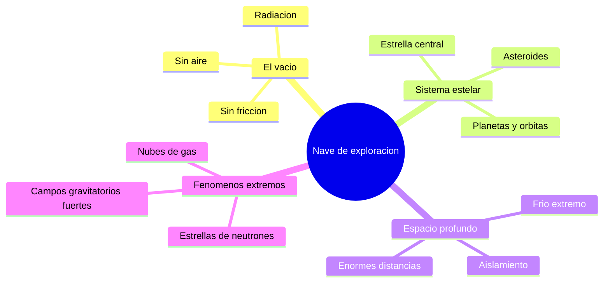

# 🌍 Entornos de la nave de exploracion

[🏠 Inicio](../../../README.md) · [🌌 Curso: Nave de exploracion](../README.md) · 🌍 Entornos

> ⚖️ Material educativo original; los derechos de las obras pertenecen a sus titulares.

Donde opera una nave de exploracion y como cambia su mision segun el entorno.
Cada region del espacio impone riesgos y ajustes distintos, y en simulacion se
traduce en escenarios diferentes. Describimos entornos genericos y reales del
cosmos, no lugares concretos de ninguna obra.

## 🗺️ Entornos principales

## Comparacion de entornos

| Entorno | Caracteristicas | Riesgos tipicos | Ajuste de mision |
| --- | --- | --- | --- |
| El vacio | Sin aire ni friccion | Radiacion, micrometeoritos | Blindaje y soporte vital constante. |
| Sistema estelar | Estrella, planetas, orbitas | Gravedad, calor de la estrella | Navegacion orbital cuidadosa. |
| Espacio profundo | Distancias inmensas, frio | Aislamiento, viajes largos | Autonomia total y gestion de energia. |
| Cerca de una estrella masiva | Gravedad intensa | Mareas y radiacion fuertes | Distancia segura y mediciones. |
| Nube de gas o polvo | Materia dispersa | Erosion del casco | Velocidad reducida y proteccion. |

## 🌌 Factores del entorno

- **Vacio**: no hay aire que frene ni transmita sonido; moverse depende solo de
  la reaccion del motor.
- **Radiacion**: estrellas y espacio emiten particulas daninas; el blindaje es
  vital para la tripulacion.
- **Gravedad**: cerca de cuerpos masivos, las orbitas y las mareas condicionan la
  ruta.
- **Distancia**: en el espacio profundo, cualquier ayuda esta a anios luz, asi que
  la nave debe bastarse a si misma.
- **Temperatura**: el vacio es muy frio, pero cerca de una estrella el calor es
  un problema tan grave como el frio.

## 🎮 Traduccion a simulacion

Cada entorno es un escenario con su nivel de radiacion, gravedad y distancia a la
ayuda mas cercana. Ver como se modela en el
[Modulo 8: Diseno de simulacion](../simulacion/diseno-simulador-nave-exploracion.md).

---

[⬅️ Anterior: Principios y operacion](principios-nave-exploracion.md) · [➡️ Siguiente: Reglas del universo](../reglamentos/reglas-universo-nave-exploracion.md)
