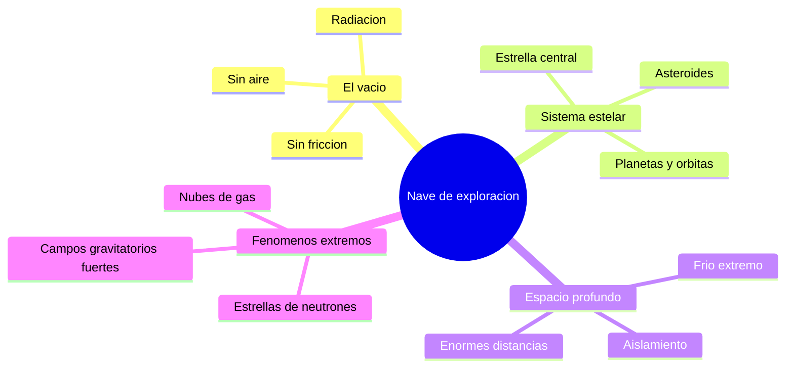

# 🌍 Entornos de la nave de exploración

[🏠 Inicio](../../../README.md) · [🌌 Curso: Nave de exploración](../README.md) · 🌍 Entornos

> ⚖️ Material educativo original; los derechos de las obras pertenecen a sus titulares.

Dónde opera una nave de exploración y cómo cambia su misión según el entorno.
Cada región del espacio impone riesgos y ajustes distintos, y en simulación se
traduce en escenarios diferentes. Describimos entornos genéricos y reales del
cosmos, no lugares concretos de ninguna obra.

## 🗺️ Entornos principales

## Comparación de entornos

| Entorno | Características | Riesgos típicos | Ajuste de misión |
| --- | --- | --- | --- |
| El vacío | Sin aire ni fricción | Radiación, micrometeoritos | Blindaje y soporte vital constante. |
| Sistema estelar | Estrella, planetas, órbitas | Gravedad, calor de la estrella | Navegación orbital cuidadosa. |
| Espacio profundo | Distancias inmensas, frío | Aislamiento, viajes largos | Autonomía total y gestión de energía. |
| Cerca de una estrella masiva | Gravedad intensa | Mareas y radiación fuertes | Distancia segura y mediciones. |
| Nube de gas o polvo | Materia dispersa | Erosión del casco | Velocidad reducida y protección. |

## 🌌 Factores del entorno

- **Vacío**: no hay aire que frene ni transmita sonido; moverse depende solo de
  la reacción del motor.
- **Radiación**: estrellas y espacio emiten partículas daninas; el blindaje es
  vital para la tripulación.
- **Gravedad**: cerca de cuerpos masivos, las órbitas y las mareas condicionan la
  ruta.
- **Distancia**: en el espacio profundo, cualquier ayuda está a años luz, así que
  la nave debe bastarse a si misma.
- **Temperatura**: el vacío es muy frío, pero cerca de una estrella el calor es
  un problema tan grave como el frío.

## 🎮 Traducción a simulación

Cada entorno es un escenario con su nivel de radiación, gravedad y distancia a la
ayuda más cercana. Ver cómo se modela en el
[Módulo 9: Diseño de simulación](../simulacion/diseno-simulador-nave-exploracion.md).

---

[⬅️ Anterior: Principios y operación](principios-nave-exploracion.md) · [➡️ Siguiente: Reglas del universo](../reglamentos/reglas-universo-nave-exploracion.md)
