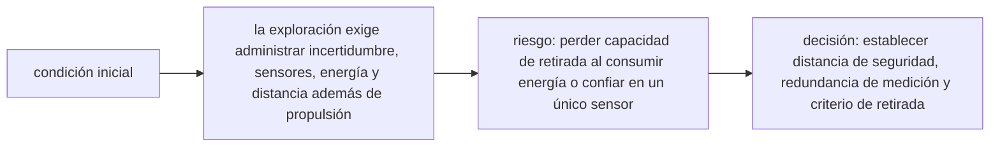

<!-- clase-meta
tipo_documento: clase
clase: 6
codigo: NAVEEXPLORAC-06
curso: nave-exploracion
titulo: "Principios y operación de la nave de exploración"
modalidad: "resolución de problemas"
duracion_minutos: 90
nivel: introductorio
prerrequisito: NAVEEXPLORAC-05
competencia: "razonamiento_operacional"
resultados_aprendizaje:
  - "Explicar principios físicos, fases de operación, decisiones y errores frecuentes con vocabulario propio de Nave de exploración."
  - "Aplicar esos conceptos a una decisión segura o a un escenario de simulación de Nave de exploración."
evidencia: "Resolución argumentada de un escenario operacional."
criterio_aprobacion: "Aplica los principios correctos, anticipa consecuencias y respeta los límites del curso."
fuentes: manuales/fuentes.md
ultima_revision: 2026-09-10
-->

# 🧪 Principios y operación de la nave de exploración

[🏠 Inicio](../../../README.md) · [🌌 Curso: Nave de exploración](../README.md) · 🧪 Principios

> ⚖️ Material educativo original; los derechos de las obras pertenecen a sus titulares.

Este es el corazón físico del curso. Aquí separamos con claridad que sería
posible, que no, y por qué. La idea guía es un principio central de la
relatividad: la velocidad de la luz en el vacío es un límite absoluto para
mover materia e información.

## 🌟 El límite de la luz

La luz viaja a unos 300000 kilómetros por segundo. Parece rapidísimo, y lo es a
escala humana, pero a escala estelar es lento. Además, cuanto más intentamos
acelerar un objeto con masa hacia esa velocidad, más energía hace falta, y la
energía necesaria tiende al infinito. Por eso ningún objeto con masa puede
alcanzar la velocidad de la luz, y mucho menos superarla de forma directa.

## 📏 Distancias interestelares

Las estrellas están lejísimos. Medimos esas distancias en años luz: lo que la
luz recorre en un año. La estrella más cercana está a más de cuatro años luz.
Eso significa que, incluso viajando casi a la velocidad de la luz, un viaje de
ida tomaría años. A velocidades realistas de hoy, tomaría decenas de miles de
años.

## ⏳ Dilatación temporal

La relatividad trae un giro fascinante: para quien viaja muy rápido, el tiempo
pasa más despacio que para quien se queda. Si una nave se acercara mucho a la
velocidad de la luz, su tripulación envejecería poco mientras en casa pasan
siglos. No es truco de ficción: es un efecto real, medido con relojes en
aviones y satélites, solo que aquí llevado al extremo.

## ⚡ El problema energético

Acelerar una nave grande a una fracción alta de la velocidad de la luz exige una
energía gigantesca, comparable a lo que consume una civilización entera durante
mucho tiempo. Y luego hay que frenar, lo que vuelve a duplicar el gasto. Este
muro energético es la razón principal por la que el viaje interestelar rápido
sigue siendo tan difícil.

## Que si, que no y por qué

| Situación | Posible | Por qué |
| --- | --- | --- |
| Viajar a un pequeño porcentaje de la luz | Si, en teoría | Respeta la física; el reto es la energía. |
| Acercarse mucho a la velocidad de la luz | Muy difícil | La energía requerida crece sin freno. |
| Igualar la velocidad de la luz con masa | No | Requeriría energía infinita. |
| Superar la luz moviendose por el espacio | No | Rompe el límite relativista. |
| Deformar el espacio (idea de Alcubierre) | Solo en teoría | Exige energía exótica desconocida. |

## Ficción frente a realidad

| Tema | Como lo muestra la ficción | Como es en la realidad |
| --- | --- | --- |
| Viaje entre estrellas | Cuestión de minutos u horas | Años o milenios. |
| Velocidad | Se supera la luz sin drama | La luz es un límite duro. |
| Energía | Nunca es problema | Es el obstáculo central. |
| Tiempo | Igual para todos | Cambia con la velocidad. |
| Comunicación | Instantánea a distancia | Limitada por la luz. |

## Naves generacionales: la vía lenta y realista

Si no podemos ir rápido, queda ir despacio. Una nave generacional viaja durante
siglos a velocidad modesta: nacen, viven y mueren varias generaciones a bordo,
y solo los descendientes lejanos llegan al destino. Es lenta y exigente, pero no
rompe ninguna ley física. Es la alternativa más honesta al viaje interestelar.

## Por qué superar la luz rompe la causalidad

Hay una razón profunda para el límite. Según la relatividad, si algo viajara más
rápido que la luz, distintos observadores podrían discrepar sobre el orden de
los sucesos: para unos, un efecto podría verse antes que su causa. Eso permitiría
paradojas, como enviar una señal a tu propio pasado. Un universo así sería
incoherente, y por eso el límite de la luz protege el orden de causa y efecto.

## Niveles de realismo

Este curso puede contarse con más ficción o más rigor. Para elegir cuanto realismo
aplicar en explicaciones y simulaciones, ver
[03-niveles-de-realismo.md](../../../docs/03-niveles-de-realismo.md).

## 🧭 Guía de estudio aplicada

### Pregunta guía

¿Cómo ayuda **El límite de la luz, Distancias interestelares, Dilatación temporal y El problema energético** a **resolver aproximación a un fenómeno desconocido con lecturas contradictorias sin agotar el margen operacional**?

### Explicación razonada

El principio rector puede resumirse así: la exploración exige administrar incertidumbre, sensores, energía y distancia además de propulsión. Esto explica por qué una misma orden produce resultados distintos cuando cambian velocidad, carga, configuración o entorno. Operar bien consiste en leer la tendencia antes de agotar el margen y tomar esta decisión: establecer distancia de seguridad, redundancia de medición y criterio de retirada.

Esta clase se conecta con el resto del curso mediante **la exploración exige administrar incertidumbre, sensores, energía y distancia además de propulsión**. El hilo de
seguridad consiste en reconocer a tiempo **perder capacidad de retirada al consumir energía o confiar en un único sensor** y poder justificar la decisión
**establecer distancia de seguridad, redundancia de medición y criterio de retirada**; en clases posteriores cambiará el ángulo de análisis, no esa relación causal.
La lectura funcional común sigue **energía ficticia → propulsión → navegación → misión científica**, de modo que cada concepto pueda
ubicarse dentro del funcionamiento completo y no quede como un dato aislado.

**Apoyo documental:** [Star Trek Database](https://www.startrek.com/database) aporta canon narrativo y tecnologías de ficción;
[Spaceships and Rockets](https://www.nasa.gov/humans-in-space/spaceships-and-rockets/) se usa para naves, sistemas y misiones. Estas fuentes
se contrastan con el alcance de la clase y no sustituyen un manual de equipo concreto.

### Caso resuelto: de la observación a la decisión

1. **Datos:** reconoce condiciones, configuración y margen disponibles en **aproximación a un fenómeno desconocido con lecturas contradictorias**.
2. **Modelo:** aplica **la exploración exige administrar incertidumbre, sensores, energía y distancia además de propulsión** para predecir una tendencia antes de actuar.
3. **Riesgo:** explica mediante qué cadena de causas podría ocurrir **perder capacidad de retirada al consumir energía o confiar en un único sensor**.
4. **Decisión:** ejecuta mentalmente **establecer distancia de seguridad, redundancia de medición y criterio de retirada** y define qué observación confirmaría que funcionó.

### Comprueba tu comprensión

1. ¿Qué variable del principio «la exploración exige administrar incertidumbre, sensores, energía y distancia además de propulsión» cambia primero en el caso?
2. ¿Cómo se propaga ese cambio hasta **misión científica**?
3. ¿Qué evidencia confirmaría que **establecer distancia de seguridad, redundancia de medición y criterio de retirada** conservó margen operacional?

Orientación para revisar tus respuestas

- La primera respuesta debe relacionar el eslabón elegido con un efecto posterior, no solo nombrarlo.
- La segunda debe proponer una señal medible u observable y explicar qué tendencia sería preocupante.
- La tercera debe cambiar al menos una variable de capacidad, mando, entorno o margen de seguridad.

## 🎓 Cierre de clase

- **Actividad:** Resuelve un escenario de Nave de exploración explicando, paso a paso, cómo intervienen principios físicos, fases de operación, decisiones y errores frecuentes.
- **Evidencia:** Resolución argumentada de un escenario operacional.
- **Criterio de aprobación:** Aplica los principios correctos, anticipa consecuencias y respeta los límites del curso.
- **Transferencia:** explica qué cambiaría al pasar a otra variante de esta máquina.

### Fuentes de esta clase

- [STARTREK-DATABASE](https://www.startrek.com/database): Star Trek Database, Paramount. Uso: canon narrativo y tecnologías de ficción.
- [NASA-SPACECRAFT](https://www.nasa.gov/humans-in-space/spaceships-and-rockets/): Spaceships and Rockets, NASA. Uso: naves, sistemas y misiones.
- [NASA-FLIGHT](https://www1.grc.nasa.gov/beginners-guide-to-aeronautics/): Beginner's Guide to Aeronautics, NASA. Uso: contraste con física y vuelo reales.

> Las fuentes sostienen el marco conceptual y normativo; esta clase no reemplaza el manual
> del fabricante, la formación certificada ni la habilitación exigida para operar equipos reales.

---

[⬅️ Anterior: Mandos](../mandos/manual-mandos-nave-exploracion.md) · [➡️ Siguiente: Entornos](entornos-nave-exploracion.md)
