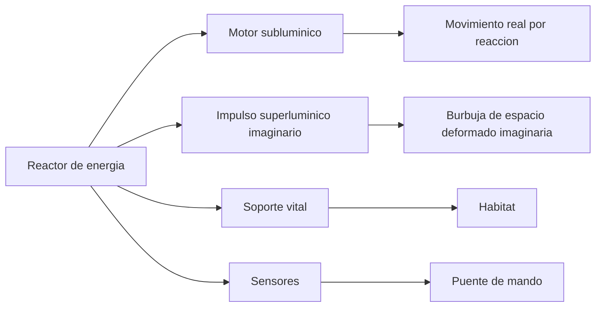
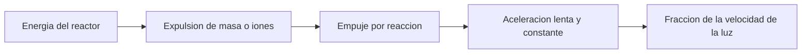

# 🔧 Sistemas mecanicos de la nave de exploracion

[🏠 Inicio](../../../README.md) · [🌌 Curso: Nave de exploracion](../README.md) · 🔧 Sistemas mecanicos

> ⚖️ Material educativo original; los derechos de las obras pertenecen a sus titulares.

Este modulo abre la nave por dentro. Por cada sistema imaginario explicamos que
fisica real evoca, que respeta y que rompe. La regla es sencilla: describimos
conceptos genericos, sin planos ni datos oficiales, y comparamos siempre la
ficcion con lo que sabemos de verdad.

---

## 1. ⚡ Fuente de energia

Todo empieza en la energia. Una nave que quiera moverse rapido o mantener a su
tripulacion necesita una fuente enorme y estable.

- **En la ficcion**: un reactor casi magico entrega energia sin limite practico.
- **En la realidad**: incluso las mejores fuentes (fision, fusion, antimateria)
  tienen limites de masa, calor y eficiencia. Nada es gratis ni infinito.

| Concepto | Ficcion | Fisica real |
| --- | --- | --- |
| Cantidad de energia | Practicamente ilimitada | Siempre finita y costosa. |
| Antimateria | Combustible comun y estable | Existe, pero se produce en cantidades minusculas. |
| Calor sobrante | Se ignora | Enorme; disiparlo en el vacio es dificil. |
| Encendido rapido | Instantaneo | Requiere sistemas complejos y tiempo. |

## 2. 🚀 Motor subluminico

Es la parte creible. Para moverse por debajo de la velocidad de la luz, una
nave real expulsa masa o particulas hacia atras y avanza por reaccion, igual
que un cohete.

- **Que respeta**: la ley de accion y reaccion; nada aqui rompe la fisica.
- **El problema**: acelerar una nave grande a una fraccion de la luz exige
  cantidades de energia y combustible descomunales, y llevaria muchisimo tiempo.
- **Ensenanza**: lo lento y pesado es justo lo realista.

## 3. 🌌 Impulso superluminico imaginario

Aqui la ficcion inventa. Para cruzar la galaxia en episodios cortos, la nave usa
un "impulso" mas rapido que la luz. La version mas seria de esta idea en la
fisica teorica es la metrica de Alcubierre.

- **La idea teorica**: en vez de mover la nave por el espacio mas rapido que la
  luz (imposible), se deforma el propio espacio, contrayendolo delante y
  expandiendolo detras, y la nave viaja dentro de una "burbuja".
- **El obstaculo enorme**: esa deformacion exigiria una forma de energia
  negativa o exotica que no sabemos como obtener ni concentrar. En la practica,
  hoy es solo un ejercicio matematico, no una tecnologia.

| Aspecto | Version de ficcion | Idea teorica seria (Alcubierre) |
| --- | --- | --- |
| Que se mueve | La nave, mas rapido que la luz | El espacio alrededor de la nave. |
| Energia necesaria | Trivial, siempre disponible | Energia negativa o exotica desconocida. |
| Viable hoy | Se presenta como rutina | No; solo existe en las ecuaciones. |
| Rompe la luz local | Si, sin consecuencias | Evita el limite local, pero abre otros problemas. |

## 4. 🛰️ Sensores y observacion

- **En la ficcion**: detectan cualquier cosa al instante y a distancias enormes.
- **En la realidad**: la informacion tampoco viaja mas rapido que la luz. Ver
  algo lejano es ver su pasado; una estrella a cien anios luz se observa como
  era hace un siglo.

## 5. 🌬️ Soporte vital

Mantener viva a la tripulacion es tan importante como moverse. El sistema debe
reciclar aire y agua, controlar temperatura y proteger de la radiacion.

- **Real y dificil**: el reciclaje casi total es un reto enorme de ingenieria.
- **Ficcion comoda**: suele mostrarse como algo que "simplemente funciona".

## 🔁 Como se conecta todo

1. El **reactor** entrega energia a toda la nave.
2. El **motor subluminico** la mueve de forma realista pero lenta.
3. El **impulso imaginario** justifica los viajes rapidos de la trama.
4. Los **sensores** informan al puente sobre el entorno.
5. El **soporte vital** mantiene el habitat en condiciones.

El [Modulo 4: Mandos](../mandos/manual-mandos-nave-exploracion.md) muestra como
la tripulacion opera todos estos sistemas desde el puente.

---

[⬅️ Anterior: Caracteristicas](caracteristicas-nave-exploracion.md) · [➡️ Siguiente: Mandos e instrumentos](../mandos/manual-mandos-nave-exploracion.md)
