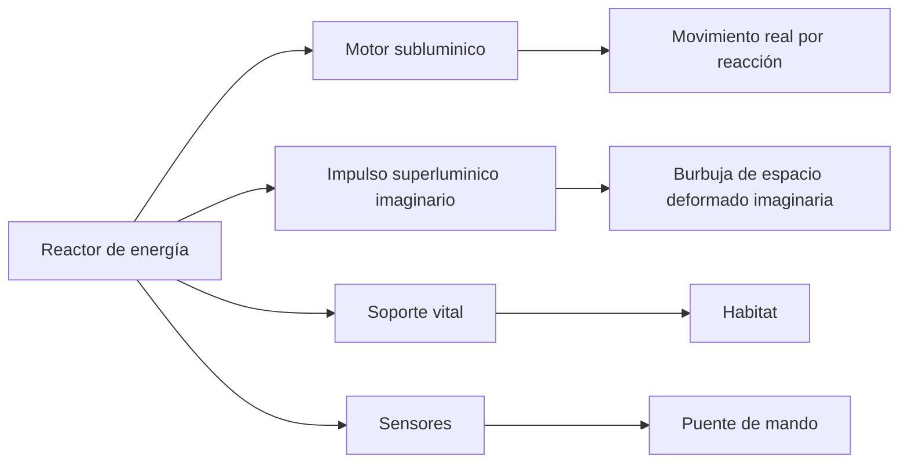
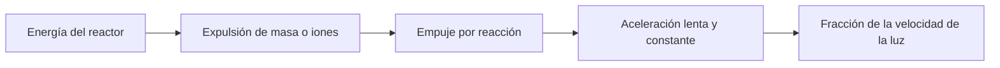
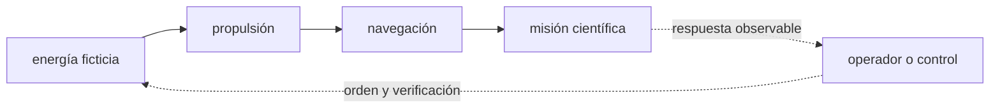

<!-- clase-meta
tipo_documento: clase
clase: 4
codigo: NAVEEXPLORAC-04
curso: nave-exploracion
titulo: "Sistemas mecánicos de la nave de exploración"
modalidad: "teórica aplicada"
duracion_minutos: 90
nivel: introductorio
prerrequisito: NAVEEXPLORAC-03
competencia: "comprension_de_sistemas"
resultados_aprendizaje:
  - "Explicar Fuente de energía, Motor subluminico, Impulso superluminico imaginario y Sensores y observación con vocabulario propio de Nave de exploración."
  - "Aplicar esos conceptos a una decisión segura o a un escenario de simulación de Nave de exploración."
evidencia: "Esquema con flujos de energía, materia o información anotados."
criterio_aprobacion: "Las conexiones esenciales son correctas y la consecuencia de la falla se propaga de manera coherente."
fuentes: manuales/fuentes.md
ultima_revision: 2026-09-10
-->

# 🔧 Sistemas mecánicos de la nave de exploración

[🏠 Inicio](../../../README.md) · [🌌 Curso: Nave de exploración](../README.md) · 🔧 Sistemas mecánicos

> ⚖️ Material educativo original; los derechos de las obras pertenecen a sus titulares.

Esta clase abre la nave por dentro. Por cada sistema imaginario explicamos que
física real evoca, que respeta y que rompe. La regla es sencilla: describimos
conceptos genéricos, sin planos ni datos oficiales, y comparamos siempre la
ficción con lo que sabemos de verdad.

```mermaid
flowchart LR
    Reactor[Reactor de energía] --> Subluz[Motor subluminico]
    Reactor --> Warp[Impulso superluminico imaginario]
    Reactor --> Soporte[Soporte vital]
    Reactor --> Sensores[Sensores]
    Subluz --> Mov[Movimiento real por reacción]
    Warp --> Burbuja[Burbuja de espacio deformado imaginaria]
    Sensores --> Puente[Puente de mando]
    Soporte --> Habitat[Habitat]
```

---

## 1. ⚡ Fuente de energía

Todo empieza en la energía. Una nave que quiera moverse rápido o mantener a su
tripulación necesita una fuente enorme y estable.

- **En la ficción**: un reactor casi mágico entrega energía sin límite práctico.
- **En la realidad**: incluso las mejores fuentes (fisión, fusión, antimateria)
  tienen límites de masa, calor y eficiencia. Nada es gratis ni infinito.

| Concepto | Ficción | Física real |
| --- | --- | --- |
| Cantidad de energía | Prácticamente ilimitada | Siempre finita y costosa. |
| Antimateria | Combustible común y estable | Existe, pero se produce en cantidades minúsculas. |
| Calor sobrante | Se ignora | Enorme; disiparlo en el vacío es difícil. |
| Encendido rápido | Instantáneo | Requiere sistemas complejos y tiempo. |

## 2. 🚀 Motor subluminico

Es la parte creíble. Para moverse por debajo de la velocidad de la luz, una
nave real expulsa masa o partículas hacia atrás y avanza por reacción, igual
que un cohete.

```mermaid
flowchart LR
    Energia[Energía del reactor] --> Empuje[Expulsión de masa o iones]
    Empuje --> Reaccion[Empuje por reacción]
    Reaccion --> Acel[Aceleración lenta y constante]
    Acel --> Veloc[Fracción de la velocidad de la luz]
```

- **Que respeta**: la ley de acción y reacción; nada aquí rompe la física.
- **El problema**: acelerar una nave grande a una fracción de la luz exige
  cantidades de energía y combustible descomunales, y llevaría muchísimo tiempo.
- **Enseñanza**: lo lento y pesado es justo lo realista.

## 3. 🌌 Impulso superluminico imaginario

Aquí la ficción inventa. Para cruzar la galaxia en episodios cortos, la nave usa
un "impulso" más rápido que la luz. La versión más seria de esta idea en la
física teórica es la métrica de Alcubierre.

- **La idea teórica**: en vez de mover la nave por el espacio más rápido que la
  luz (imposible), se deforma el propio espacio, contrayendolo delante y
  expandiendolo detrás, y la nave viaja dentro de una "burbuja".
- **El obstáculo enorme**: esa deformación exigiría una forma de energía
  negativa o exótica que no sabemos como obtener ni concentrar. En la práctica,
  hoy es solo un ejercicio matemático, no una tecnología.

| Aspecto | Versión de ficción | Idea teórica sería (Alcubierre) |
| --- | --- | --- |
| Que se mueve | La nave, más rápido que la luz | El espacio alrededor de la nave. |
| Energía necesaria | Trivial, siempre disponible | Energía negativa o exótica desconocida. |
| Viable hoy | Se presenta como rutina | No; solo existe en las ecuaciones. |
| Rompe la luz local | Si, sin consecuencias | Evita el límite local, pero abre otros problemas. |

## 4. 🛰️ Sensores y observación

- **En la ficción**: detectan cualquier cosa al instante y a distancias enormes.
- **En la realidad**: la información tampoco viaja más rápido que la luz. Ver
  algo lejano es ver su pasado; una estrella a cien años luz se observa como
  era hace un siglo.

## 5. 🌬️ Soporte vital

Mantener viva a la tripulación es tan importante como moverse. El sistema debe
reciclar aire y agua, controlar temperatura y proteger de la radiación.

- **Real y difícil**: el reciclaje casi total es un reto enorme de ingeniería.
- **Ficción cómoda**: suele mostrarse como algo que "simplemente funciona".

## 🔁 Cómo se conecta todo

1. El **reactor** entrega energía a toda la nave.
2. El **motor subluminico** la mueve de forma realista pero lenta.
3. El **impulso imaginario** justifica los viajes rápidos de la trama.
4. Los **sensores** informan al puente sobre el entorno.
5. El **soporte vital** mantiene el habitat en condiciones.

El [Clase 5: Mandos](../mandos/manual-mandos-nave-exploracion.md) muestra como
la tripulación opera todos estos sistemas desde el puente.

## 🧭 Guía de estudio aplicada

### Pregunta guía

¿Cómo ayuda **Fuente de energía, Motor subluminico, Impulso superluminico imaginario y Sensores y observación** a **seguir una alteración desde energía ficticia hasta misión científica durante aproximación a un fenómeno desconocido con lecturas contradictorias**?

### Explicación razonada

El funcionamiento puede leerse como una cadena causal: energía ficticia entrega o transforma energía; propulsión la adapta; navegación la transmite o gobierna; y misión científica produce el efecto observable. La cadena no es lineal en sentido estricto: sensores, estructura y operador cierran el lazo. Si un eslabón se degrada, la señal importante es cómo cambia el estado de misión científica y qué margen queda.

```mermaid
flowchart LR
    A["energía ficticia"] --> B["propulsión"] --> C["navegación"] --> D["misión científica"]
    D -. respuesta observable .-> O["operador o control"]
    O -. orden y verificación .-> A
```

Esta clase se conecta con el resto del curso mediante **la exploración exige administrar incertidumbre, sensores, energía y distancia además de propulsión**. El hilo de
seguridad consiste en reconocer a tiempo **perder capacidad de retirada al consumir energía o confiar en un único sensor** y poder justificar la decisión
**establecer distancia de seguridad, redundancia de medición y criterio de retirada**; en clases posteriores cambiará el ángulo de análisis, no esa relación causal.
La lectura funcional común sigue **energía ficticia → propulsión → navegación → misión científica**, de modo que cada concepto pueda
ubicarse dentro del funcionamiento completo y no quede como un dato aislado.

**Apoyo documental:** [Star Trek Database](https://www.startrek.com/database) aporta canon narrativo y tecnologías de ficción;
[Spaceships and Rockets](https://www.nasa.gov/humans-in-space/spaceships-and-rockets/) se usa para naves, sistemas y misiones. Estas fuentes
se contrastan con el alcance de la clase y no sustituyen un manual de equipo concreto.

### Caso resuelto: de la observación a la decisión

1. **Entrada:** identifica el estado inicial de **energía ficticia** durante **aproximación a un fenómeno desconocido con lecturas contradictorias**.
2. **Transformación:** explica qué hacen **propulsión** y **navegación**, y qué magnitud cambia en cada paso.
3. **Salida:** comprueba el efecto esperado en **misión científica** y busca una desviación temprana.
4. **Falla razonada:** si aparece **perder capacidad de retirada al consumir energía o confiar en un único sensor**, retrocede por la cadena antes de ordenar otra acción.

### Comprueba tu comprensión

1. Si se degrada **propulsión**, ¿qué efecto esperarías primero en **navegación** y después en **misión científica**?
2. ¿Qué observación ayudaría a diferenciar una falla de **energía ficticia** de una falla de **navegación**?
3. ¿Por qué una segunda orden podría agravar **perder capacidad de retirada al consumir energía o confiar en un único sensor**?

Orientación para revisar tus respuestas

- La primera respuesta debe relacionar el eslabón elegido con un efecto posterior, no solo nombrarlo.
- La segunda debe proponer una señal medible u observable y explicar qué tendencia sería preocupante.
- La tercera debe cambiar al menos una variable de capacidad, mando, entorno o margen de seguridad.

## 🎓 Cierre de clase

- **Actividad:** Dibuja un esquema funcional de Nave de exploración que conecte Fuente de energía, Motor subluminico, Impulso superluminico imaginario y Sensores y observación; después predice el efecto de una falla simulada.
- **Evidencia:** Esquema con flujos de energía, materia o información anotados.
- **Criterio de aprobación:** Las conexiones esenciales son correctas y la consecuencia de la falla se propaga de manera coherente.
- **Transferencia:** explica qué cambiaría al pasar a otra variante de esta máquina.

### Fuentes de esta clase

- [STARTREK-DATABASE](https://www.startrek.com/database): Star Trek Database, Paramount. Uso: canon narrativo y tecnologías de ficción.
- [NASA-SPACECRAFT](https://www.nasa.gov/humans-in-space/spaceships-and-rockets/): Spaceships and Rockets, NASA. Uso: naves, sistemas y misiones.
- [NASA-FLIGHT](https://www1.grc.nasa.gov/beginners-guide-to-aeronautics/): Beginner's Guide to Aeronautics, NASA. Uso: contraste con física y vuelo reales.

> Las fuentes sostienen el marco conceptual y normativo; esta clase no reemplaza el manual
> del fabricante, la formación certificada ni la habilitación exigida para operar equipos reales.

---

[⬅️ Anterior: Modelos y variantes](../modelos/modelos-nave-exploracion.md) · [➡️ Siguiente: Mandos e instrumentos](../mandos/manual-mandos-nave-exploracion.md)
