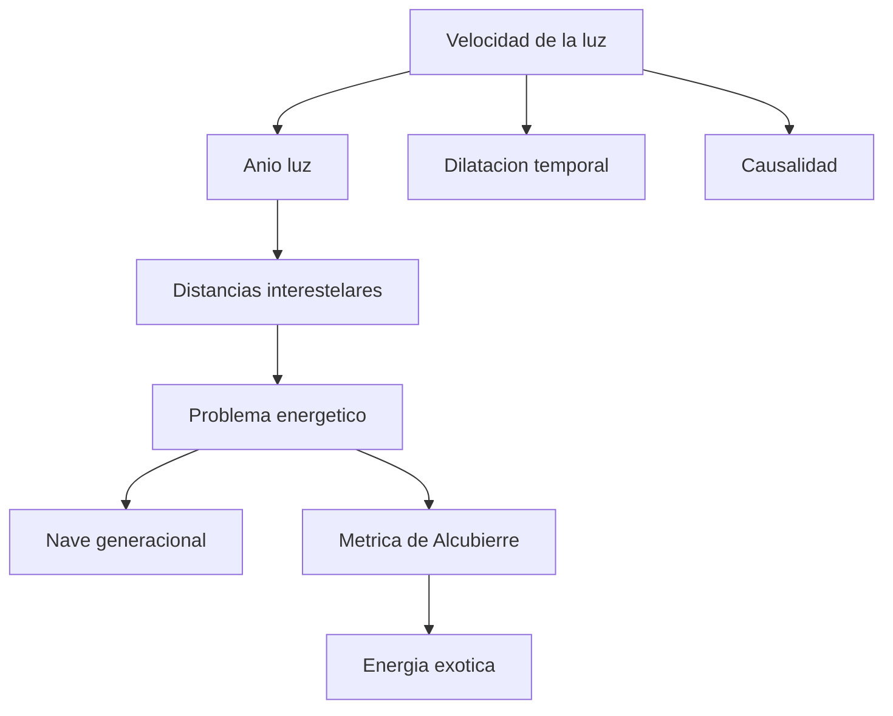

# 🧰 Recursos de la nave de exploracion

[🏠 Inicio](../../../README.md) · [🌌 Curso: Nave de exploracion](../README.md) · 🧰 Recursos

> ⚖️ Material educativo original; los derechos de las obras pertenecen a sus titulares.

Cierre del curso: un glosario de los conceptos clave, un mapa de como se
relacionan y enlaces utiles para seguir aprendiendo. Todo con nuestras palabras
y con foco en la fisica real detras de la ficcion.

## 🗺️ Mapa de conceptos

## 📖 Glosario

| Termino | Definicion breve |
| --- | --- |
| Velocidad de la luz | Limite maximo para mover materia e informacion; unos 300000 km/s. |
| Anio luz | Distancia que la luz recorre en un anio; sirve para medir el espacio. |
| Distancia interestelar | Separacion enorme entre estrellas, medida en anios luz. |
| Dilatacion temporal | Efecto real por el que el tiempo pasa mas lento a gran velocidad. |
| Problema energetico | Energia gigantesca que exige acelerar y frenar una nave grande. |
| Nave generacional | Nave lenta donde varias generaciones viven durante el viaje. |
| Impulso superluminico | Idea de ficcion para viajar mas rapido que la luz. |
| Metrica de Alcubierre | Idea teorica de deformar el espacio; exigiria energia exotica. |
| Energia exotica | Energia negativa o rara que hoy no sabemos obtener. |
| Causalidad | Orden de causa y efecto que superar la luz pondria en riesgo. |

## 🔗 Enlaces del repositorio

- [Glosario general](../../../docs/05-glosario-general.md)
- [Portada del curso: Nave de exploracion](../README.md)
- [Catalogo de naves de ficcion](../../README.md)

## 🧭 Como seguir

- Repasar el [Modulo 5: Principios](../operacion/principios-nave-exploracion.md)
  para afianzar la fisica.
- Probar mentalmente el modo ciencia del
  [Modulo 8: Simulacion](../simulacion/diseno-simulador-nave-exploracion.md).
- Comparar esta nave con las demas del catalogo para ver que fisica evoca cada una.

---

[🎓 Portada del curso](../README.md) · [⬅️ Anterior: Diseno de simulacion](../simulacion/diseno-simulador-nave-exploracion.md)
