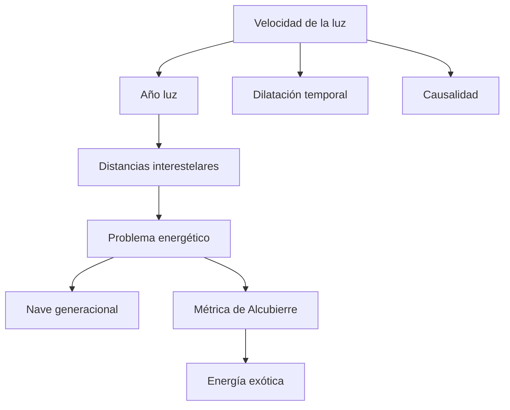

# 🧰 Recursos de la nave de exploración

[🏠 Inicio](../../../README.md) · [🌌 Curso: Nave de exploración](../README.md) · 🧰 Recursos

> ⚖️ Material educativo original; los derechos de las obras pertenecen a sus titulares.

Cierre del curso: un glosario de los conceptos clave, un mapa de cómo se
relacionan y enlaces útiles para seguir aprendiendo. Todo con nuestras palabras
y con foco en la física real detrás de la ficción.

## 🗺️ Mapa de conceptos

```mermaid
flowchart TD
    C[Velocidad de la luz] --> AL[Año luz]
    AL --> Dist[Distancias interestelares]
    C --> Dil[Dilatación temporal]
    Dist --> Energia[Problema energético]
    Energia --> Gen[Nave generacional]
    Energia --> Alc[Métrica de Alcubierre]
    Alc --> Exo[Energía exótica]
    C --> Caus[Causalidad]
```

## 📖 Glosario

| Término | Definición breve |
| --- | --- |
| Velocidad de la luz | Límite máximo para mover materia e información; unos 300000 km/s. |
| Año luz | Distancia que la luz recorre en un año; sirve para medir el espacio. |
| Distancia interestelar | Separación enorme entre estrellas, medida en años luz. |
| Dilatación temporal | Efecto real por el que el tiempo pasa más lento a gran velocidad. |
| Problema energético | Energía gigantesca que exige acelerar y frenar una nave grande. |
| Nave generacional | Nave lenta donde varias generaciones viven durante el viaje. |
| Impulso superluminico | Idea de ficción para viajar más rápido que la luz. |
| Métrica de Alcubierre | Idea teórica de deformar el espacio; exigiría energía exótica. |
| Energía exótica | Energía negativa o rara que hoy no sabemos obtener. |
| Causalidad | Orden de causa y efecto que superar la luz pondria en riesgo. |

## 🔗 Enlaces del repositorio

- [Glosario general](../../../docs/05-glosario-general.md)
- [Portada del curso: Nave de exploración](../README.md)
- [Catálogo de naves de ficción](../../README.md)

## 🧭 Cómo seguir

- Repasar el [Módulo 6: Principios](../operacion/principios-nave-exploracion.md)
  para afianzar la física.
- Probar mentalmente el modo ciencia del
  [Módulo 9: Simulación](../simulacion/diseno-simulador-nave-exploracion.md).
- Comparar esta nave con las demás del catálogo para ver que física evoca cada una.

## 🎓 Cierre de clase

- **Actividad:** Selecciona términos de glosario, esquemas y trazabilidad de fuentes, explícalos en contexto de Nave de exploración y verifica la procedencia de las fuentes utilizadas.
- **Evidencia:** Glosario aplicado y ficha breve de trazabilidad.
- **Criterio de aprobación:** Los términos permiten interpretar el curso y las fuentes se distinguen por autoridad, alcance y vigencia.
- **Transferencia:** explica qué cambiaría al pasar a otra variante de esta máquina.

### Fuentes de esta clase

- [STARTREK-DATABASE](https://www.startrek.com/database): Star Trek Database, Paramount. Uso: canon narrativo y tecnologías de ficción.
- [NASA-SPACECRAFT](https://www.nasa.gov/humans-in-space/spaceships-and-rockets/): Spaceships and Rockets, NASA. Uso: naves, sistemas y misiones.
- [NASA-FLIGHT](https://www1.grc.nasa.gov/beginners-guide-to-aeronautics/): Beginner's Guide to Aeronautics, NASA. Uso: contraste con física y vuelo reales.

> Las fuentes sostienen el marco conceptual y normativo; esta clase no reemplaza el manual
> del fabricante, la formación certificada ni la habilitación exigida para operar equipos reales.

---

[🎓 Portada del curso](../README.md) · [⬅️ Anterior: Diseño de simulación](../simulacion/diseno-simulador-nave-exploracion.md) · [➡️ Siguiente: Ejercicios](../ejercicios/ejercicios-nave-exploracion.md)
