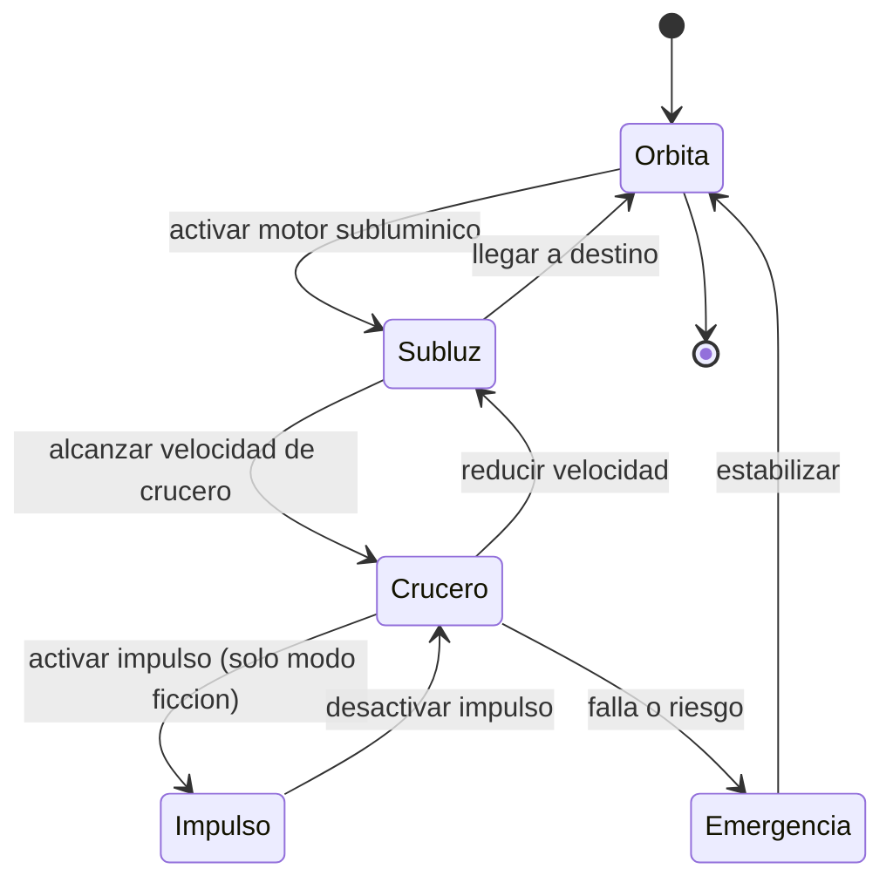

# 🎮 Diseno de simulacion de la nave de exploracion

[🏠 Inicio](../../../README.md) · [🌌 Curso: Nave de exploracion](../README.md) · 🎮 Simulacion

> ⚖️ Material educativo original; los derechos de las obras pertenecen a sus titulares.

Este modulo convierte todo lo anterior en un plan de simulacion educativo. La
clave es un interruptor central: el **modo ciencia o ficcion**, que decide si el
simulador respeta la fisica real o permite el viaje rapido imaginario.

## Objetivo de la simulacion

Que el usuario entienda, jugando, por que el viaje interestelar es tan dificil:
cuanta energia cuesta acelerar, cuanto tiempo toman las distancias reales y como
la dilatacion temporal separa el reloj de a bordo del reloj de casa.

## Modo ciencia o ficcion

- **Modo ciencia**: el impulso superluminico queda bloqueado. Los viajes tardan
  anios o siglos, la energia limita todo y se muestra la dilatacion temporal. Sirve
  para aprender fisica real.
- **Modo ficcion**: se habilita el impulso imaginario para cruzar distancias
  rapido, al estilo "Star Trek". Sirve para explorar y divertirse, dejando claro
  que es invencion.

## Nivel de realismo

- Nivel elegido: se ofrece del 1 al 3 (ver `../../../docs/03-niveles-de-realismo.md`).
- Justificacion: la nave permite ensenar relatividad, distancias y energia; el
  modo ciencia o ficcion deja graduar cuanto rigor se aplica.

## Variables principales

| Variable | Tipo | Rango | Afecta a | Comentarios |
| --- | --- | --- | --- | --- |
| Modo | discreta | ciencia / ficcion | Reglas del viaje | Bloquea o permite el impulso. |
| Velocidad subluminica | numerica | 0-99% de c | Tiempo de viaje | Central en modo ciencia. |
| Energia | numerica | 0-100% | Maniobras posibles | Limite realista. |
| Distancia al destino | numerica | anios luz | Duracion del viaje | Escala real. |
| Tiempo a bordo | numerica | horas a anios | Tripulacion | Ligado a la dilatacion. |
| Tiempo externo | numerica | anios a siglos | Mundo de origen | Crece mas rapido a alta velocidad. |
| Impulso activo | booleana | si / no | Modo de viaje | Solo en modo ficcion. |
| Radiacion del entorno | numerica | 0-100% | Riesgo | Depende del escenario. |

## Ciclo basico

1. Leer entrada del usuario (modo, empuje, rumbo, energia, impulso).
2. Comprobar si el modo permite la accion pedida.
3. Calcular energia disponible y consumo de la maniobra.
4. Actualizar velocidad, posicion y ambos relojes segun la relatividad.
5. Aplicar efectos del entorno (radiacion, gravedad, distancia a la ayuda).
6. Refrescar el tablero, incluidos los dos relojes y el nivel de energia.

## Modos de juego futuros

- Tutorial de fisica: sentir por que la luz es un limite.
- Reto energetico: llegar a una estrella sin quedarse sin reactor.
- Experimento de dilatacion temporal: comparar los dos relojes al volver.
- Mision de nave generacional: planear un viaje de siglos.
- Modo ficcion libre: explorar rapido con el impulso imaginario.

## Elementos fuera de alcance

- Presentar el viaje superluminico como algo tecnicamente resuelto en la realidad.
- Datos que simulen construir armas o sistemas peligrosos reales.
- Mezclar sin aviso lo inventado con lo cientifico.

## Pendientes

- [ ] Definir valores por defecto de cada variable segun el escenario.
- [ ] Prototipar el calculo de dilatacion temporal en un motor simple.
- [ ] Ajustar el balance del modo ficcion para que siga siendo educativo.
- [ ] Agregar fuentes divulgativas a [`manuales/fuentes.md`](../../../manuales/fuentes.md).

---

[⬅️ Anterior: Reglas del universo](../reglamentos/reglas-universo-nave-exploracion.md) · [➡️ Siguiente: Recursos](../recursos/recursos-nave-exploracion.md)
