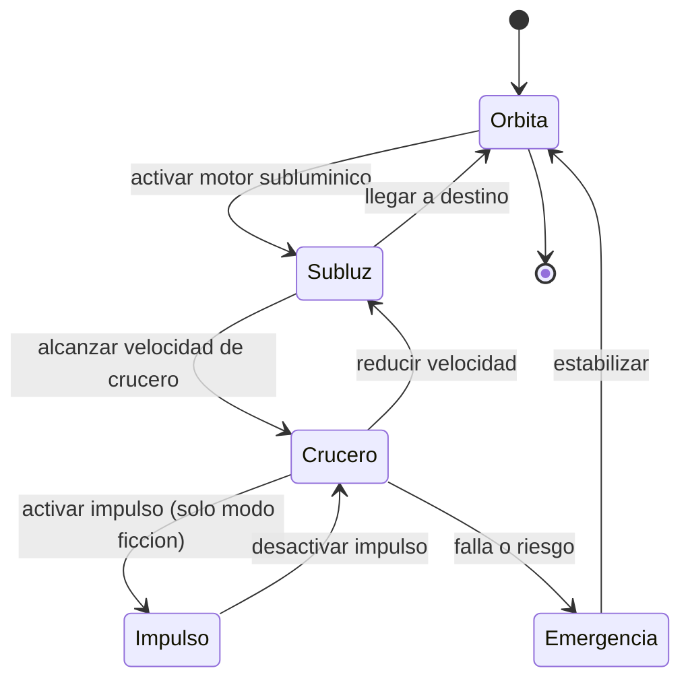

# 🎮 Diseño de simulación de la nave de exploración

[🏠 Inicio](../../../README.md) · [🌌 Curso: Nave de exploración](../README.md) · 🎮 Simulación

> ⚖️ Material educativo original; los derechos de las obras pertenecen a sus titulares.

Este módulo convierte todo lo anterior en un plan de simulación educativo. La
clave es un interruptor central: el **modo ciencia o ficción**, que decide si el
simulador respeta la física real o permite el viaje rápido imaginario.

## Objetivo de la simulación

Que el usuario entienda, jugando, por qué el viaje interestelar es tan difícil:
cuanta energía cuesta acelerar, cuanto tiempo toman las distancias reales y como
la dilatación temporal separa el reloj de a bordo del reloj de casa.

## Modo ciencia o ficción

- **Modo ciencia**: el impulso superluminico queda bloqueado. Los viajes tardan
  años o siglos, la energía limita todo y se muestra la dilatación temporal. Sirve
  para aprender física real.
- **Modo ficción**: se habilita el impulso imaginario para cruzar distancias
  rápido, al estilo "Star Trek". Sirve para explorar y divertirse, dejando claro
  que es invención.

## Nivel de realismo

- Nivel elegido: se ofrece del 1 al 3 (ver `../../../docs/03-niveles-de-realismo.md`).
- Justificación: la nave permite enseñar relatividad, distancias y energía; el
  modo ciencia o ficción deja graduar cuanto rigor se aplica.

## Variables principales

| Variable | Tipo | Rango | Afecta a | Comentarios |
| --- | --- | --- | --- | --- |
| Modo | discreta | ciencia / ficción | Reglas del viaje | Bloquea o permite el impulso. |
| Velocidad subluminica | numérica | 0-99% de c | Tiempo de viaje | Central en modo ciencia. |
| Energía | numérica | 0-100% | Maniobras posibles | Límite realista. |
| Distancia al destino | numérica | años luz | Duración del viaje | Escala real. |
| Tiempo a bordo | numérica | horas a años | Tripulación | Ligado a la dilatación. |
| Tiempo externo | numérica | años a siglos | Mundo de origen | Crece más rápido a alta velocidad. |
| Impulso activo | booleana | si / no | Modo de viaje | Solo en modo ficción. |
| Radiación del entorno | numérica | 0-100% | Riesgo | Depende del escenario. |

## Ciclo básico

1. Leer entrada del usuario (modo, empuje, rumbo, energía, impulso).
2. Comprobar si el modo permite la acción pedida.
3. Calcular energía disponible y consumo de la maniobra.
4. Actualizar velocidad, posición y ambos relojes según la relatividad.
5. Aplicar efectos del entorno (radiación, gravedad, distancia a la ayuda).
6. Refrescar el tablero, incluidos los dos relojes y el nivel de energía.

## Modos de juego futuros

- Tutorial de física: sentir por qué la luz es un límite.
- Reto energético: llegar a una estrella sin quedarse sin reactor.
- Experimento de dilatación temporal: comparar los dos relojes al volver.
- Misión de nave generacional: planear un viaje de siglos.
- Modo ficción libre: explorar rápido con el impulso imaginario.

## Elementos fuera de alcance

- Presentar el viaje superluminico como algo técnicamente resuelto en la realidad.
- Datos que simulen construir armas o sistemas peligrosos reales.
- Mezclar sin aviso lo inventado con lo científico.

## Pendientes

- [ ] Definir valores por defecto de cada variable según el escenario.
- [ ] Prototipar el cálculo de dilatación temporal en un motor simple.
- [ ] Ajustar el balance del modo ficción para que siga siendo educativo.
- [ ] Agregar fuentes divulgativas a [`manuales/fuentes.md`](../../../manuales/fuentes.md).

---

[⬅️ Anterior: Reglas del universo](../reglamentos/reglas-universo-nave-exploracion.md) · [➡️ Siguiente: Recursos](../recursos/recursos-nave-exploracion.md)
