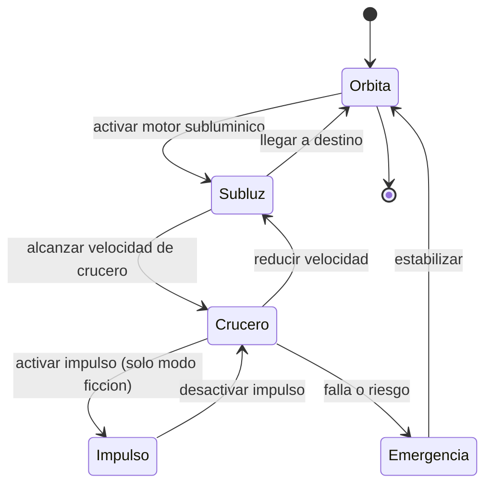
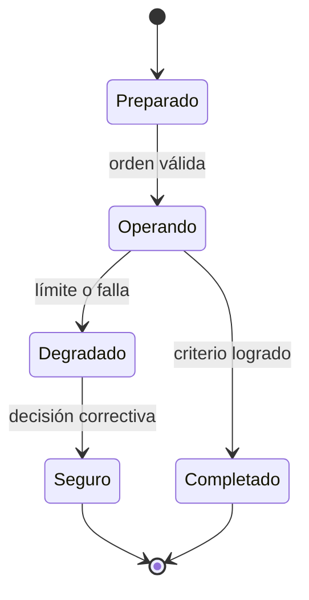

<!-- clase-meta
tipo_documento: clase
clase: 9
codigo: NAVEEXPLORAC-09
curso: nave-exploracion
titulo: "Diseño de simulación de la nave de exploración"
modalidad: "laboratorio de diseño"
duracion_minutos: 90
nivel: introductorio
prerrequisito: NAVEEXPLORAC-08
competencia: "modelado_de_simulacion"
resultados_aprendizaje:
  - "Explicar objetivo, variables, estados, ciclo y escenarios de simulación con vocabulario propio de Nave de exploración."
  - "Aplicar esos conceptos a una decisión segura o a un escenario de simulación de Nave de exploración."
evidencia: "Ficha de escenario y diagrama de estados."
criterio_aprobacion: "El modelo es específico de la máquina, medible, seguro y trazable a clases anteriores."
fuentes: manuales/fuentes.md
ultima_revision: 2026-09-10
-->

# 🎮 Diseño de simulación de la nave de exploración

[🏠 Inicio](../../../README.md) · [🌌 Curso: Nave de exploración](../README.md) · 🎮 Simulación

> ⚖️ Material educativo original; los derechos de las obras pertenecen a sus titulares.

Esta clase convierte todo lo anterior en un plan de simulación educativo. La
clave es un interruptor central: el **modo ciencia o ficción**, que decide si el
simulador respeta la física real o permite el viaje rápido imaginario.

```mermaid
stateDiagram-v2
    [*] --> Orbita
    Orbita --> Subluz: activar motor subluminico
    Subluz --> Crucero: alcanzar velocidad de crucero
    Crucero --> Impulso: activar impulso (solo modo ficcion)
    Impulso --> Crucero: desactivar impulso
    Crucero --> Subluz: reducir velocidad
    Subluz --> Orbita: llegar a destino
    Crucero --> Emergencia: falla o riesgo
    Emergencia --> Orbita: estabilizar
    Orbita --> [*]
```

## Objetivo de la simulación

Que el usuario entienda, jugando, por qué el viaje interestelar es tan difícil:
cuanta energía cuesta acelerar, cuanto tiempo toman las distancias reales y como
la dilatación temporal separa el reloj de a bordo del reloj de casa.

## Modo ciencia o ficción

- **Modo ciencia**: el impulso superluminico queda bloqueado. Los viajes tardan
  años o siglos, la energía limita todo y se muestra la dilatación temporal. Sirve
  para aprender física real.
- **Modo ficción**: se habilita el impulso imaginario para cruzar distancias
  rápido, al estilo "Star Trek". Sirve para explorar y divertirse, dejando claro
  que es invención.

## Nivel de realismo

- Nivel elegido: se ofrece del 1 al 3 (ver `../../../docs/03-niveles-de-realismo.md`).
- Justificación: la nave permite enseñar relatividad, distancias y energía; el
  modo ciencia o ficción deja graduar cuanto rigor se aplica.

## Variables principales

| Variable | Tipo | Rango | Afecta a | Comentarios |
| --- | --- | --- | --- | --- |
| Modo | discreta | ciencia / ficción | Reglas del viaje | Bloquea o permite el impulso. |
| Velocidad subluminica | numérica | 0-99% de c | Tiempo de viaje | Central en modo ciencia. |
| Energía | numérica | 0-100% | Maniobras posibles | Límite realista. |
| Distancia al destino | numérica | años luz | Duración del viaje | Escala real. |
| Tiempo a bordo | numérica | horas a años | Tripulación | Ligado a la dilatación. |
| Tiempo externo | numérica | años a siglos | Mundo de origen | Crece más rápido a alta velocidad. |
| Impulso activo | booleana | si / no | Modo de viaje | Solo en modo ficción. |
| Radiación del entorno | numérica | 0-100% | Riesgo | Depende del escenario. |

## Ciclo básico

1. Leer entrada del usuario (modo, empuje, rumbo, energía, impulso).
2. Comprobar si el modo permite la acción pedida.
3. Calcular energía disponible y consumo de la maniobra.
4. Actualizar velocidad, posición y ambos relojes según la relatividad.
5. Aplicar efectos del entorno (radiación, gravedad, distancia a la ayuda).
6. Refrescar el tablero, incluidos los dos relojes y el nivel de energía.

## Modos de juego futuros

- Tutorial de física: sentir por qué la luz es un límite.
- Reto energético: llegar a una estrella sin quedarse sin reactor.
- Experimento de dilatación temporal: comparar los dos relojes al volver.
- Misión de nave generacional: planear un viaje de siglos.
- Modo ficción libre: explorar rápido con el impulso imaginario.

## Elementos fuera de alcance

- Presentar el viaje superluminico como algo técnicamente resuelto en la realidad.
- Datos que simulen construir armas o sistemas peligrosos reales.
- Mezclar sin aviso lo inventado con lo científico.

## Pendientes

- [ ] Definir valores por defecto de cada variable según el escenario.
- [ ] Prototipar el cálculo de dilatación temporal en un motor simple.
- [ ] Ajustar el balance del modo ficción para que siga siendo educativo.
- [ ] Agregar fuentes divulgativas a [`manuales/fuentes.md`](../../../manuales/fuentes.md).

## 🧭 Guía de estudio aplicada

### Pregunta guía

¿Cómo ayuda **Objetivo de la simulación, Modo ciencia o ficción, Nivel de realismo y Variables principales** a **modelar aproximación a un fenómeno desconocido con lecturas contradictorias como estados, variables y decisiones observables**?

### Explicación razonada

Una simulación de Nave de exploración es educativa si representa decisiones y consecuencias. Como mínimo debe modelar el estado de energía ficticia, la respuesta de propulsión, la transición en navegación y el resultado en misión científica. El escenario «aproximación a un fenómeno desconocido con lecturas contradictorias» es valioso porque obliga a observar, formular una hipótesis, actuar y comprobar.

```mermaid
stateDiagram-v2
    [*] --> Preparado
    Preparado --> Operando: orden válida
    Operando --> Degradado: límite o falla
    Degradado --> Seguro: decisión correctiva
    Operando --> Completado: criterio logrado
    Seguro --> [*]
    Completado --> [*]
```

Esta clase se conecta con el resto del curso mediante **la exploración exige administrar incertidumbre, sensores, energía y distancia además de propulsión**. El hilo de
seguridad consiste en reconocer a tiempo **perder capacidad de retirada al consumir energía o confiar en un único sensor** y poder justificar la decisión
**establecer distancia de seguridad, redundancia de medición y criterio de retirada**; en clases posteriores cambiará el ángulo de análisis, no esa relación causal.
La lectura funcional común sigue **energía ficticia → propulsión → navegación → misión científica**, de modo que cada concepto pueda
ubicarse dentro del funcionamiento completo y no quede como un dato aislado.

**Apoyo documental:** [Star Trek Database](https://www.startrek.com/database) aporta canon narrativo y tecnologías de ficción;
[Spaceships and Rockets](https://www.nasa.gov/humans-in-space/spaceships-and-rockets/) se usa para naves, sistemas y misiones. Estas fuentes
se contrastan con el alcance de la clase y no sustituyen un manual de equipo concreto.

### Caso resuelto: de la observación a la decisión

1. **Estado inicial:** representa aproximación a un fenómeno desconocido con lecturas contradictorias con valores observables para **energía ficticia**, **propulsión**, **navegación** y **misión científica**.
2. **Decisión del estudiante:** ofrece una elección que cambie el estado, no una animación automática.
3. **Consecuencia:** modela la tendencia hacia **perder capacidad de retirada al consumir energía o confiar en un único sensor** y una señal previa que permita corregir.
4. **Cierre:** evalúa la explicación de la decisión, además de si el estudiante “ganó” el escenario.

### Comprueba tu comprensión

1. ¿Qué cuatro estados mínimos necesita el escenario «aproximación a un fenómeno desconocido con lecturas contradictorias»?
2. ¿Qué variable anticipa **perder capacidad de retirada al consumir energía o confiar en un único sensor** antes de llegar al estado de falla?
3. ¿Cómo evaluarías la explicación del estudiante y no solo el resultado final?

Orientación para revisar tus respuestas

- La primera respuesta debe relacionar el eslabón elegido con un efecto posterior, no solo nombrarlo.
- La segunda debe proponer una señal medible u observable y explicar qué tendencia sería preocupante.
- La tercera debe cambiar al menos una variable de capacidad, mando, entorno o margen de seguridad.

## 🎓 Cierre de clase

- **Actividad:** Diseña un escenario educativo de Nave de exploración basado en objetivo, variables, estados, ciclo y escenarios de simulación, con entradas, estados, variables y criterio de cierre.
- **Evidencia:** Ficha de escenario y diagrama de estados.
- **Criterio de aprobación:** El modelo es específico de la máquina, medible, seguro y trazable a clases anteriores.
- **Transferencia:** explica qué cambiaría al pasar a otra variante de esta máquina.

### Fuentes de esta clase

- [STARTREK-DATABASE](https://www.startrek.com/database): Star Trek Database, Paramount. Uso: canon narrativo y tecnologías de ficción.
- [NASA-SPACECRAFT](https://www.nasa.gov/humans-in-space/spaceships-and-rockets/): Spaceships and Rockets, NASA. Uso: naves, sistemas y misiones.
- [NASA-FLIGHT](https://www1.grc.nasa.gov/beginners-guide-to-aeronautics/): Beginner's Guide to Aeronautics, NASA. Uso: contraste con física y vuelo reales.

> Las fuentes sostienen el marco conceptual y normativo; esta clase no reemplaza el manual
> del fabricante, la formación certificada ni la habilitación exigida para operar equipos reales.

---

[⬅️ Anterior: Reglas del universo](../reglamentos/reglas-universo-nave-exploracion.md) · [➡️ Siguiente: Recursos](../recursos/recursos-nave-exploracion.md)
