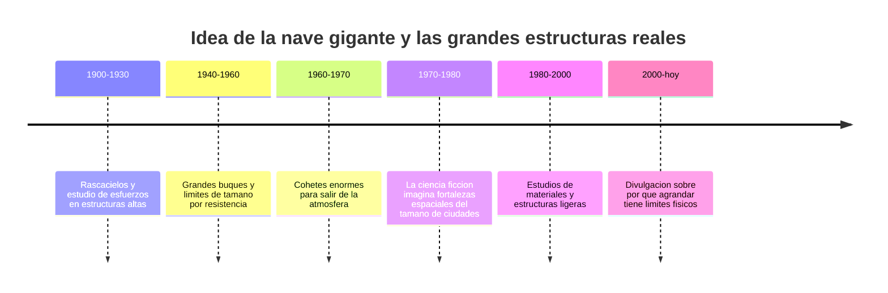

# 📜 Historia del SDF-1

[🏠 Inicio](../../../README.md) · [🏯 Curso: SDF-1](../README.md) · 📜 Historia

> ⚖️ Material educativo original; los derechos de las obras pertenecen a sus titulares.

Este módulo situa la idea de la nave-fortaleza gigante dentro de la ciencia
ficción y la compara con la historia real de las grandes estructuras. No
describe una nave oficial: analiza el concepto genérico de "fortaleza volante"
que popularizo el estilo "Robotech" y lo contrasta con lo que la ingeniería sabe
hacer de verdad.

## De donde viene la idea

La nave-fortaleza de la ficción nace del deseo de reunir todo en un solo
vehículo colosal: una ciudad, un puerto, un arsenal y una nave, todo junto. Es
una imagen poderosa porque transmite seguridad y grandeza. El problema es que
hacer algo muy grande no es solo "lo mismo pero más grande": al crecer, la física
cambia de reglas, y ahí empieza lo interesante de este curso.

## Lo real frente a lo imaginado

La historia real de las grandes estructuras siguió otro camino. Cada vez que se
quiso construir algo más alto o más pesado, aparecieron límites: el propio peso
del material, la resistencia de las uniones, la energía para moverlo. No existe
la fortaleza gratis: agrandar una nave multiplica su masa mucho más rápido que
su superficie, y eso obliga a repensar toda la estructura.

| Periodo | Hito de referencia | Importancia para el curso |
| --- | --- | --- |
| 1900-1930 | Estudio de esfuerzos en edificios altos | Muestra que el peso propio limita el tamaño. |
| 1940-1960 | Grandes buques y sus límites | Ejemplo real de escala y estructura. |
| 1960-1970 | Cohetes gigantes para el espacio | Muestra el coste de mover mucha masa. |
| 1970-1980 | Auge de la fortaleza volante en la ficción | Fija la imagen popular de la nave-ciudad. |
| 1980-2000 | Materiales y estructuras ligeras | Explica cómo se pelea contra el peso propio. |
| 2000-hoy | Divulgación de escala e ingeniería | Separa el espectáculo de la realidad. |

## Por  qué la ficción eligió la nave gigante

Una nave del tamaño de una ciudad es un escenario perfecto: dentro caben
personajes, hogares, hangares y batallas. Sirve como refugio y como símbolo de
poder. La ficción prioriza esa grandeza sobre la viabilidad técnica, y eso es una
decisión artística legítima que este curso respeta y analiza.

## Que aprenderemos de todo esto

- Que conceptos de física real evoca la nave aunque los exagere.
- Por  qué la ley del cubo-cuadrado hace tan difíciles a los gigantes.
- Cómo sería una nave-fortaleza si tuviera que respetar la ingeniería real.

## Fuentes

- Registrar aquí las fuentes públicas de divulgación consultadas.
- Enlazar cada fuente también en [`manuales/fuentes.md`](../../../manuales/fuentes.md).

---

[🎓 Portada del curso](../README.md) · [➡️ Siguiente: Características](../operacion/caracteristicas-sdf-1.md)
