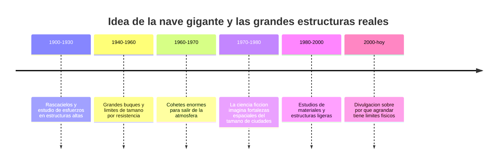

<!-- clase-meta
tipo_documento: clase
clase: 1
codigo: SDF1-01
curso: sdf-1
titulo: "Historia del SDF-1"
modalidad: "teórica dialogada"
duracion_minutos: 45
nivel: introductorio
prerrequisito: ninguno
competencia: "contexto_historico"
resultados_aprendizaje:
  - "Explicar origen, evolución tecnológica, variantes representativas e impacto con vocabulario propio de SDF-1."
  - "Aplicar esos conceptos a una decisión segura o a un escenario de simulación de SDF-1."
evidencia: "Línea de tiempo comentada con cuatro hitos o más."
criterio_aprobacion: "Los hitos están ordenados, son pertinentes y dos relaciones de causa y efecto quedan justificadas."
fuentes: manuales/fuentes.md
ultima_revision: 2026-09-10
-->

# 📜 Historia del SDF-1

[🏠 Inicio](../../../README.md) · [🏯 Curso: SDF-1](../README.md) · 📜 Historia

> ⚖️ Material educativo original; los derechos de las obras pertenecen a sus titulares.

Esta clase situa la idea de la nave-fortaleza gigante dentro de la ciencia
ficción y la compara con la historia real de las grandes estructuras. No
describe una nave oficial: analiza el concepto genérico de "fortaleza volante"
que popularizo el estilo "Robotech" y lo contrasta con lo que la ingeniería sabe
hacer de verdad.

```mermaid
timeline
    title Idea de la nave gigante y las grandes estructuras reales
    1900-1930 : Rascacielos y estudio de esfuerzos en estructuras altas
    1940-1960 : Grandes buques y limites de tamano por resistencia
    1960-1970 : Cohetes enormes para salir de la atmosfera
    1970-1980 : La ciencia ficcion imagina fortalezas espaciales del tamano de ciudades
    1980-2000 : Estudios de materiales y estructuras ligeras
    2000-hoy : Divulgacion sobre por que agrandar tiene limites fisicos
```

## De donde viene la idea

La nave-fortaleza de la ficción nace del deseo de reunir todo en un solo
vehículo colosal: una ciudad, un puerto, un arsenal y una nave, todo junto. Es
una imagen poderosa porque transmite seguridad y grandeza. El problema es que
hacer algo muy grande no es solo "lo mismo pero más grande": al crecer, la física
cambia de reglas, y ahí empieza lo interesante de este curso.

## Lo real frente a lo imaginado

La historia real de las grandes estructuras siguió otro camino. Cada vez que se
quiso construir algo más alto o más pesado, aparecieron límites: el propio peso
del material, la resistencia de las uniones, la energía para moverlo. No existe
la fortaleza gratis: agrandar una nave multiplica su masa mucho más rápido que
su superficie, y eso obliga a repensar toda la estructura.

| Periodo | Hito de referencia | Importancia para el curso |
| --- | --- | --- |
| 1900-1930 | Estudio de esfuerzos en edificios altos | Muestra que el peso propio limita el tamaño. |
| 1940-1960 | Grandes buques y sus límites | Ejemplo real de escala y estructura. |
| 1960-1970 | Cohetes gigantes para el espacio | Muestra el coste de mover mucha masa. |
| 1970-1980 | Auge de la fortaleza volante en la ficción | Fija la imagen popular de la nave-ciudad. |
| 1980-2000 | Materiales y estructuras ligeras | Explica cómo se pelea contra el peso propio. |
| 2000-hoy | Divulgación de escala e ingeniería | Separa el espectáculo de la realidad. |

## Por qué la ficción eligió la nave gigante

Una nave del tamaño de una ciudad es un escenario perfecto: dentro caben
personajes, hogares, hangares y batallas. Sirve como refugio y como símbolo de
poder. La ficción prioriza esa grandeza sobre la viabilidad técnica, y eso es una
decisión artística legítima que este curso respeta y analiza.

## Que aprenderemos de todo esto

- Que conceptos de física real evoca la nave aunque los exagere.
- Por qué la ley del cubo-cuadrado hace tan difíciles a los gigantes.
- Cómo sería una nave-fortaleza si tuviera que respetar la ingeniería real.

## Fuentes

- Registrar aquí las fuentes públicas de divulgación consultadas.
- Enlazar cada fuente también en [`manuales/fuentes.md`](../../../manuales/fuentes.md).

## 🧭 Guía de estudio aplicada

### Pregunta guía

¿Cómo ayuda **De donde viene la idea, Lo real frente a lo imaginado, Por qué la ficción eligió la nave gigante y Que aprenderemos de todo esto** a **explicar cómo la evolución hizo posibles alternativas como modo crucero frente a configuración humanoide**?

### Explicación razonada

La evolución de SDF-1 se comprende mejor como una sucesión de respuestas a problemas, no como una lista de fechas. Los cambios en energía ficticia, propulsión, transformación estructural y nave y población alteraron qué podía hacer la máquina, quién podía usarla y qué riesgos debían controlarse. El contraste «modo crucero frente a configuración humanoide» permite observar qué decisiones de diseño permanecieron y cuáles cambiaron con la tecnología y el propósito.

Esta clase se conecta con el resto del curso mediante **una nave-ciudad combina movilidad, transformación y continuidad de servicios**. El hilo de
seguridad consiste en reconocer a tiempo **tratar la transformación como efecto visual sin impactos en energía, estructura y habitabilidad** y poder justificar la decisión
**secuenciar transición, aislar servicios y representar costos operativos**; en clases posteriores cambiará el ángulo de análisis, no esa relación causal.
La lectura funcional común sigue **energía ficticia → propulsión → transformación estructural → nave y población**, de modo que cada concepto pueda
ubicarse dentro del funcionamiento completo y no quede como un dato aislado.

**Apoyo documental:** [Robotech](https://robotech.com/) aporta referencia oficial del universo ficticio;
[Spaceships and Rockets](https://www.nasa.gov/humans-in-space/spaceships-and-rockets/) se usa para naves, sistemas y misiones. Estas fuentes
se contrastan con el alcance de la clase y no sustituyen un manual de equipo concreto.

### Caso resuelto: de la observación a la decisión

1. **Situar:** ordena los hitos que explican cómo se llegó a **modo crucero frente a configuración humanoide** y describe la necesidad que impulsó cada cambio.
2. **Relacionar:** explica qué se modificó en **energía ficticia**, **propulsión**, **transformación estructural** o **nave y población**; una fecha sin mecanismo no basta.
3. **Interpretar:** vincula el cambio con una capacidad nueva y también con el riesgo **tratar la transformación como efecto visual sin impactos en energía, estructura y habitabilidad**.
4. **Transferir:** usa la evolución para justificar por qué hoy conviene **secuenciar transición, aislar servicios y representar costos operativos**.

### Comprueba tu comprensión

1. ¿Qué necesidad histórica impulsó un cambio en **energía ficticia** o **propulsión**?
2. ¿Qué hito modificó la relación entre capacidad y **tratar la transformación como efecto visual sin impactos en energía, estructura y habitabilidad**?
3. ¿Por qué **modo crucero frente a configuración humanoide** no puede explicarse como una simple diferencia estética?

Orientación para revisar tus respuestas

- La primera respuesta debe relacionar el eslabón elegido con un efecto posterior, no solo nombrarlo.
- La segunda debe proponer una señal medible u observable y explicar qué tendencia sería preocupante.
- La tercera debe cambiar al menos una variable de capacidad, mando, entorno o margen de seguridad.

## 🎓 Cierre de clase

- **Actividad:** Construye una línea de tiempo de SDF-1 y explica cómo dos cambios históricos transformaron su función o su puesto de mando.
- **Evidencia:** Línea de tiempo comentada con cuatro hitos o más.
- **Criterio de aprobación:** Los hitos están ordenados, son pertinentes y dos relaciones de causa y efecto quedan justificadas.
- **Transferencia:** explica qué cambiaría al pasar a otra variante de esta máquina.

### Fuentes de esta clase

- [ROBOTECH-OFFICIAL](https://robotech.com/): Robotech, Harmony Gold. Uso: referencia oficial del universo ficticio.
- [NASA-SPACECRAFT](https://www.nasa.gov/humans-in-space/spaceships-and-rockets/): Spaceships and Rockets, NASA. Uso: naves, sistemas y misiones.
- [NASA-FLIGHT](https://www1.grc.nasa.gov/beginners-guide-to-aeronautics/): Beginner's Guide to Aeronautics, NASA. Uso: contraste con física y vuelo reales.

> Las fuentes sostienen el marco conceptual y normativo; esta clase no reemplaza el manual
> del fabricante, la formación certificada ni la habilitación exigida para operar equipos reales.

---

[🎓 Portada del curso](../README.md) · [➡️ Siguiente: Características](../operacion/caracteristicas-sdf-1.md)
