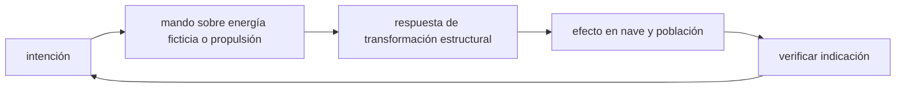

<!-- clase-meta
tipo_documento: clase
clase: 5
codigo: SDF1-05
curso: sdf-1
titulo: "Mandos e instrumentos del SDF-1"
modalidad: "taller de simulación"
duracion_minutos: 60
nivel: introductorio
prerrequisito: SDF1-04
competencia: "lectura_y_mando"
resultados_aprendizaje:
  - "Explicar controles, instrumentos, entradas y estados del sistema con vocabulario propio de SDF-1."
  - "Aplicar esos conceptos a una decisión segura o a un escenario de simulación de SDF-1."
evidencia: "Mapa de mandos y resolución de dos estados del tablero."
criterio_aprobacion: "Reconoce los controles críticos y responde a los estados sin introducir acciones inseguras."
fuentes: manuales/fuentes.md
ultima_revision: 2026-09-10
-->

# 🎛️ Mandos e instrumentos del SDF-1

[🏠 Inicio](../../../README.md) · [🏯 Curso: SDF-1](../README.md) · 🎛️ Mandos

> ⚖️ Material educativo original; los derechos de las obras pertenecen a sus titulares.

## Vista general

El puente de mando de una nave-fortaleza realista no se parece a una cabina de
piloto, sino a la sala de control de una gran instalación. Nadie "conduce" una
mole de esta escala con reflejos: se coordinan equipos que vigilan estructura,
energía, propulsión y soporte vital. Como la nave es gigantesca, cada orden de
maniobra tarda en surtir efecto y hay que anticiparse mucho.

## Mapa de controles

| Zona | Control | Tipo | Función | Prioridad | Comentarios |
| --- | --- | --- | --- | --- | --- |
| Puesto de mando | Ordenes de maniobra | Consola | Pedir cambios de rumbo o velocidad | Alta | La respuesta es lenta por la masa. |
| Estación de propulsión | Gestión de motores | Consola | Repartir empuje entre motores | Alta | Coordina el empuje sobre la mole. |
| Estación de estructura | Vigilancia de esfuerzos | Panel | Controlar tensión del casco | Alta | Evita maniobras que danen la estructura. |
| Estación de energía | Reparto de energía | Consola | Distribuir potencia entre sistemas | Alta | Propulsión, soporte vital, defensa. |
| Estación de soporte vital | Control de habitabilidad | Panel | Aire, agua y temperatura interior | Alta | Mantiene con vida a la tripulación. |
| Estación de sensores | Vigilancia del entorno | Pantallas | Detectar objetos y amenazas | Alta | El entorno se explora a gran distancia. |
| Puesto de coordinación | Comunicación interna | Consola | Enlazar a todas las estaciones | Media | Una nave-ciudad necesita coordinación. |

## Instrumentos principales

| Instrumento | Muestra | Unidad | Importancia | Notas |
| --- | --- | --- | --- | --- |
| Vector de velocidad | Dirección y módulo del movimiento | m/s | Alta | Cambia muy despacio por la masa. |
| Orientación global | Hacia donde apunta la nave | grados | Alta | Reorientar la mole lleva tiempo. |
| Tensión estructural | Esfuerzo en el casco | porcentaje | Alta | Limita la brusquedad de las maniobras. |
| Masa total | Nave, carga y tripulación | toneladas | Alta | Decide la aceleración posible. |
| Presupuesto de maniobra | Delta-v restante | m/s | Alta | Enorme gasto por la masa. |
| Calor acumulado | Calor interno pendiente de disipar | porcentaje | Alta | La superficie limita su evacuación. |
| Estado de soporte vital | Aire, agua, temperatura | varios | Alta | Vital para la tripulación. |

## Entradas de simulación

| Acción | Teclado | Controlador | Comentarios |
| --- | --- | --- | --- |
| Ordenar empuje adelante | Flecha arriba | Gatillo derecho | La nave tarda en acelerar. |
| Ordenar giro | A y D | Stick horizontal | Reorientar lleva mucho tiempo. |
| Vigilar estructura | E | Botón lateral | Muestra la tensión del casco. |
| Repartir energía | 1 a 5 | Cruceta | Prioriza propulsión, defensa o soporte vital. |
| Control de soporte vital | V | Botón de menu | Ajusta aire, agua y temperatura. |
| Alerta estructural | Barra espaciadora | Botón central | Suaviza una maniobra peligrosa. |

## Estados del sistema

| Estado | Descripción | Indicadores | Acciones disponibles |
| --- | --- | --- | --- |
| En estación | Nave estable, sin maniobra | Velocidad casi constante | Vigilar sistemas, planificar. |
| Maniobra lenta | Cambio de rumbo o velocidad en curso | Tensión estructural visible | Ajustar empuje, cuidar la estructura. |
| Alerta estructural | Esfuerzos cerca del límite | Tensión alta | Reducir la maniobra, estabilizar. |
| Emergencia | Falla de energía o soporte vital | Alertas múltiples | Priorizar la vida de la tripulación. |

## Observaciones ergonomicas

- El puente debe mostrar a la vez el movimiento, la tensión estructural y el
  estado del soporte vital: son las tres cosas que pueden hundir la misión.
- Toda maniobra ha de anticiparse: la masa hace que la respuesta llegue tarde.
- La tensión estructural es tan crítica como el combustible: si se supera, la
  nave se dana.
- Conviene un modo asistido que límite automáticamente las maniobras bruscas
  para proteger la estructura.

## 🧭 Guía de estudio aplicada

### Pregunta guía

¿Cómo ayuda **Vista general, Mapa de controles, Instrumentos principales y Entradas de simulación** a **interpretar mandos e indicaciones durante transformación simulada mientras algunos sistemas están degradados**?

### Explicación razonada

Un mando no se aprende memorizando su nombre, sino recorriendo el ciclo intención → acción → indicación → verificación. En SDF-1, el operador actúa sobre energía ficticia o propulsión, observa la respuesta en transformación estructural y confirma el efecto en nave y población. Una indicación inesperada exige detener la secuencia mental, identificar el modo activo y evitar una segunda orden que agrave el estado.

Esta clase se conecta con el resto del curso mediante **una nave-ciudad combina movilidad, transformación y continuidad de servicios**. El hilo de
seguridad consiste en reconocer a tiempo **tratar la transformación como efecto visual sin impactos en energía, estructura y habitabilidad** y poder justificar la decisión
**secuenciar transición, aislar servicios y representar costos operativos**; en clases posteriores cambiará el ángulo de análisis, no esa relación causal.
La lectura funcional común sigue **energía ficticia → propulsión → transformación estructural → nave y población**, de modo que cada concepto pueda
ubicarse dentro del funcionamiento completo y no quede como un dato aislado.

**Apoyo documental:** [Robotech](https://robotech.com/) aporta referencia oficial del universo ficticio;
[Spaceships and Rockets](https://www.nasa.gov/humans-in-space/spaceships-and-rockets/) se usa para naves, sistemas y misiones. Estas fuentes
se contrastan con el alcance de la clase y no sustituyen un manual de equipo concreto.

### Caso resuelto: de la observación a la decisión

1. **Intención:** formula qué cambio se necesita durante **transformación simulada mientras algunos sistemas están degradados**.
2. **Mando:** identifica el control que actúa sobre **energía ficticia** o **propulsión** y el modo que debe estar activo.
3. **Lectura:** localiza la indicación que confirma la respuesta de **transformación estructural** y el efecto en **nave y población**.
4. **Verificación:** si la lectura no coincide, no acumules órdenes; estabiliza e investiga el estado.

### Comprueba tu comprensión

1. ¿Qué mando inicia la respuesta y qué instrumento confirma que el modo correcto está activo?
2. ¿Qué indicación temprana advertiría **tratar la transformación como efecto visual sin impactos en energía, estructura y habitabilidad**?
3. ¿Qué secuencia usarías si la respuesta de **nave y población** no coincide con la orden?

Orientación para revisar tus respuestas

- La primera respuesta debe relacionar el eslabón elegido con un efecto posterior, no solo nombrarlo.
- La segunda debe proponer una señal medible u observable y explicar qué tendencia sería preocupante.
- La tercera debe cambiar al menos una variable de capacidad, mando, entorno o margen de seguridad.

## 🎓 Cierre de clase

- **Actividad:** Recorre el puesto de mando simulado de SDF-1: localiza los controles de controles, instrumentos, entradas y estados del sistema y asocia cada indicación con una decisión.
- **Evidencia:** Mapa de mandos y resolución de dos estados del tablero.
- **Criterio de aprobación:** Reconoce los controles críticos y responde a los estados sin introducir acciones inseguras.
- **Transferencia:** explica qué cambiaría al pasar a otra variante de esta máquina.

### Fuentes de esta clase

- [ROBOTECH-OFFICIAL](https://robotech.com/): Robotech, Harmony Gold. Uso: referencia oficial del universo ficticio.
- [NASA-SPACECRAFT](https://www.nasa.gov/humans-in-space/spaceships-and-rockets/): Spaceships and Rockets, NASA. Uso: naves, sistemas y misiones.
- [NASA-FLIGHT](https://www1.grc.nasa.gov/beginners-guide-to-aeronautics/): Beginner's Guide to Aeronautics, NASA. Uso: contraste con física y vuelo reales.

> Las fuentes sostienen el marco conceptual y normativo; esta clase no reemplaza el manual
> del fabricante, la formación certificada ni la habilitación exigida para operar equipos reales.

---

[⬅️ Anterior: Sistemas mecánicos](../operacion/sistemas-mecanicos-sdf-1.md) · [➡️ Siguiente: Principios y operación](../operacion/principios-sdf-1.md)
