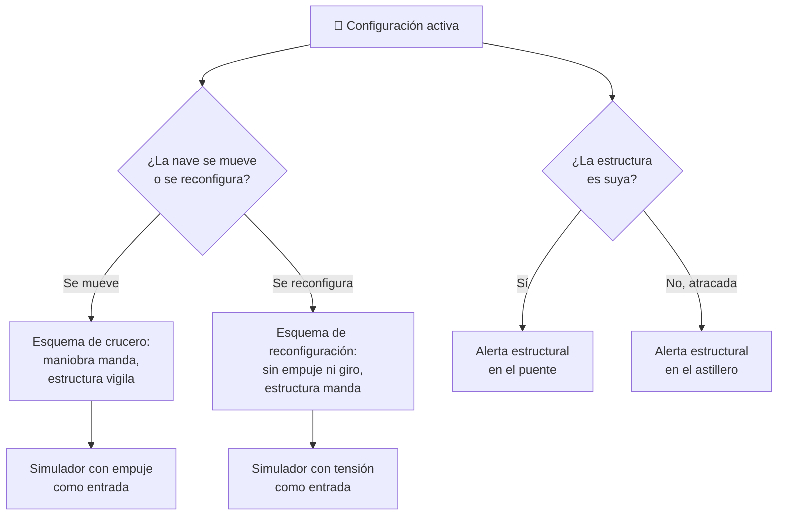

# 🧩 Modelos y variantes del SDF-1

[🏠 Inicio](../../../README.md) · [🏯 Curso: SDF-1](../README.md) · 🧩 Modelos

> ⚖️ Material educativo original; los derechos de las obras pertenecen a sus titulares.

El [Módulo 2](../operacion/caracteristicas-sdf-1.md) ya dijo qué es una
nave-fortaleza y qué tipos conceptuales caben bajo esa idea: refugio, astillero
y bastión. También dejó anotado el rasgo más incómodo de todos, la
**transformación**. Este módulo responde a lo siguiente: esas no son versiones
de una misma nave, son **configuraciones**, y una nave que se reconfigura deja
de ser una sola máquina en cuanto la miras desde el puente.

> 🎯 **La idea que sostiene el módulo.** Cambiar de configuración a esta escala
> no reordena piezas: reordena la estructura que sostiene el peso propio y, con
> ella, quién manda la nave. Cada configuración tiene otro reparto de masa, otro
> camino de esfuerzos y otro puesto de mando al frente. Un simulador que ofrezca
> un solo esquema de control está representando una configuración concreta
> aunque diga representarlas todas.

---

## 🧭 Por qué la configuración decide el simulador

El [Módulo 5](../mandos/manual-mandos-sdf-1.md) describe un puente donde las
órdenes de maniobra mandan y la estación de estructura vigila: la propulsión
propone, la estructura avisa. El [Módulo 9](../simulacion/diseno-simulador-sdf-1.md)
expone ese mismo reparto en sus variables, con `Empuje de motores` como entrada
y `Tensión estructural` como consecuencia. Ambos describen la nave **en su
configuración de crucero**, moviéndose por el vacío como un bloque.

Durante una reconfiguración ese reparto se invierte. La nave no maniobra: se
está abriendo. `Tensión estructural` deja de ser el resultado de una orden de
empuje y pasa a ser la variable que gobierna la partida, porque el casco está
recorriendo estados intermedios donde el peso propio del [Módulo 6](../operacion/principios-sdf-1.md)
no encuentra el camino para el que fue diseñado. Si el simulador se construye
sobre el esquema de crucero y luego se le "añade" la transformación, el
resultado es una mole que se reconfigura mientras acelera, que es exactamente la
regla de ficción que el [Módulo 8](../reglamentos/reglas-universo-sdf-1.md)
marca como no real.

---

## 🗂️ Qué cambia en el manejo

| Configuración | Qué cambia en su operación |
| --- | --- |
| Crucero (forma base) | La referencia del curso: el casco se comporta como un bloque, la maniobra es lentísima y la estructura solo avisa. |
| Reconfiguración en curso | La nave no va a ninguna parte. Toda la operación consiste en atravesar los estados intermedios sin pasarse de esfuerzo. |
| Nave-refugio | Mucho volumen habitable: la masa sube al cubo y el soporte vital para miles de personas pasa a marcar el ritmo de todo lo demás. |
| Nave-astillero | Hangares y talleres abiertos: la estructura pierde continuidad justo donde antes repartía esfuerzos. |
| Nave-bastión | Blindaje y armamento: aún más masa sobre la misma superficie, y el empuje se queda corto para la mole resultante. |
| Atracada en astillero | La estructura la sostiene un apoyo externo. La nave deja de gestionar su propio peso y pasa a depender de otro. |

---

## 🎛️ Qué cambia en el mando

| Configuración | Qué mando aparece o desaparece | Consecuencia |
| --- | --- | --- |
| Crucero (forma base) | Ninguno: el mapa de controles del Módulo 5 aplica tal cual. | Cambian los márgenes, no los controles. |
| Reconfiguración en curso | **Desaparecen** las órdenes de maniobra y la gestión de motores. La vigilancia de esfuerzos **deja de ser un panel y pasa a ser la consola que manda**. | La estación de estructura, que solo avisaba, dirige la nave. No se maniobra y se reconfigura a la vez. |
| Nave-refugio | **Aparece** el control de habitabilidad como mando de primera línea, por delante del reparto de energía. | El soporte vital deja de ser una condición de fondo y compite por la energía con la propulsión. |
| Nave-astillero | **Aparece** la coordinación con los hangares como demanda permanente sobre el puesto de comunicación interna. | La nave-ciudad se opera hacia dentro tanto como hacia fuera. |
| Nave-bastión | **Aparece** la defensa como destino fijo del reparto de energía. | Lo que se da a la defensa se le quita a la propulsión y al soporte vital. |
| Atracada en astillero | **Desaparece** la vigilancia de esfuerzos como responsabilidad propia: la asume el apoyo externo. | El puente queda sin su alarma más crítica; la estructura ya no es suya. |

---

## 🎮 Qué cambia en el simulador

Contrastado con las variables del
[Módulo 9](../simulacion/diseno-simulador-sdf-1.md):

| Configuración | Variables que cambian | Esquema de control |
| --- | --- | --- |
| Crucero (forma base) | Ninguna: es el caso base. | El del Módulo 5. |
| Reconfiguración en curso | `Empuje de motores` **se anula** durante la maniobra. `Tensión estructural` deja de ser salida y pasa a ser la variable que se pilota. | Sin entrada de empuje ni de giro; la estructura es la única entrada viva. |
| Nave-refugio | `Masa total` sube al cubo del `Tamaño de la nave`. `Estado de soporte vital` deja de ser un indicador y pasa a consumir energía de forma continua. | El mismo, con la habitabilidad compitiendo por la energía. |
| Nave-astillero | `Tensión estructural` **cambia de significado**: ya no mide un casco continuo, sino un casco con huecos. | El mismo, con márgenes estructurales más estrechos. |
| Nave-bastión | `Masa total` crece sin que crezca `Empuje de motores`. `Calor acumulado` sube sobre la misma superficie. | El mismo, con respuesta aún más lenta. |
| Atracada en astillero | `Tensión estructural` **se externaliza**: la calcula el apoyo, no la nave. `Gravedad del entorno` pasa a cargar sobre el astillero. | Sin alerta estructural propia. |

Nota: la variable `Modo` del Módulo 9 no es una configuración. Atraviesa a todas:
cualquiera de estas seis se puede jugar en modo ficción o en modo ciencia, y la
diferencia entre ambos modos es justo lo que el curso quiere enseñar.

---

## 🗺️ De la configuración al esquema de control

---

## ⚠️ Qué configuraciones no comparten simulador

Dos casos no se resuelven ajustando parámetros, porque su esquema de control es
otro:

- **La reconfiguración en curso** frente a todas las demás: se apagan dos
  entradas y una salida se convierte en entrada. La estación que solo miraba
  pasa a mandar. Es un modo de control distinto, no una maniobra más difícil.
- **La nave atracada** frente a las demás: su variable más crítica deja de
  calcularse a bordo. No es una nave con la alerta desactivada, es una nave que
  no tiene esa responsabilidad.

Las tres siluetas conceptuales del Módulo 2 —refugio, astillero y bastión— sí
caben en un mismo simulador ajustando masa, superficie y reparto de energía, tal
como plantean los [niveles de realismo](../../../docs/03-niveles-de-realismo.md):
en el nivel 1 las tres se sienten igual de lentas, y las diferencias emergen a
medida que el nivel sube y la ley del cubo-cuadrado empieza a cobrar.

> ⚖️ **El principio detrás de todo esto.** Cuánto pesa la carga y dónde va no cambia
> solo los números: cambia qué puede hacer el operador. La física común a todas las
> máquinas del catálogo —sostener, girar, equilibrar y la masa que cambia en
> marcha— está en [⚖️ carga y manejo](../../../docs/09-carga-y-manejo.md).

---

[⬅️ Anterior: Características](../operacion/caracteristicas-sdf-1.md) · [➡️ Siguiente: Sistemas mecánicos](../operacion/sistemas-mecanicos-sdf-1.md)
