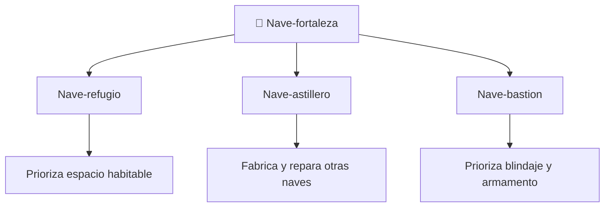

# 📋 Características del SDF-1

[🏠 Inicio](../../../README.md) · [🏯 Curso: SDF-1](../README.md) · 📋 Características

> ⚖️ Material educativo original; los derechos de las obras pertenecen a sus titulares.

Que es una nave-fortaleza gigante genérica, que rasgos la definen en la ficción
y cuales tendrían sentido físico real. Este módulo da el contexto antes de abrir
la tecnología por dentro en el Módulo 3.

---

## 🧭 Definición

Una nave-fortaleza, en la ficción estilo "Robotech", es una nave colosal que
funciona como ciudad, base y arma a la vez. La imaginamos del tamaño de un barrio
entero, con hangares, calles interiores y miles de tripulantes. En este curso la
usamos como excusa para estudiar que le pasa a la física de un vehículo cuando lo
agrandamos hasta ese extremo.

---

## 🧬 Características clave

| Característica | Como la muestra la ficción | Lectura física real |
| --- | --- | --- |
| Tamaño colosal | Del tamaño de una ciudad | Al crecer, la masa sube al cubo: enorme desafío. |
| Interior habitable | Calles, hangares y viviendas | Plausible como concepto, exige mucha estructura. |
| Estructura aparente | Casco que se mueve como un bloque | Su propio peso genera esfuerzos gigantescos. |
| Movilidad | Maniobra pese a su tamaño | Mover tanta masa exige empuje y energía enormes. |
| Autonomía total | Se abastece a si misma | Coherente con la idea de ciudad, muy exigente. |
| Transformación | Cambia de forma en algunas obras | Fascinante, pero muy difícil a esa escala. |

---

## 🗂️ Tipos conceptuales de nave gigante

| Tipo | Idea de diseño | Compromiso físico |
| --- | --- | --- |
| Nave-refugio | Mucho espacio interior | Gran volumen y masa; difícil de mover. |
| Nave-astillero | Hangares y talleres | Estructura compleja y muy pesada. |
| Nave-bastion | Blindaje y armamento | Aun más masa; empuje casi inviable. |

---

## 🎯 Para qué sirve en el relato

- Ofrecer un escenario enorme donde viven y luchan los personajes.
- Representar un símbolo de protección y de poder.
- Permitir historias dentro de la nave, como una ciudad en movimiento.

En cambio, para este curso sirve como laboratorio: cada rasgo colosal nos deja
preguntar si sería posible y por  qué.

---

[⬅️ Anterior: Historia](../historia/historia-sdf-1.md) · [➡️ Siguiente: Sistemas mecánicos](sistemas-mecanicos-sdf-1.md)
