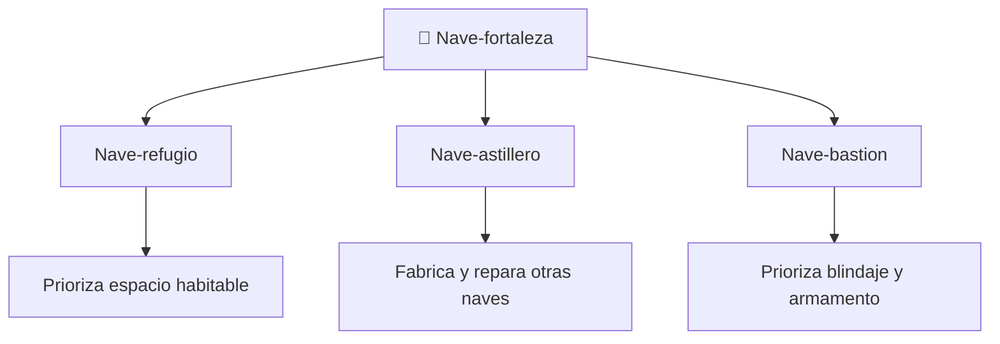

<!-- clase-meta
tipo_documento: clase
clase: 2
codigo: SDF1-02
curso: sdf-1
titulo: "Características del SDF-1"
modalidad: "teórica aplicada"
duracion_minutos: 45
nivel: introductorio
prerrequisito: SDF1-01
competencia: "identificacion_funcional"
resultados_aprendizaje:
  - "Explicar definición, rasgos funcionales, tipos y usos con vocabulario propio de SDF-1."
  - "Aplicar esos conceptos a una decisión segura o a un escenario de simulación de SDF-1."
evidencia: "Matriz comparativa y decisión justificada."
criterio_aprobacion: "La elección considera función, límites, mando y efecto en la simulación; no se apoya solo en preferencias."
fuentes: manuales/fuentes.md
ultima_revision: 2026-09-10
-->

# 📋 Características del SDF-1

[🏠 Inicio](../../../README.md) · [🏯 Curso: SDF-1](../README.md) · 📋 Características

> ⚖️ Material educativo original; los derechos de las obras pertenecen a sus titulares.

Que es una nave-fortaleza gigante genérica, que rasgos la definen en la ficción
y cuales tendrían sentido físico real. Esta clase da el contexto antes de abrir
la tecnología por dentro en el Clase 4.

---

## 🧭 Definición

Una nave-fortaleza, en la ficción estilo "Robotech", es una nave colosal que
funciona como ciudad, base y arma a la vez. La imaginamos del tamaño de un barrio
entero, con hangares, calles interiores y miles de tripulantes. En este curso la
usamos como excusa para estudiar que le pasa a la física de un vehículo cuando lo
agrandamos hasta ese extremo.

---

## 🧬 Características clave

| Característica | Como la muestra la ficción | Lectura física real |
| --- | --- | --- |
| Tamaño colosal | Del tamaño de una ciudad | Al crecer, la masa sube al cubo: enorme desafío. |
| Interior habitable | Calles, hangares y viviendas | Plausible como concepto, exige mucha estructura. |
| Estructura aparente | Casco que se mueve como un bloque | Su propio peso genera esfuerzos gigantescos. |
| Movilidad | Maniobra pese a su tamaño | Mover tanta masa exige empuje y energía enormes. |
| Autonomía total | Se abastece a si misma | Coherente con la idea de ciudad, muy exigente. |
| Transformación | Cambia de forma en algunas obras | Fascinante, pero muy difícil a esa escala. |

---

## 🗂️ Tipos conceptuales de nave gigante

```mermaid
flowchart TD
    Fortaleza[🏯 Nave-fortaleza] --> Refugio[Nave-refugio]
    Fortaleza --> Astillero[Nave-astillero]
    Fortaleza --> Bastion[Nave-bastion]
    Refugio --> Habitat[Prioriza espacio habitable]
    Astillero --> Naves[Fabrica y repara otras naves]
    Bastion --> Defensa[Prioriza blindaje y armamento]
```

| Tipo | Idea de diseño | Compromiso físico |
| --- | --- | --- |
| Nave-refugio | Mucho espacio interior | Gran volumen y masa; difícil de mover. |
| Nave-astillero | Hangares y talleres | Estructura compleja y muy pesada. |
| Nave-bastión | Blindaje y armamento | Aun más masa; empuje casi inviable. |

---

## 🎯 Para qué sirve en el relato

- Ofrecer un escenario enorme donde viven y luchan los personajes.
- Representar un símbolo de protección y de poder.
- Permitir historias dentro de la nave, como una ciudad en movimiento.

En cambio, para este curso sirve como laboratorio: cada rasgo colosal nos deja
preguntar si sería posible y por qué.

## 🧭 Guía de estudio aplicada

### Pregunta guía

¿Cómo ayuda **Definición, Características clave, Tipos conceptuales de nave gigante y Para qué sirve en el relato** a **elegir una configuración adecuada para transformación simulada mientras algunos sistemas están degradados**?

### Explicación razonada

Una característica solo es útil cuando permite anticipar comportamiento. En SDF-1, la relación entre energía ficticia, propulsión, transformación estructural y nave y población determina capacidad, respuesta y límites. Por eso «modo crucero frente a configuración humanoide» no se compara por apariencia: se compara por misión, entorno, carga de trabajo y exposición al riesgo «tratar la transformación como efecto visual sin impactos en energía, estructura y habitabilidad».

Esta clase se conecta con el resto del curso mediante **una nave-ciudad combina movilidad, transformación y continuidad de servicios**. El hilo de
seguridad consiste en reconocer a tiempo **tratar la transformación como efecto visual sin impactos en energía, estructura y habitabilidad** y poder justificar la decisión
**secuenciar transición, aislar servicios y representar costos operativos**; en clases posteriores cambiará el ángulo de análisis, no esa relación causal.
La lectura funcional común sigue **energía ficticia → propulsión → transformación estructural → nave y población**, de modo que cada concepto pueda
ubicarse dentro del funcionamiento completo y no quede como un dato aislado.

**Apoyo documental:** [Robotech](https://robotech.com/) aporta referencia oficial del universo ficticio;
[Spaceships and Rockets](https://www.nasa.gov/humans-in-space/spaceships-and-rockets/) se usa para naves, sistemas y misiones. Estas fuentes
se contrastan con el alcance de la clase y no sustituyen un manual de equipo concreto.

### Caso resuelto: de la observación a la decisión

1. **Definir la necesidad:** convierte «transformación simulada mientras algunos sistemas están degradados» en requisitos de capacidad, entorno y respuesta.
2. **Comparar:** contrasta **modo crucero frente a configuración humanoide** usando esos requisitos y la cadena **energía ficticia → propulsión → transformación estructural → nave y población**.
3. **Descartar:** elimina la alternativa que deja menos margen frente a **tratar la transformación como efecto visual sin impactos en energía, estructura y habitabilidad**.
4. **Elegir:** declara la variante escogida, la evidencia usada y una limitación que todavía debe respetarse.

### Comprueba tu comprensión

1. ¿Qué característica de **nave y población** condiciona primero el caso «transformación simulada mientras algunos sistemas están degradados»?
2. ¿Qué requisito descartaría una de las alternativas **modo crucero frente a configuración humanoide**?
3. ¿Qué límite debe declararse junto con la variante elegida?

Orientación para revisar tus respuestas

- La primera respuesta debe relacionar el eslabón elegido con un efecto posterior, no solo nombrarlo.
- La segunda debe proponer una señal medible u observable y explicar qué tendencia sería preocupante.
- La tercera debe cambiar al menos una variable de capacidad, mando, entorno o margen de seguridad.

## 🎓 Cierre de clase

- **Actividad:** Compara variantes de SDF-1 mediante los ejes «definición, rasgos funcionales, tipos y usos» y elige una para un caso de uso razonado.
- **Evidencia:** Matriz comparativa y decisión justificada.
- **Criterio de aprobación:** La elección considera función, límites, mando y efecto en la simulación; no se apoya solo en preferencias.
- **Transferencia:** explica qué cambiaría al pasar a otra variante de esta máquina.

### Fuentes de esta clase

- [ROBOTECH-OFFICIAL](https://robotech.com/): Robotech, Harmony Gold. Uso: referencia oficial del universo ficticio.
- [NASA-SPACECRAFT](https://www.nasa.gov/humans-in-space/spaceships-and-rockets/): Spaceships and Rockets, NASA. Uso: naves, sistemas y misiones.
- [NASA-FLIGHT](https://www1.grc.nasa.gov/beginners-guide-to-aeronautics/): Beginner's Guide to Aeronautics, NASA. Uso: contraste con física y vuelo reales.

> Las fuentes sostienen el marco conceptual y normativo; esta clase no reemplaza el manual
> del fabricante, la formación certificada ni la habilitación exigida para operar equipos reales.

---

[⬅️ Anterior: Historia](../historia/historia-sdf-1.md) · [➡️ Siguiente: Modelos y variantes](../modelos/modelos-sdf-1.md)
