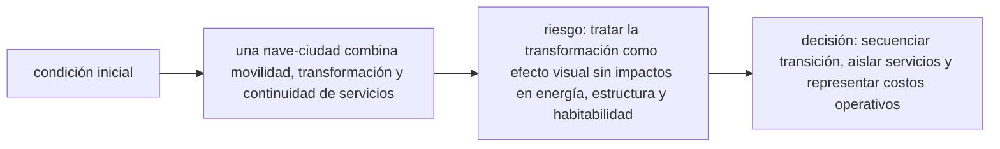

<!-- clase-meta
tipo_documento: clase
clase: 6
codigo: SDF1-06
curso: sdf-1
titulo: "Principios y operación del SDF-1"
modalidad: "resolución de problemas"
duracion_minutos: 90
nivel: introductorio
prerrequisito: SDF1-05
competencia: "razonamiento_operacional"
resultados_aprendizaje:
  - "Explicar principios físicos, fases de operación, decisiones y errores frecuentes con vocabulario propio de SDF-1."
  - "Aplicar esos conceptos a una decisión segura o a un escenario de simulación de SDF-1."
evidencia: "Resolución argumentada de un escenario operacional."
criterio_aprobacion: "Aplica los principios correctos, anticipa consecuencias y respeta los límites del curso."
fuentes: manuales/fuentes.md
ultima_revision: 2026-09-10
-->

# 🧪 Principios y operación del SDF-1

[🏠 Inicio](../../../README.md) · [🏯 Curso: SDF-1](../README.md) · 🧪 Principios

> ⚖️ Material educativo original; los derechos de las obras pertenecen a sus titulares.

Documento educativo y de divulgación. Aquí está el corazón del curso: la ley del
cubo-cuadrado y por qué las naves gigantes son un problema de ingeniería real.
Explica que si sería posible, que no, y sobre todo por qué.

## La ley del cubo-cuadrado

Cuando agrandas un objeto sin cambiar su forma:

- Su **superficie** crece con el cuadrado del tamaño.
- Su **volumen** y su **masa** crecen con el cubo del tamaño.

Si duplicas cada medida, la superficie se multiplica por cuatro pero la masa por
ocho. Como la resistencia de una columna depende de su superficie, y el peso que
soporta depende del volumen, agrandar mucho un objeto hace que su propio peso
supere lo que su estructura puede aguantar. Por eso no basta con "hacer lo mismo
más grande": a cierta escala, la física se vuelve el enemigo.

## Por qué la masa lo cambia todo

- **Aceleración pequeña**: la aceleración es el empuje dividido por la masa. Una
  nave colosal, aunque tenga motores enormes, acelera muy despacio.
- **Maniobra lenta**: reorientar o frenar una mole exige tiempo y planificación;
  no hay giros bruscos posibles.
- **Gasto enorme**: cambiar la velocidad de tanta masa consume cantidades
  descomunales de propelente y recorta el delta-v.

## Estructura: el peso propio como enemigo

En un gigante, el mayor rival no es el enemigo, sino su propio peso. La
estructura interna tiene que sostener toda la masa y repartir los esfuerzos de
cada maniobra sin romperse ni deformarse. Hacer las paredes más gruesas parece la
solución, pero añade aún más masa, que exige más estructura: un círculo del que
la escala no deja escapar fácilmente.

## Calor: fácil de generar, difícil de expulsar

Una nave-ciudad genera muchísimo calor: motores, energía y miles de personas. En
el vacío el calor solo sale por radiación, a través de la superficie. Pero la
superficie crece con el cuadrado y el calor generado con el volumen, que crece
con el cubo. Cuanto más grande es la nave, más le cuesta refrigerarse. Es la ley
del cubo-cuadrado otra vez, ahora en forma de calor.

## Que si y que no

| Idea de la ficción | Que si es real | Que no es real |
| --- | --- | --- |
| Una nave del tamaño de una ciudad | Se pueden hacer estructuras grandes | La escala colosal choca con el peso propio. |
| Maniobra ágil pese a su tamaño | Se puede mover con empuje | Una mole acelera y gira muy despacio. |
| Estructura que nunca se dobla | Materiales resistentes existen | A esa escala flexiona y sufre esfuerzos enormes. |
| Se refrigera sin problema | El calor se puede radiar | La superficie no basta para tanto calor. |
| Autonomía total sin explicación | El reciclaje es posible | Sostener una ciudad exige sistemas enormes. |
| Transformarse de forma | Existen mecanismos móviles | A esa escala sería un reto casi imposible. |

## Cómo sería una nave gigante realista

- Maniobraría muy despacio, con cambios de rumbo planificados con antelación.
- Tendría una estructura interna enorme solo para sostener su propio peso.
- Dedicaría gran parte de su superficie a radiar calor.
- Gastaría cantidades inmensas de propelente para cualquier cambio de velocidad.

## Relación con los niveles de realismo

- **Nivel 1 (educativo)**: notar que la nave gigante reacciona muy despacio.
- **Nivel 2 (simplificado)**: sumar la ley del cubo-cuadrado y la tensión estructural.
- **Nivel 3 (técnico)**: gestionar masa, estructura, calor y delta-v a gran escala.

Ver [`docs/03-niveles-de-realismo.md`](../../../docs/03-niveles-de-realismo.md)
para el detalle de cada nivel.

## 🧭 Guía de estudio aplicada

### Pregunta guía

¿Cómo ayuda **La ley del cubo-cuadrado, Por qué la masa lo cambia todo, Estructura: el peso propio como enemigo y Calor: fácil de generar, difícil de expulsar** a **resolver transformación simulada mientras algunos sistemas están degradados sin agotar el margen operacional**?

### Explicación razonada

El principio rector puede resumirse así: una nave-ciudad combina movilidad, transformación y continuidad de servicios. Esto explica por qué una misma orden produce resultados distintos cuando cambian velocidad, carga, configuración o entorno. Operar bien consiste en leer la tendencia antes de agotar el margen y tomar esta decisión: secuenciar transición, aislar servicios y representar costos operativos.

Esta clase se conecta con el resto del curso mediante **una nave-ciudad combina movilidad, transformación y continuidad de servicios**. El hilo de
seguridad consiste en reconocer a tiempo **tratar la transformación como efecto visual sin impactos en energía, estructura y habitabilidad** y poder justificar la decisión
**secuenciar transición, aislar servicios y representar costos operativos**; en clases posteriores cambiará el ángulo de análisis, no esa relación causal.
La lectura funcional común sigue **energía ficticia → propulsión → transformación estructural → nave y población**, de modo que cada concepto pueda
ubicarse dentro del funcionamiento completo y no quede como un dato aislado.

**Apoyo documental:** [Robotech](https://robotech.com/) aporta referencia oficial del universo ficticio;
[Spaceships and Rockets](https://www.nasa.gov/humans-in-space/spaceships-and-rockets/) se usa para naves, sistemas y misiones. Estas fuentes
se contrastan con el alcance de la clase y no sustituyen un manual de equipo concreto.

### Caso resuelto: de la observación a la decisión

1. **Datos:** reconoce condiciones, configuración y margen disponibles en **transformación simulada mientras algunos sistemas están degradados**.
2. **Modelo:** aplica **una nave-ciudad combina movilidad, transformación y continuidad de servicios** para predecir una tendencia antes de actuar.
3. **Riesgo:** explica mediante qué cadena de causas podría ocurrir **tratar la transformación como efecto visual sin impactos en energía, estructura y habitabilidad**.
4. **Decisión:** ejecuta mentalmente **secuenciar transición, aislar servicios y representar costos operativos** y define qué observación confirmaría que funcionó.

### Comprueba tu comprensión

1. ¿Qué variable del principio «una nave-ciudad combina movilidad, transformación y continuidad de servicios» cambia primero en el caso?
2. ¿Cómo se propaga ese cambio hasta **nave y población**?
3. ¿Qué evidencia confirmaría que **secuenciar transición, aislar servicios y representar costos operativos** conservó margen operacional?

Orientación para revisar tus respuestas

- La primera respuesta debe relacionar el eslabón elegido con un efecto posterior, no solo nombrarlo.
- La segunda debe proponer una señal medible u observable y explicar qué tendencia sería preocupante.
- La tercera debe cambiar al menos una variable de capacidad, mando, entorno o margen de seguridad.

## 🎓 Cierre de clase

- **Actividad:** Resuelve un escenario de SDF-1 explicando, paso a paso, cómo intervienen principios físicos, fases de operación, decisiones y errores frecuentes.
- **Evidencia:** Resolución argumentada de un escenario operacional.
- **Criterio de aprobación:** Aplica los principios correctos, anticipa consecuencias y respeta los límites del curso.
- **Transferencia:** explica qué cambiaría al pasar a otra variante de esta máquina.

### Fuentes de esta clase

- [ROBOTECH-OFFICIAL](https://robotech.com/): Robotech, Harmony Gold. Uso: referencia oficial del universo ficticio.
- [NASA-SPACECRAFT](https://www.nasa.gov/humans-in-space/spaceships-and-rockets/): Spaceships and Rockets, NASA. Uso: naves, sistemas y misiones.
- [NASA-FLIGHT](https://www1.grc.nasa.gov/beginners-guide-to-aeronautics/): Beginner's Guide to Aeronautics, NASA. Uso: contraste con física y vuelo reales.

> Las fuentes sostienen el marco conceptual y normativo; esta clase no reemplaza el manual
> del fabricante, la formación certificada ni la habilitación exigida para operar equipos reales.

---

[⬅️ Anterior: Mandos](../mandos/manual-mandos-sdf-1.md) · [➡️ Siguiente: Entornos](entornos-sdf-1.md)
