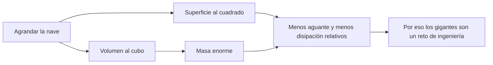

# 🧰 Recursos del SDF-1

[🏠 Inicio](../../../README.md) · [🏯 Curso: SDF-1](../README.md) · 🧰 Recursos

> ⚖️ Material educativo original; los derechos de las obras pertenecen a sus titulares.

Glosario específico, enlaces y diagramas de apoyo del curso de la nave-fortaleza.
Amplia el [glosario general](../../../docs/05-glosario-general.md).

---

## 📖 Glosario específico

| Término | Definición |
| --- | --- |
| Ley del cubo-cuadrado | Al agrandar, la superficie crece al cuadrado y el volumen al cubo. |
| Escala | Tamaño relativo de la nave; decide cómo se comporta su física. |
| Volumen | Espacio que ocupa la nave; crece con el cubo del tamaño. |
| Superficie | Área externa; crece con el cuadrado y limita la disipación de calor. |
| Masa total | Cantidad de materia de la nave; crece con el volumen. |
| Peso propio | Carga que la estructura debe soportar por su propia masa. |
| Tensión estructural | Esfuerzo interno del casco durante una maniobra. |
| Relación empuje/masa | Cociente que decide lo lento o ágil que responde la nave. |
| Radiación de calor | Única vía de expulsar calor en el vacío, por la superficie. |
| Soporte vital | Sistemas que mantienen aire, agua y temperatura habitables. |

---

## 🗺️ Diagrama: la ley del cubo-cuadrado

---

## 🔗 Enlaces y fuentes

- Portada del curso: [🏯 Curso: SDF-1](../README.md)
- Catálogo de naves de ficción: [🌌 Naves de ficción](../../README.md)
- Glosario general: [📖 docs/05-glosario-general.md](../../../docs/05-glosario-general.md)
- Niveles de realismo: [🎚️ docs/03-niveles-de-realismo.md](../../../docs/03-niveles-de-realismo.md)
- Registro de fuentes: [📚 manuales/fuentes.md](../../../manuales/fuentes.md)

Registrar cada recurso nuevo con su origen y licencia, respetando el aviso de
derechos del catálogo de naves de ficción.

---

[🎓 Portada del curso](../README.md) · [⬅️ Anterior: Diseño de simulación](../simulacion/diseno-simulador-sdf-1.md) · [➡️ Siguiente: Ejercicios](../ejercicios/ejercicios-sdf-1.md)
