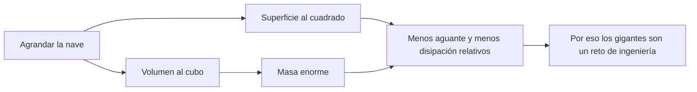

<!-- clase-meta
tipo_documento: clase
clase: 10
codigo: SDF1-10
curso: sdf-1
titulo: "Recursos del SDF-1"
modalidad: "taller documental"
duracion_minutos: 45
nivel: introductorio
prerrequisito: SDF1-09
competencia: "alfabetizacion_tecnica"
resultados_aprendizaje:
  - "Explicar glosario, esquemas y trazabilidad de fuentes con vocabulario propio de SDF-1."
  - "Aplicar esos conceptos a una decisión segura o a un escenario de simulación de SDF-1."
evidencia: "Glosario aplicado y ficha breve de trazabilidad."
criterio_aprobacion: "Los términos permiten interpretar el curso y las fuentes se distinguen por autoridad, alcance y vigencia."
fuentes: manuales/fuentes.md
ultima_revision: 2026-09-10
-->

# 🧰 Recursos del SDF-1

[🏠 Inicio](../../../README.md) · [🏯 Curso: SDF-1](../README.md) · 🧰 Recursos

> ⚖️ Material educativo original; los derechos de las obras pertenecen a sus titulares.

Glosario específico, enlaces y diagramas de apoyo del curso de la nave-fortaleza.
Amplia el [glosario general](../../../docs/05-glosario-general.md).

---

## 📖 Glosario específico

| Término | Definición |
| --- | --- |
| Ley del cubo-cuadrado | Al agrandar, la superficie crece al cuadrado y el volumen al cubo. |
| Escala | Tamaño relativo de la nave; decide cómo se comporta su física. |
| Volumen | Espacio que ocupa la nave; crece con el cubo del tamaño. |
| Superficie | Área externa; crece con el cuadrado y limita la disipación de calor. |
| Masa total | Cantidad de materia de la nave; crece con el volumen. |
| Peso propio | Carga que la estructura debe soportar por su propia masa. |
| Tensión estructural | Esfuerzo interno del casco durante una maniobra. |
| Relación empuje/masa | Cociente que decide lo lento o ágil que responde la nave. |
| Radiación de calor | Única vía de expulsar calor en el vacío, por la superficie. |
| Soporte vital | Sistemas que mantienen aire, agua y temperatura habitables. |

---

## 🗺️ Diagrama: la ley del cubo-cuadrado

```mermaid
flowchart LR
    Crecer[Agrandar la nave] --> Sup[Superficie al cuadrado]
    Crecer --> Vol[Volumen al cubo]
    Vol --> Masa[Masa enorme]
    Sup --> Limite[Menos aguante y menos disipación relativos]
    Masa --> Limite
    Limite --> Idea[Por eso los gigantes son un reto de ingeniería]
```

---

## 🔗 Enlaces y fuentes

- Portada del curso: [🏯 Curso: SDF-1](../README.md)
- Catálogo de naves de ficción: [🌌 Naves de ficción](../../README.md)
- Glosario general: [📖 docs/05-glosario-general.md](../../../docs/05-glosario-general.md)
- Niveles de realismo: [🎚️ docs/03-niveles-de-realismo.md](../../../docs/03-niveles-de-realismo.md)
- Registro de fuentes: [📚 manuales/fuentes.md](../../../manuales/fuentes.md)

Registrar cada recurso nuevo con su origen y licencia, respetando el aviso de
derechos del catálogo de naves de ficción.

## 🧭 Guía de estudio aplicada

### Pregunta guía

¿Cómo ayuda **Glosario específico, Diagrama: la ley del cubo-cuadrado, Enlaces y fuentes y Guía de estudio aplicada** a **explicar con fuentes los términos energía ficticia, propulsión, transformación estructural y nave y población**?

### Explicación razonada

El vocabulario técnico organiza relaciones: energía ficticia, propulsión, transformación estructural y nave y población nombran partes distintas de una misma cadena funcional. Una fuente se usa para sostener una afirmación concreta —principio, límite, procedimiento o contexto— y debe distinguirse del manual particular de un fabricante o de una regla narrativa.

Esta clase se conecta con el resto del curso mediante **una nave-ciudad combina movilidad, transformación y continuidad de servicios**. El hilo de
seguridad consiste en reconocer a tiempo **tratar la transformación como efecto visual sin impactos en energía, estructura y habitabilidad** y poder justificar la decisión
**secuenciar transición, aislar servicios y representar costos operativos**; en clases posteriores cambiará el ángulo de análisis, no esa relación causal.
La lectura funcional común sigue **energía ficticia → propulsión → transformación estructural → nave y población**, de modo que cada concepto pueda
ubicarse dentro del funcionamiento completo y no quede como un dato aislado.

**Apoyo documental:** [Robotech](https://robotech.com/) aporta referencia oficial del universo ficticio;
[Spaceships and Rockets](https://www.nasa.gov/humans-in-space/spaceships-and-rockets/) se usa para naves, sistemas y misiones. Estas fuentes
se contrastan con el alcance de la clase y no sustituyen un manual de equipo concreto.

### Caso resuelto: de la observación a la decisión

1. **Definir en contexto:** explica **energía ficticia**, **propulsión**, **transformación estructural** y **nave y población** por su función y relación.
2. **Respaldar:** enlaza cada afirmación importante con una fuente identificable y declara su alcance.
3. **Contrastar:** separa principios generales, requisitos locales, manual de fabricante y —si aplica— canon ficticio.
4. **Reformular:** convierte una definición copiada en una explicación propia con un ejemplo de **SDF-1**.

### Comprueba tu comprensión

1. Explica la diferencia funcional entre **propulsión** y **transformación estructural** sin copiar una definición.
2. ¿Qué fuente respalda el principio «una nave-ciudad combina movilidad, transformación y continuidad de servicios» y cuál es su alcance?
3. ¿Qué dato exigiría un manual de fabricante en vez de una fuente general?

Orientación para revisar tus respuestas

- La primera respuesta debe relacionar el eslabón elegido con un efecto posterior, no solo nombrarlo.
- La segunda debe proponer una señal medible u observable y explicar qué tendencia sería preocupante.
- La tercera debe cambiar al menos una variable de capacidad, mando, entorno o margen de seguridad.

## 🎓 Cierre de clase

- **Actividad:** Selecciona términos de glosario, esquemas y trazabilidad de fuentes, explícalos en contexto de SDF-1 y verifica la procedencia de las fuentes utilizadas.
- **Evidencia:** Glosario aplicado y ficha breve de trazabilidad.
- **Criterio de aprobación:** Los términos permiten interpretar el curso y las fuentes se distinguen por autoridad, alcance y vigencia.
- **Transferencia:** explica qué cambiaría al pasar a otra variante de esta máquina.

### Fuentes de esta clase

- [ROBOTECH-OFFICIAL](https://robotech.com/): Robotech, Harmony Gold. Uso: referencia oficial del universo ficticio.
- [NASA-SPACECRAFT](https://www.nasa.gov/humans-in-space/spaceships-and-rockets/): Spaceships and Rockets, NASA. Uso: naves, sistemas y misiones.
- [NASA-FLIGHT](https://www1.grc.nasa.gov/beginners-guide-to-aeronautics/): Beginner's Guide to Aeronautics, NASA. Uso: contraste con física y vuelo reales.

> Las fuentes sostienen el marco conceptual y normativo; esta clase no reemplaza el manual
> del fabricante, la formación certificada ni la habilitación exigida para operar equipos reales.

---

[🎓 Portada del curso](../README.md) · [⬅️ Anterior: Diseño de simulación](../simulacion/diseno-simulador-sdf-1.md) · [➡️ Siguiente: Ejercicios](../ejercicios/ejercicios-sdf-1.md)
