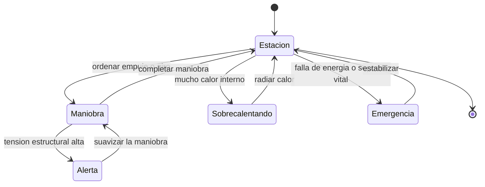
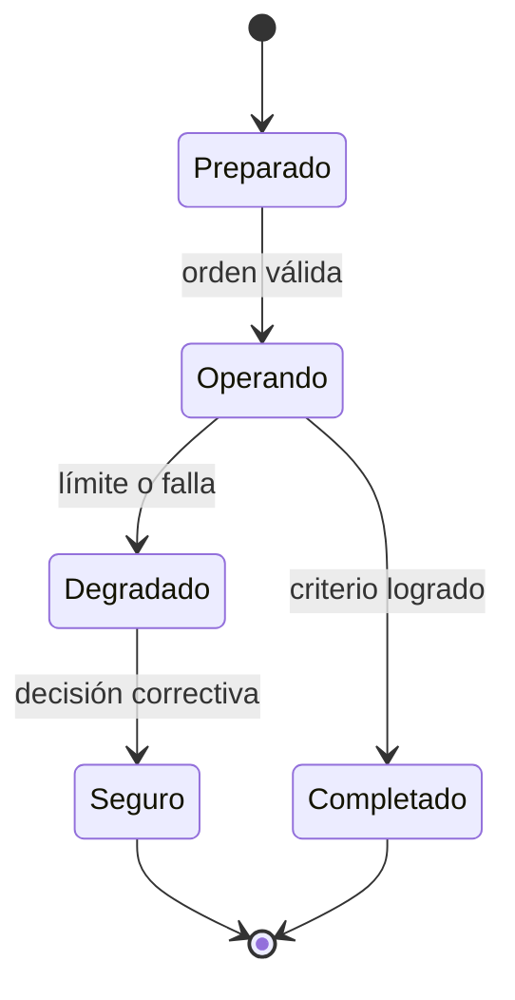

<!-- clase-meta
tipo_documento: clase
clase: 9
codigo: SDF1-09
curso: sdf-1
titulo: "Diseño de simulación del SDF-1"
modalidad: "laboratorio de diseño"
duracion_minutos: 90
nivel: introductorio
prerrequisito: SDF1-08
competencia: "modelado_de_simulacion"
resultados_aprendizaje:
  - "Explicar objetivo, variables, estados, ciclo y escenarios de simulación con vocabulario propio de SDF-1."
  - "Aplicar esos conceptos a una decisión segura o a un escenario de simulación de SDF-1."
evidencia: "Ficha de escenario y diagrama de estados."
criterio_aprobacion: "El modelo es específico de la máquina, medible, seguro y trazable a clases anteriores."
fuentes: manuales/fuentes.md
ultima_revision: 2026-09-10
-->

# 🎮 Diseño de simulación del SDF-1

[🏠 Inicio](../../../README.md) · [🏯 Curso: SDF-1](../README.md) · 🎮 Simulación

> ⚖️ Material educativo original; los derechos de las obras pertenecen a sus titulares.

Como modelar de forma educativa y divertida una nave-fortaleza gigante. La idea
central es poder alternar entre la versión espectacular de la ficción y la
versión fiel a la física, para que el usuario compare ambas con la misma nave, y
sobre todo para que sienta como la escala vuelve lento y delicado cada
movimiento.

```mermaid
stateDiagram-v2
    [*] --> Estacion
    Estacion --> Maniobra: ordenar empuje o giro
    Maniobra --> Estacion: completar maniobra
    Maniobra --> Alerta: tension estructural alta
    Alerta --> Maniobra: suavizar la maniobra
    Estacion --> Sobrecalentando: mucho calor interno
    Sobrecalentando --> Estacion: radiar calor
    Estacion --> Emergencia: falla de energia o soporte vital
    Emergencia --> Estacion: estabilizar
    Estacion --> [*]
```

## Objetivo de la simulación

Que el usuario comprenda, jugando, que agrandar una nave no es gratis: la ley del
cubo-cuadrado dispara la masa, la maniobra se vuelve lentísima, la estructura
sufre y el calor cuesta expulsarse. El modo ficción sirve para engancharse; el
modo ciencia, para aprender.

## Modo ciencia o ficción

La variable más importante del simulador es el **modo**:

- **Modo ficción**: la nave gigante maniobra con soltura, la estructura aguanta
  todo y el calor no molesta. Es divertido y espectacular.
- **Modo ciencia**: se aplican la ley del cubo-cuadrado, la relación empuje/masa,
  la tensión estructural y el límite de disipación de calor. Todo se vuelve
  lento y delicado.

Al cambiar de modo, la interfaz avisa que reglas se activan o desactivan, para
que la comparación sea explícita y educativa.

## Variables principales

| Variable | Tipo | Rango | Afecta a | Comentarios |
| --- | --- | --- | --- | --- |
| Modo | discreta | ciencia / ficción | Todas las reglas | Interruptor central del aprendizaje. |
| Tamaño de la nave | numérica | grande a colosal | Masa y estructura | Aplica la ley del cubo-cuadrado. |
| Masa total | numérica | enorme | Aceleración y delta-v | Crece con el cubo del tamaño. |
| Empuje de motores | numérica | 0-100% | Cambio de velocidad | Aun al máximo, acelera despacio. |
| Tensión estructural | numérica | 0-100% | Integridad del casco | Limita la brusquedad de la maniobra. |
| Calor acumulado | numérica | 0-100% | Riesgo térmico | Se disipa lento por la superficie. |
| Estado de soporte vital | numérica | 0-100% | Habitabilidad | Aire, agua y temperatura interior. |
| Gravedad del entorno | numérica | 0-alta | Trayectoria y esfuerzos | Añade cargas a la estructura. |

## Ciclo básico

1. Leer entrada del usuario (empuje, giro, reparto de energía).
2. Comprobar el modo activo (ciencia o ficción).
3. Calcular la masa total según el tamaño (ley del cubo-cuadrado).
4. Calcular la aceleración como empuje dividido por masa.
5. En modo ciencia, actualizar la tensión estructural con cada maniobra.
6. Actualizar el calor: generado por dentro, radiado por la superficie.
7. Aplicar el entorno: gravedad y esfuerzos.
8. Refrescar instrumentos (velocidad, tensión, calor, soporte vital).

## Modos de juego futuros

- Tutorial de escala: comparar la maniobra de una nave pequeña y una colosal.
- Reto estructural: girar sin superar la tensión del casco.
- Comparador lado a lado: misma maniobra en modo ciencia y en modo ficción.
- Gestión térmica: mantener el calor bajo control con la superficie disponible.
- Operación de atraque en un astillero con apoyo estructural externo.

## Elementos fuera de alcance

- Presentar la maniobra ágil de la nave gigante como si fuera física real.
- Detalles de armamento presentados como datos técnicos reales.
- Cualquier contenido que confunda espectáculo con ciencia sin distinguirlos.

## Pendientes

- [ ] Definir la relación entre tamaño, masa y tensión estructural.
- [ ] Prototipar el ciclo básico con la ley del cubo-cuadrado.
- [ ] Ajustar el modelo de calor por superficie disponible.
- [ ] Agregar fuentes de divulgación a [`manuales/fuentes.md`](../../../manuales/fuentes.md).

## 🧭 Guía de estudio aplicada

### Pregunta guía

¿Cómo ayuda **Objetivo de la simulación, Modo ciencia o ficción, Variables principales y Ciclo básico** a **modelar transformación simulada mientras algunos sistemas están degradados como estados, variables y decisiones observables**?

### Explicación razonada

Una simulación de SDF-1 es educativa si representa decisiones y consecuencias. Como mínimo debe modelar el estado de energía ficticia, la respuesta de propulsión, la transición en transformación estructural y el resultado en nave y población. El escenario «transformación simulada mientras algunos sistemas están degradados» es valioso porque obliga a observar, formular una hipótesis, actuar y comprobar.

```mermaid
stateDiagram-v2
    [*] --> Preparado
    Preparado --> Operando: orden válida
    Operando --> Degradado: límite o falla
    Degradado --> Seguro: decisión correctiva
    Operando --> Completado: criterio logrado
    Seguro --> [*]
    Completado --> [*]
```

Esta clase se conecta con el resto del curso mediante **una nave-ciudad combina movilidad, transformación y continuidad de servicios**. El hilo de
seguridad consiste en reconocer a tiempo **tratar la transformación como efecto visual sin impactos en energía, estructura y habitabilidad** y poder justificar la decisión
**secuenciar transición, aislar servicios y representar costos operativos**; en clases posteriores cambiará el ángulo de análisis, no esa relación causal.
La lectura funcional común sigue **energía ficticia → propulsión → transformación estructural → nave y población**, de modo que cada concepto pueda
ubicarse dentro del funcionamiento completo y no quede como un dato aislado.

**Apoyo documental:** [Robotech](https://robotech.com/) aporta referencia oficial del universo ficticio;
[Spaceships and Rockets](https://www.nasa.gov/humans-in-space/spaceships-and-rockets/) se usa para naves, sistemas y misiones. Estas fuentes
se contrastan con el alcance de la clase y no sustituyen un manual de equipo concreto.

### Caso resuelto: de la observación a la decisión

1. **Estado inicial:** representa transformación simulada mientras algunos sistemas están degradados con valores observables para **energía ficticia**, **propulsión**, **transformación estructural** y **nave y población**.
2. **Decisión del estudiante:** ofrece una elección que cambie el estado, no una animación automática.
3. **Consecuencia:** modela la tendencia hacia **tratar la transformación como efecto visual sin impactos en energía, estructura y habitabilidad** y una señal previa que permita corregir.
4. **Cierre:** evalúa la explicación de la decisión, además de si el estudiante “ganó” el escenario.

### Comprueba tu comprensión

1. ¿Qué cuatro estados mínimos necesita el escenario «transformación simulada mientras algunos sistemas están degradados»?
2. ¿Qué variable anticipa **tratar la transformación como efecto visual sin impactos en energía, estructura y habitabilidad** antes de llegar al estado de falla?
3. ¿Cómo evaluarías la explicación del estudiante y no solo el resultado final?

Orientación para revisar tus respuestas

- La primera respuesta debe relacionar el eslabón elegido con un efecto posterior, no solo nombrarlo.
- La segunda debe proponer una señal medible u observable y explicar qué tendencia sería preocupante.
- La tercera debe cambiar al menos una variable de capacidad, mando, entorno o margen de seguridad.

## 🎓 Cierre de clase

- **Actividad:** Diseña un escenario educativo de SDF-1 basado en objetivo, variables, estados, ciclo y escenarios de simulación, con entradas, estados, variables y criterio de cierre.
- **Evidencia:** Ficha de escenario y diagrama de estados.
- **Criterio de aprobación:** El modelo es específico de la máquina, medible, seguro y trazable a clases anteriores.
- **Transferencia:** explica qué cambiaría al pasar a otra variante de esta máquina.

### Fuentes de esta clase

- [ROBOTECH-OFFICIAL](https://robotech.com/): Robotech, Harmony Gold. Uso: referencia oficial del universo ficticio.
- [NASA-SPACECRAFT](https://www.nasa.gov/humans-in-space/spaceships-and-rockets/): Spaceships and Rockets, NASA. Uso: naves, sistemas y misiones.
- [NASA-FLIGHT](https://www1.grc.nasa.gov/beginners-guide-to-aeronautics/): Beginner's Guide to Aeronautics, NASA. Uso: contraste con física y vuelo reales.

> Las fuentes sostienen el marco conceptual y normativo; esta clase no reemplaza el manual
> del fabricante, la formación certificada ni la habilitación exigida para operar equipos reales.

---

[⬅️ Anterior: Reglas del universo](../reglamentos/reglas-universo-sdf-1.md) · [➡️ Siguiente: Recursos](../recursos/recursos-sdf-1.md)
