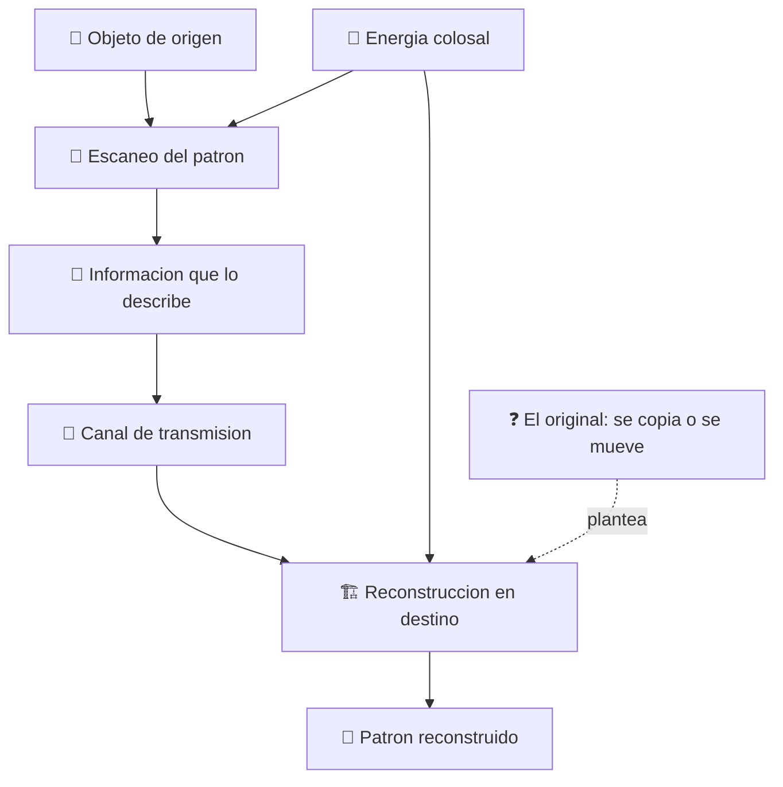

# 🌀 Curso: Teletransportador

[🏠 Inicio](../../README.md) · [🌌 Naves de ficcion](../README.md) · [🎓 Guia de curso](../../docs/08-guia-de-estilo-y-curso.md)

> ⚖️ Material educativo original; los derechos de las obras pertenecen a sus titulares.

---

> Curso de analisis educativo de ciencia ficcion sobre el teletransportador,
> ese aparato generico que "desmaterializa" a alguien en un sitio y lo hace
> "aparecer" en otro. Lo usamos como excusa para estudiar la fisica real de la
> informacion, la energia y el estado cuantico: que seria posible, que no y por
> que la teletransportacion de las historias no es transporte de materia.

---

## 🎯 Objetivos de aprendizaje

Al terminar este curso deberias poder:

- Distinguir entre mover materia y mover la informacion que describe un objeto.
- Estimar por que reconstruir un cuerpo exigiria energia y datos astronomicos.
- Explicar el problema del duplicado: copiar un patron deja dos, no uno.
- Entender que la teleportacion cuantica real transfiere estados, no objetos.
- Razonar el teorema de no clonacion y el limite de la velocidad de la luz.
- Traducir todo lo anterior a variables de un simulador educativo.

---

## 🗺️ Mapa del vehiculo

---

## 📚 Modulos del curso

| # | Modulo | Contenido | Enlace |
| :-: | --- | --- | --- |
| 1 | 📜 Historia | Contexto del teletransportador y de la fisica cuantica real. | [Abrir](historia/historia-teletransportador.md) |
| 2 | 📋 Caracteristicas | Que es un teletransportador generico y para que sirve. | [Abrir](operacion/caracteristicas-teletransportador.md) |
| 3 | 🔧 Sistemas mecanicos | Tecnologia imaginaria frente a la fisica real. | [Abrir](operacion/sistemas-mecanicos-teletransportador.md) |
| 4 | 🎛️ Mandos e instrumentos | Puesto de mando conceptual y controles. | [Abrir](mandos/manual-mandos-teletransportador.md) |
| 5 | 🧪 Principios y operacion | Informacion, energia y estado: que si, que no y por que. | [Abrir](operacion/principios-teletransportador.md) |
| 6 | 🌍 Entornos | Donde y como se usaria el teletransporte. | [Abrir](operacion/entornos-teletransportador.md) |
| 7 | ⚖️ Reglas del universo | Las leyes internas de la ficcion frente a la fisica. | [Abrir](reglamentos/reglas-universo-teletransportador.md) |
| 8 | 🎮 Diseno de simulacion | Variables, ciclo y modo ciencia o ficcion. | [Abrir](simulacion/diseno-simulador-teletransportador.md) |
| 9 | 🧰 Recursos | Glosario, enlaces y diagramas. | [Abrir](recursos/recursos-teletransportador.md) |

---

## 🧩 Requisitos previos

Ninguno formal. Ayuda tener nociones basicas de energia y de informacion, pero
el curso las explica desde cero. La idea central es simple y potente: mover un
objeto por teletransporte no seria mover su materia, sino medir, transmitir y
reconstruir la enorme cantidad de informacion que lo describe, y eso choca con
limites reales de energia, de datos y de la fisica cuantica.

---

[➡️ Empezar por el Modulo 1: Historia](historia/historia-teletransportador.md)
