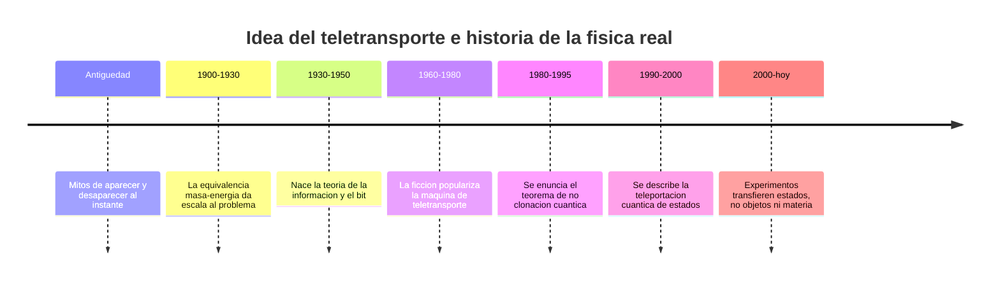

# 📜 Historia del teletransportador

[🏠 Inicio](../../../README.md) · [🌀 Curso: Teletransportador](../README.md) · 📜 Historia

> ⚖️ Material educativo original; los derechos de las obras pertenecen a sus titulares.

Este modulo situa la idea del teletransportador dentro de la ciencia ficcion y
la compara con la historia real de la fisica de la informacion y del estado
cuantico. No describe un aparato oficial: analiza el concepto generico de
"teletransporte" y lo contrasta con lo que la ciencia sabe hacer de verdad.

## De donde viene la idea

El teletransportador de la ficcion resuelve un problema narrativo: llevar a un
personaje de un lugar a otro sin mostrar el viaje. Es una imagen poderosa
porque promete abolir la distancia. El relato rara vez explica el como; se
limita a "desmaterializar" aqui y "materializar" alla. Ese hueco es justo lo
que este curso llena con fisica real.

## Lo real frente a lo imaginado

La ciencia siguio otro camino. Nadie ha movido un objeto desapareciendolo y
rearmandolo en otro sitio. Lo que si existe es la teleportacion cuantica: una
tecnica que transfiere el estado de una particula a otra distante, sin mover la
particula ni superar la velocidad de la luz. Transporta informacion sobre un
estado, no materia, y por eso su nombre confunde a mucha gente.

| Periodo | Hito de referencia | Importancia para el curso |
| --- | --- | --- |
| 1900-1930 | Equivalencia entre masa y energia | Da la escala colosal de energia implicada. |
| 1930-1950 | Teoria de la informacion y el bit | Permite medir cuanta informacion describe un cuerpo. |
| 1960-1980 | Auge del teletransporte en la ficcion | Fija la imagen popular de "desarmar y rearmar". |
| 1980-1995 | Teorema de no clonacion cuantica | Prohibe copiar un estado cuantico desconocido. |
| 1990-2000 | Descripcion de la teleportacion cuantica | Aclara que se transfiere estado, no objeto. |
| 2000-hoy | Experimentos de estados cuanticos | Confirman el limite: informacion, no materia. |

## Por que la ficcion eligio el teletransporte

Contar una historia sin tiempos muertos de viaje es comodo: el personaje
aparece donde hace falta y la accion sigue. Ademas evoca lo maravilloso, lo
instantaneo, lo que no podemos hacer. La ficcion prioriza el efecto sobre el
mecanismo, y esa es una decision artistica legitima que este curso respeta y
analiza sin exigirle rigor cientifico.

## Que aprenderemos de todo esto

- Que conceptos de fisica real evoca el aparato aunque los exagere.
- Que licencias creativas chocan con la energia, la informacion y la fisica cuantica.
- Como se distingue el teletransporte de la ficcion de la teleportacion cuantica real.

## Fuentes

- Registrar aqui las fuentes publicas de divulgacion consultadas.
- Enlazar cada fuente tambien en [`manuales/fuentes.md`](../../../manuales/fuentes.md).

---

[🎓 Portada del curso](../README.md) · [➡️ Siguiente: Caracteristicas](../operacion/caracteristicas-teletransportador.md)
