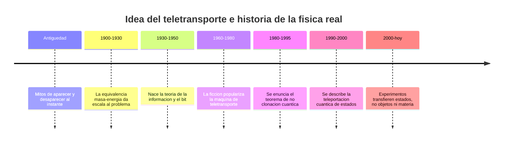

# 📜 Historia del teletransportador

[🏠 Inicio](../../../README.md) · [🌀 Curso: Teletransportador](../README.md) · 📜 Historia

> ⚖️ Material educativo original; los derechos de las obras pertenecen a sus titulares.

Este módulo situa la idea del teletransportador dentro de la ciencia ficción y
la compara con la historia real de la física de la información y del estado
cuántico. No describe un aparato oficial: analiza el concepto genérico de
"teletransporte" y lo contrasta con lo que la ciencia sabe hacer de verdad.

## De donde viene la idea

El teletransportador de la ficción resuelve un problema narrativo: llevar a un
personaje de un lugar a otro sin mostrar el viaje. Es una imagen poderosa
porque promete abolir la distancia. El relato rara vez explica el como; se
limita a "desmaterializar" aquí y "materializar" allá. Ese hueco es justo lo
que este curso llena con física real.

## Lo real frente a lo imaginado

La ciencia siguió otro camino. Nadie ha movido un objeto desapareciendolo y
rearmandolo en otro sitio. Lo que si existe es la teleportación cuántica: una
técnica que transfiere el estado de una partícula a otra distante, sin mover la
partícula ni superar la velocidad de la luz. Transporta información sobre un
estado, no materia, y por eso su nombre confunde a mucha gente.

| Periodo | Hito de referencia | Importancia para el curso |
| --- | --- | --- |
| 1900-1930 | Equivalencia entre masa y energía | Da la escala colosal de energía implicada. |
| 1930-1950 | Teoría de la información y el bit | Permite medir cuanta información describe un cuerpo. |
| 1960-1980 | Auge del teletransporte en la ficción | Fija la imagen popular de "desarmar y rearmar". |
| 1980-1995 | Teorema de no clonación cuántica | Prohibe copiar un estado cuántico desconocido. |
| 1990-2000 | Descripción de la teleportación cuántica | Aclara que se transfiere estado, no objeto. |
| 2000-hoy | Experimentos de estados cuánticos | Confirman el límite: información, no materia. |

## Por qué la ficción eligió el teletransporte

Contar una historia sin tiempos muertos de viaje es cómodo: el personaje
aparece donde hace falta y la acción sigue. Además evoca lo maravilloso, lo
instantáneo, lo que no podemos hacer. La ficción prioriza el efecto sobre el
mecanismo, y esa es una decisión artística legítima que este curso respeta y
analiza sin exigirle rigor científico.

## Que aprenderemos de todo esto

- Que conceptos de física real evoca el aparato aunque los exagere.
- Que licencias creativas chocan con la energía, la información y la física cuántica.
- Cómo se distingue el teletransporte de la ficción de la teleportación cuántica real.

## Fuentes

- Registrar aquí las fuentes públicas de divulgación consultadas.
- Enlazar cada fuente también en [`manuales/fuentes.md`](../../../manuales/fuentes.md).

---

[🎓 Portada del curso](../README.md) · [➡️ Siguiente: Características](../operacion/caracteristicas-teletransportador.md)
