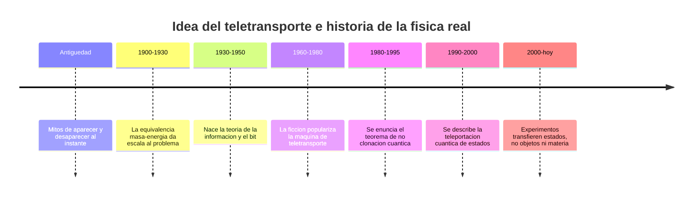

<!-- clase-meta
tipo_documento: clase
clase: 1
codigo: TELETRANSPOR-01
curso: teletransportador
titulo: "Historia del teletransportador"
modalidad: "teórica dialogada"
duracion_minutos: 45
nivel: introductorio
prerrequisito: ninguno
competencia: "contexto_historico"
resultados_aprendizaje:
  - "Explicar origen, evolución tecnológica, variantes representativas e impacto con vocabulario propio de Teletransportador."
  - "Aplicar esos conceptos a una decisión segura o a un escenario de simulación de Teletransportador."
evidencia: "Línea de tiempo comentada con cuatro hitos o más."
criterio_aprobacion: "Los hitos están ordenados, son pertinentes y dos relaciones de causa y efecto quedan justificadas."
fuentes: manuales/fuentes.md
ultima_revision: 2026-09-10
-->

# 📜 Historia del teletransportador

[🏠 Inicio](../../../README.md) · [🌀 Curso: Teletransportador](../README.md) · 📜 Historia

> ⚖️ Material educativo original; los derechos de las obras pertenecen a sus titulares.

Esta clase situa la idea del teletransportador dentro de la ciencia ficción y
la compara con la historia real de la física de la información y del estado
cuántico. No describe un aparato oficial: analiza el concepto genérico de
"teletransporte" y lo contrasta con lo que la ciencia sabe hacer de verdad.

```mermaid
timeline
    title Idea del teletransporte e historia de la fisica real
    Antiguedad : Mitos de aparecer y desaparecer al instante
    1900-1930 : La equivalencia masa-energia da escala al problema
    1930-1950 : Nace la teoria de la informacion y el bit
    1960-1980 : La ficcion populariza la maquina de teletransporte
    1980-1995 : Se enuncia el teorema de no clonacion cuantica
    1990-2000 : Se describe la teleportacion cuantica de estados
    2000-hoy : Experimentos transfieren estados, no objetos ni materia
```

## De donde viene la idea

El teletransportador de la ficción resuelve un problema narrativo: llevar a un
personaje de un lugar a otro sin mostrar el viaje. Es una imagen poderosa
porque promete abolir la distancia. El relato rara vez explica el como; se
limita a "desmaterializar" aquí y "materializar" allá. Ese hueco es justo lo
que este curso llena con física real.

## Lo real frente a lo imaginado

La ciencia siguió otro camino. Nadie ha movido un objeto desapareciendolo y
rearmandolo en otro sitio. Lo que si existe es la teleportación cuántica: una
técnica que transfiere el estado de una partícula a otra distante, sin mover la
partícula ni superar la velocidad de la luz. Transporta información sobre un
estado, no materia, y por eso su nombre confunde a mucha gente.

| Periodo | Hito de referencia | Importancia para el curso |
| --- | --- | --- |
| 1900-1930 | Equivalencia entre masa y energía | Da la escala colosal de energía implicada. |
| 1930-1950 | Teoría de la información y el bit | Permite medir cuanta información describe un cuerpo. |
| 1960-1980 | Auge del teletransporte en la ficción | Fija la imagen popular de "desarmar y rearmar". |
| 1980-1995 | Teorema de no clonación cuántica | Prohibe copiar un estado cuántico desconocido. |
| 1990-2000 | Descripción de la teleportación cuántica | Aclara que se transfiere estado, no objeto. |
| 2000-hoy | Experimentos de estados cuánticos | Confirman el límite: información, no materia. |

## Por qué la ficción eligió el teletransporte

Contar una historia sin tiempos muertos de viaje es cómodo: el personaje
aparece donde hace falta y la acción sigue. Además evoca lo maravilloso, lo
instantáneo, lo que no podemos hacer. La ficción prioriza el efecto sobre el
mecanismo, y esa es una decisión artística legítima que este curso respeta y
analiza sin exigirle rigor científico.

## Que aprenderemos de todo esto

- Que conceptos de física real evoca el aparato aunque los exagere.
- Que licencias creativas chocan con la energía, la información y la física cuántica.
- Cómo se distingue el teletransporte de la ficción de la teleportación cuántica real.

## Fuentes

- Registrar aquí las fuentes públicas de divulgación consultadas.
- Enlazar cada fuente también en [`manuales/fuentes.md`](../../../manuales/fuentes.md).

## 🧭 Guía de estudio aplicada

### Pregunta guía

¿Cómo ayuda **De donde viene la idea, Lo real frente a lo imaginado, Por qué la ficción eligió el teletransporte y Que aprenderemos de todo esto** a **explicar cómo la evolución hizo posibles alternativas como transporte convencional frente a teletransporte narrativo**?

### Explicación razonada

La evolución de Teletransportador se comprende mejor como una sucesión de respuestas a problemas, no como una lista de fechas. Los cambios en sensado ficticio, codificación, transmisión y reconstrucción alteraron qué podía hacer la máquina, quién podía usarla y qué riesgos debían controlarse. El contraste «transporte convencional frente a teletransporte narrativo» permite observar qué decisiones de diseño permanecieron y cuáles cambiaron con la tecnología y el propósito.

Esta clase se conecta con el resto del curso mediante **la tecnología narrativa plantea continuidad, información, energía y verificación de destino**. El hilo de
seguridad consiste en reconocer a tiempo **presentar una ficción sin límites, fallas observables ni dilemas explícitos** y poder justificar la decisión
**definir condiciones de autorización, aborto y evidencia de integridad**; en clases posteriores cambiará el ángulo de análisis, no esa relación causal.
La lectura funcional común sigue **sensado ficticio → codificación → transmisión → reconstrucción**, de modo que cada concepto pueda
ubicarse dentro del funcionamiento completo y no quede como un dato aislado.

**Apoyo documental:** [Star Trek Database](https://www.startrek.com/database) aporta canon narrativo y tecnologías de ficción;
[Quantum Teleportation](https://quantum.cloud.ibm.com/learning/en/courses/basics-of-quantum-information/entanglement-in-action/quantum-teleportation) se usa para información cuántica, entrelazamiento y teorema de no clonación. Estas fuentes
se contrastan con el alcance de la clase y no sustituyen un manual de equipo concreto.

### Caso resuelto: de la observación a la decisión

1. **Situar:** ordena los hitos que explican cómo se llegó a **transporte convencional frente a teletransporte narrativo** y describe la necesidad que impulsó cada cambio.
2. **Relacionar:** explica qué se modificó en **sensado ficticio**, **codificación**, **transmisión** o **reconstrucción**; una fecha sin mecanismo no basta.
3. **Interpretar:** vincula el cambio con una capacidad nueva y también con el riesgo **presentar una ficción sin límites, fallas observables ni dilemas explícitos**.
4. **Transferir:** usa la evolución para justificar por qué hoy conviene **definir condiciones de autorización, aborto y evidencia de integridad**.

### Comprueba tu comprensión

1. ¿Qué necesidad histórica impulsó un cambio en **sensado ficticio** o **codificación**?
2. ¿Qué hito modificó la relación entre capacidad y **presentar una ficción sin límites, fallas observables ni dilemas explícitos**?
3. ¿Por qué **transporte convencional frente a teletransporte narrativo** no puede explicarse como una simple diferencia estética?

Orientación para revisar tus respuestas

- La primera respuesta debe relacionar el eslabón elegido con un efecto posterior, no solo nombrarlo.
- La segunda debe proponer una señal medible u observable y explicar qué tendencia sería preocupante.
- La tercera debe cambiar al menos una variable de capacidad, mando, entorno o margen de seguridad.

## 🎓 Cierre de clase

- **Actividad:** Construye una línea de tiempo de Teletransportador y explica cómo dos cambios históricos transformaron su función o su puesto de mando.
- **Evidencia:** Línea de tiempo comentada con cuatro hitos o más.
- **Criterio de aprobación:** Los hitos están ordenados, son pertinentes y dos relaciones de causa y efecto quedan justificadas.
- **Transferencia:** explica qué cambiaría al pasar a otra variante de esta máquina.

### Fuentes de esta clase

- [STARTREK-DATABASE](https://www.startrek.com/database): Star Trek Database, Paramount. Uso: canon narrativo y tecnologías de ficción.
- [IBM-QUANTUM-TELEPORT](https://quantum.cloud.ibm.com/learning/en/courses/basics-of-quantum-information/entanglement-in-action/quantum-teleportation): Quantum Teleportation, IBM Quantum Learning. Uso: información cuántica, entrelazamiento y teorema de no clonación.
- [NASA-FLIGHT](https://www1.grc.nasa.gov/beginners-guide-to-aeronautics/): Beginner's Guide to Aeronautics, NASA. Uso: contraste con física y vuelo reales.

> Las fuentes sostienen el marco conceptual y normativo; esta clase no reemplaza el manual
> del fabricante, la formación certificada ni la habilitación exigida para operar equipos reales.

---

[🎓 Portada del curso](../README.md) · [➡️ Siguiente: Características](../operacion/caracteristicas-teletransportador.md)
