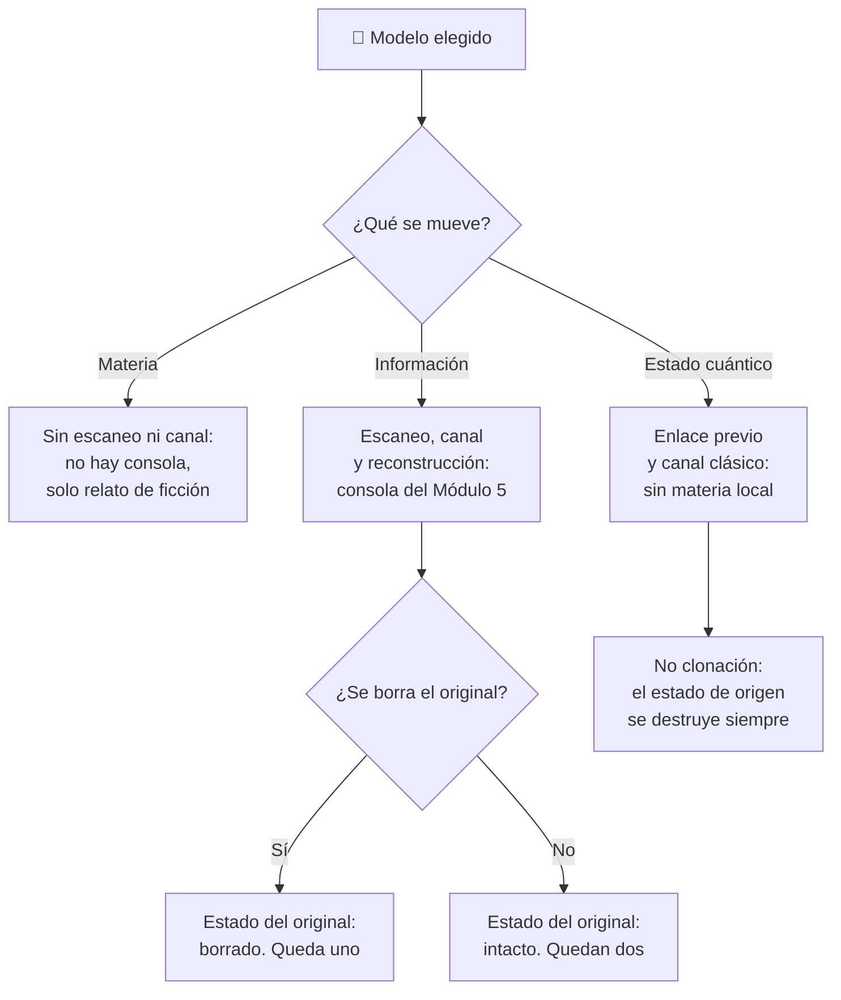

# 🧩 Modelos y variantes del teletransportador

[🏠 Inicio](../../../README.md) · [🌀 Curso: Teletransportador](../README.md) · 🧩 Modelos

> ⚖️ Material educativo original; los derechos de las obras pertenecen a sus titulares.

El [Módulo 2](../operacion/caracteristicas-teletransportador.md) ya separó tres
tipos conceptuales: transporte de materia, copia y reconstrucción, y
transferencia de estado. Este módulo responde a lo siguiente: **esos tres no son
tres versiones del mismo aparato**. Son tres mecanismos distintos, y esa
diferencia no es de matiz. Cambia qué mandos tiene la consola y, por tanto, qué
debe modelar el simulador.

> 🎯 **La idea que sostiene el módulo.** Aquí no hay modelos de máquina que
> comparar, porque el teletransportador no es un vehículo que se conduzca ni
> existe como aparato. Lo que este curso documenta son **modelos conceptuales**:
> hipótesis distintas sobre qué se mueve. Y cada hipótesis genera su propia
> consola. Un simulador que presente un solo esquema de control está
> representando un modelo concreto aunque diga representarlos todos.

---

## 🧭 Por qué el modelo decide el simulador

El [Módulo 5](../mandos/manual-mandos-teletransportador.md) describe un puesto de
mando dividido en tres etapas separadas: escaneo del origen, canal de
transmisión y reconstrucción en destino. El
[Módulo 9](../simulacion/diseno-simulador-teletransportador.md) expone variables
como `Volumen de datos`, `Materia local` y `Estado del original`. Ambos describen
un teletransportador **que escanea, transmite y reconstruye**.

En el modelo de transporte de materia esa división no existe: si los mismos
átomos viajan al destino, no hay patrón que medir, no hay volumen de datos que
transmitir y no hace falta reserva de materia local. Y en la teleportación
cuántica real ocurre lo contrario: la etapa de reconstrucción no ensambla nada,
porque el estado se transfiere a una partícula que ya estaba allí.

Si el simulador se construye sobre el esquema de escanear-transmitir-reconstruir
y luego se le "añade" la teleportación cuántica, el resultado es una
teleportación cuántica que mueve materia, que es exactamente lo que el
[Módulo 9](../simulacion/diseno-simulador-teletransportador.md) declara fuera de
alcance.

---

## 🗂️ Qué cambia en la operación

| Modelo | Qué cambia al operarlo |
| --- | --- |
| Transporte de materia | El modelo de la ficción pura: no hay etapas. No se mide ni se transmite nada; los átomos mismos llegan. El [Módulo 2](../operacion/caracteristicas-teletransportador.md) lo cierra: no hay mecanismo real para mover masa así. |
| Escanear, destruir y reconstruir | La referencia del curso: tres etapas separadas y un original que se borra tras medirlo. El operador gestiona datos, energía y materia local, no un traslado. |
| Copiar sin destruir el original | El mismo proceso, pero sin el borrado. Al terminar hay dos objetos iguales: es el problema del duplicado del [Módulo 6](../operacion/principios-teletransportador.md) sobre la mesa. |
| Transferencia de estado (teleportación cuántica real) | No hay objeto que enviar. Exige un enlace cuántico previo entre origen y destino, y además un canal clásico limitado por la velocidad de la luz. El estado de origen se destruye al transferirse: no es una opción del operador, es el teorema de no clonación. |

---

## 🎛️ Qué cambia en el mando

Contrastado con el mapa de controles del
[Módulo 5](../mandos/manual-mandos-teletransportador.md):

| Modelo | Qué mando aparece o desaparece | Consecuencia |
| --- | --- | --- |
| Escanear, destruir y reconstruir | Ninguno: el mapa de controles del Módulo 5 aplica tal cual. | Es el modelo para el que esa consola fue descrita. |
| Copiar sin destruir el original | Ninguno **se añade**: el `Modo de proceso` ya tiene la posición «copia». Lo que cambia es que el `Estado del original` deja de llegar a «borrado». | El mismo mando, en la otra posición, produce dos objetos en vez de uno. El aborto deja de ser lo único que protege el original. |
| Transporte de materia | **Desaparecen** el ajuste de resolución, el control del canal y la confirmación de destino con su reserva de materia local. | Sin patrón que medir ni datos que enviar, no queda consola: queda un botón. Por eso este modelo no se puede operar, solo narrar. |
| Transferencia de estado (teleportación cuántica real) | El `Modo de proceso` **pierde una de sus dos posiciones**: «copia» queda prohibida por la no clonación. **Aparece** la gestión del enlace cuántico previo, que no existe en ningún otro modelo. | Un selector de dos posiciones se convierte en una constante. El operador ya no elige si queda una o dos: la física lo decide por él. |

---

## 🎮 Qué cambia en el simulador

Contrastado con las variables del
[Módulo 9](../simulacion/diseno-simulador-teletransportador.md):

| Modelo | Variables que cambian | Esquema de control |
| --- | --- | --- |
| Escanear, destruir y reconstruir | Ninguna: es el caso base. `Modo de proceso` en «transferencia», `Estado del original` termina en «borrado». | El del Módulo 5. |
| Copiar sin destruir el original | `Modo de proceso` en «copia»; `Estado del original` se queda en «intacto». El resultado deja de ser un objeto y pasa a ser dos. | El mismo. |
| Transporte de materia | `Volumen de datos`, `Materia local` e `Integridad del patrón` **se eliminan**: no hay patrón. `Distancia` deja de generar retardo de canal. Solo sobrevive `Modo` en «ficción». | Sin escaneo, sin canal, sin reconstrucción. |
| Transferencia de estado (teleportación cuántica real) | `Materia local` **desaparece**: no se ensambla nada en destino. `Modo de proceso` se fija en «transferencia» y deja de ser una entrada del usuario. `Distancia` sigue limitando por la velocidad de la luz, porque el canal clásico es obligatorio. `Modo` queda fijo en «ciencia». | Sin reserva de materia; con enlace previo como requisito de arranque. |

El [Módulo 9](../simulacion/diseno-simulador-teletransportador.md) ya reserva
para esto un escenario propio, «teleportación cuántica con enlace y canal
clásico». Este módulo explica por qué tenía que ser un escenario aparte y no un
ajuste del principal.

---

## 🗺️ Del modelo al esquema de control

---

## ⚠️ Qué modelos no comparten simulador

Dos modelos no se resuelven con un ajuste de parámetros, porque su mecanismo es
otro:

- **El transporte de materia** frente al resto: le faltan tres variables y no le
  queda ninguna etapa que operar. Cabe en el `Modo` «ficción» del
  [Módulo 9](../simulacion/diseno-simulador-teletransportador.md) como
  convención narrativa, tal como lo describe el
  [Módulo 8](../reglamentos/reglas-universo-teletransportador.md), pero no como
  esquema de control.
- **La teleportación cuántica real** frente al resto: elimina la materia local,
  congela el `Modo de proceso` y añade un requisito previo, el enlace, que
  ningún otro modelo tiene. Es un mecanismo distinto, no una dificultad
  distinta. Presentarla como transporte de materia está explícitamente fuera de
  alcance.

Los dos modelos de escaneo sí caben en un mismo simulador cambiando el `Modo de
proceso`, tal como plantean los
[niveles de realismo](../../../docs/03-niveles-de-realismo.md): en el nivel 1
basta con entender que se mueve información, y las diferencias emergen a medida
que el nivel sube hasta modelar la no clonación en el nivel 3.

---

[⬅️ Anterior: Características](../operacion/caracteristicas-teletransportador.md) · [➡️ Siguiente: Sistemas mecánicos](../operacion/sistemas-mecanicos-teletransportador.md)
