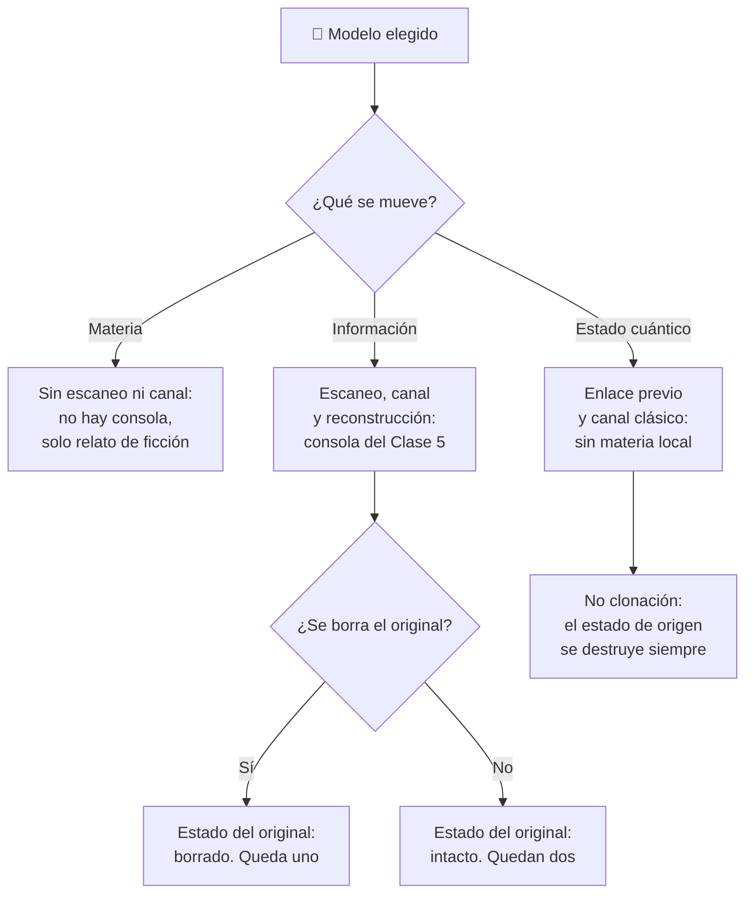

<!-- clase-meta
tipo_documento: clase
clase: 3
codigo: TELETRANSPOR-03
curso: teletransportador
titulo: "Modelos y variantes del teletransportador"
modalidad: "comparativa guiada"
duracion_minutos: 60
nivel: introductorio
prerrequisito: TELETRANSPOR-02
competencia: "seleccion_de_configuracion"
resultados_aprendizaje:
  - "Explicar manejo, arquitectura de mandos y variables de simulación con vocabulario propio de Teletransportador."
  - "Aplicar esos conceptos a una decisión segura o a un escenario de simulación de Teletransportador."
evidencia: "Matriz comparativa y decisión justificada."
criterio_aprobacion: "La elección considera función, límites, mando y efecto en la simulación; no se apoya solo en preferencias."
fuentes: manuales/fuentes.md
ultima_revision: 2026-09-10
-->

# 🧩 Modelos y variantes del teletransportador

[🏠 Inicio](../../../README.md) · [🌀 Curso: Teletransportador](../README.md) · 🧩 Modelos

> ⚖️ Material educativo original; los derechos de las obras pertenecen a sus titulares.

El [Clase 2](../operacion/caracteristicas-teletransportador.md) ya separó tres
tipos conceptuales: transporte de materia, copia y reconstrucción, y
transferencia de estado. Esta clase responde a lo siguiente: **esos tres no son
tres versiones del mismo aparato**. Son tres mecanismos distintos, y esa
diferencia no es de matiz. Cambia qué mandos tiene la consola y, por tanto, qué
debe modelar el simulador.

> 🎯 **La idea que sostiene el módulo.** Aquí no hay modelos de máquina que
> comparar, porque el teletransportador no es un vehículo que se conduzca ni
> existe como aparato. Lo que este curso documenta son **modelos conceptuales**:
> hipótesis distintas sobre qué se mueve. Y cada hipótesis genera su propia
> consola. Un simulador que presente un solo esquema de control está
> representando un modelo concreto aunque diga representarlos todos.

---

## 🧭 Por qué el modelo decide el simulador

El [Clase 5](../mandos/manual-mandos-teletransportador.md) describe un puesto de
mando dividido en tres etapas separadas: escaneo del origen, canal de
transmisión y reconstrucción en destino. El
[Clase 9](../simulacion/diseno-simulador-teletransportador.md) expone variables
como `Volumen de datos`, `Materia local` y `Estado del original`. Ambos describen
un teletransportador **que escanea, transmite y reconstruye**.

En el modelo de transporte de materia esa división no existe: si los mismos
átomos viajan al destino, no hay patrón que medir, no hay volumen de datos que
transmitir y no hace falta reserva de materia local. Y en la teleportación
cuántica real ocurre lo contrario: la etapa de reconstrucción no ensambla nada,
porque el estado se transfiere a una partícula que ya estaba allí.

Si el simulador se construye sobre el esquema de escanear-transmitir-reconstruir
y luego se le "añade" la teleportación cuántica, el resultado es una
teleportación cuántica que mueve materia, que es exactamente lo que el
[Clase 9](../simulacion/diseno-simulador-teletransportador.md) declara fuera de
alcance.

---

## 🗂️ Qué cambia en la operación

| Modelo | Qué cambia al operarlo |
| --- | --- |
| Transporte de materia | El modelo de la ficción pura: no hay etapas. No se mide ni se transmite nada; los átomos mismos llegan. El [Clase 2](../operacion/caracteristicas-teletransportador.md) lo cierra: no hay mecanismo real para mover masa así. |
| Escanear, destruir y reconstruir | La referencia del curso: tres etapas separadas y un original que se borra tras medirlo. El operador gestiona datos, energía y materia local, no un traslado. |
| Copiar sin destruir el original | El mismo proceso, pero sin el borrado. Al terminar hay dos objetos iguales: es el problema del duplicado del [Clase 6](../operacion/principios-teletransportador.md) sobre la mesa. |
| Transferencia de estado (teleportación cuántica real) | No hay objeto que enviar. Exige un enlace cuántico previo entre origen y destino, y además un canal clásico limitado por la velocidad de la luz. El estado de origen se destruye al transferirse: no es una opción del operador, es el teorema de no clonación. |

---

## 🎛️ Qué cambia en el mando

Contrastado con el mapa de controles del
[Clase 5](../mandos/manual-mandos-teletransportador.md):

| Modelo | Qué mando aparece o desaparece | Consecuencia |
| --- | --- | --- |
| Escanear, destruir y reconstruir | Ninguno: el mapa de controles del Clase 5 aplica tal cual. | Es el modelo para el que esa consola fue descrita. |
| Copiar sin destruir el original | Ninguno **se añade**: el `Modo de proceso` ya tiene la posición «copia». Lo que cambia es que el `Estado del original` deja de llegar a «borrado». | El mismo mando, en la otra posición, produce dos objetos en vez de uno. El aborto deja de ser lo único que protege el original. |
| Transporte de materia | **Desaparecen** el ajuste de resolución, el control del canal y la confirmación de destino con su reserva de materia local. | Sin patrón que medir ni datos que enviar, no queda consola: queda un botón. Por eso este modelo no se puede operar, solo narrar. |
| Transferencia de estado (teleportación cuántica real) | El `Modo de proceso` **pierde una de sus dos posiciones**: «copia» queda prohibida por la no clonación. **Aparece** la gestión del enlace cuántico previo, que no existe en ningún otro modelo. | Un selector de dos posiciones se convierte en una constante. El operador ya no elige si queda una o dos: la física lo decide por él. |

---

## 🎮 Qué cambia en el simulador

Contrastado con las variables del
[Clase 9](../simulacion/diseno-simulador-teletransportador.md):

| Modelo | Variables que cambian | Esquema de control |
| --- | --- | --- |
| Escanear, destruir y reconstruir | Ninguna: es el caso base. `Modo de proceso` en «transferencia», `Estado del original` termina en «borrado». | El del Clase 5. |
| Copiar sin destruir el original | `Modo de proceso` en «copia»; `Estado del original` se queda en «intacto». El resultado deja de ser un objeto y pasa a ser dos. | El mismo. |
| Transporte de materia | `Volumen de datos`, `Materia local` e `Integridad del patrón` **se eliminan**: no hay patrón. `Distancia` deja de generar retardo de canal. Solo sobrevive `Modo` en «ficción». | Sin escaneo, sin canal, sin reconstrucción. |
| Transferencia de estado (teleportación cuántica real) | `Materia local` **desaparece**: no se ensambla nada en destino. `Modo de proceso` se fija en «transferencia» y deja de ser una entrada del usuario. `Distancia` sigue limitando por la velocidad de la luz, porque el canal clásico es obligatorio. `Modo` queda fijo en «ciencia». | Sin reserva de materia; con enlace previo como requisito de arranque. |

El [Clase 9](../simulacion/diseno-simulador-teletransportador.md) ya reserva
para esto un escenario propio, «teleportación cuántica con enlace y canal
clásico». Esta clase explica por qué tenía que ser un escenario aparte y no un
ajuste del principal.

---

## 🗺️ Del modelo al esquema de control

```mermaid
flowchart TD
    Modelo[🧩 Modelo elegido] --> Que{¿Qué se mueve?}
    Que -- Materia --> Mat[Sin escaneo ni canal:<br/>no hay consola,<br/>solo relato de ficción]
    Que -- Información --> Info[Escaneo, canal<br/>y reconstrucción:<br/>consola del Clase 5]
    Que -- Estado cuántico --> Est[Enlace previo<br/>y canal clásico:<br/>sin materia local]
    Info --> Borra{¿Se borra el original?}
    Borra -- Sí --> Uno[Estado del original:<br/>borrado. Queda uno]
    Borra -- No --> Dos[Estado del original:<br/>intacto. Quedan dos]
    Est --> NoClon[No clonación:<br/>el estado de origen<br/>se destruye siempre]
```

---

## ⚠️ Qué modelos no comparten simulador

Dos modelos no se resuelven con un ajuste de parámetros, porque su mecanismo es
otro:

- **El transporte de materia** frente al resto: le faltan tres variables y no le
  queda ninguna etapa que operar. Cabe en el `Modo` «ficción» del
  [Clase 9](../simulacion/diseno-simulador-teletransportador.md) como
  convención narrativa, tal como lo describe el
  [Clase 8](../reglamentos/reglas-universo-teletransportador.md), pero no como
  esquema de control.
- **La teleportación cuántica real** frente al resto: elimina la materia local,
  congela el `Modo de proceso` y añade un requisito previo, el enlace, que
  ningún otro modelo tiene. Es un mecanismo distinto, no una dificultad
  distinta. Presentarla como transporte de materia está explícitamente fuera de
  alcance.

Los dos modelos de escaneo sí caben en un mismo simulador cambiando el `Modo de
proceso`, tal como plantean los
[niveles de realismo](../../../docs/03-niveles-de-realismo.md): en el nivel 1
basta con entender que se mueve información, y las diferencias emergen a medida
que el nivel sube hasta modelar la no clonación en el nivel 3.

## 🧭 Guía de estudio aplicada

### Pregunta guía

¿Cómo ayuda **Por qué el modelo decide el simulador, Qué cambia en la operación, Qué cambia en el mando y Qué cambia en el simulador** a **comparar transporte convencional frente a teletransporte narrativo frente al mismo encargo**?

### Explicación razonada

Las variantes «transporte convencional frente a teletransporte narrativo» resuelven prioridades distintas. Una comparación profesional sigue la cadena sensado ficticio → codificación → transmisión → reconstrucción: cada cambio de arquitectura modifica mandos, respuesta, mantenimiento y variables que una simulación debe representar. Elegir un modelo significa justificar qué compromiso sirve mejor al caso, no declarar un favorito.

Esta clase se conecta con el resto del curso mediante **la tecnología narrativa plantea continuidad, información, energía y verificación de destino**. El hilo de
seguridad consiste en reconocer a tiempo **presentar una ficción sin límites, fallas observables ni dilemas explícitos** y poder justificar la decisión
**definir condiciones de autorización, aborto y evidencia de integridad**; en clases posteriores cambiará el ángulo de análisis, no esa relación causal.
La lectura funcional común sigue **sensado ficticio → codificación → transmisión → reconstrucción**, de modo que cada concepto pueda
ubicarse dentro del funcionamiento completo y no quede como un dato aislado.

**Apoyo documental:** [Star Trek Database](https://www.startrek.com/database) aporta canon narrativo y tecnologías de ficción;
[Quantum Teleportation](https://quantum.cloud.ibm.com/learning/en/courses/basics-of-quantum-information/entanglement-in-action/quantum-teleportation) se usa para información cuántica, entrelazamiento y teorema de no clonación. Estas fuentes
se contrastan con el alcance de la clase y no sustituyen un manual de equipo concreto.

### Caso resuelto: de la observación a la decisión

1. **Mantener el encargo constante:** ambas variantes deben evaluarse ante **transporte ficticio con señal degradada y destino parcialmente bloqueado**.
2. **Trazar consecuencias:** para cada variante sigue el efecto desde **sensado ficticio** hasta **reconstrucción**.
3. **Comparar el puesto de mando:** determina qué debe percibir y controlar el operador en cada arquitectura.
4. **Justificar:** elige una variante y explica qué sacrifica; toda selección técnica contiene un compromiso.

### Comprueba tu comprensión

1. ¿Qué cambia en la cadena **sensado ficticio → codificación → transmisión → reconstrucción** entre las dos variantes?
2. ¿Qué indicación o mando adicional necesitaría una de ellas?
3. ¿Cuál elegirías para «transporte ficticio con señal degradada y destino parcialmente bloqueado» y qué desventaja aceptarías?

Orientación para revisar tus respuestas

- La primera respuesta debe relacionar el eslabón elegido con un efecto posterior, no solo nombrarlo.
- La segunda debe proponer una señal medible u observable y explicar qué tendencia sería preocupante.
- La tercera debe cambiar al menos una variable de capacidad, mando, entorno o margen de seguridad.

## 🎓 Cierre de clase

- **Actividad:** Compara variantes de Teletransportador mediante los ejes «manejo, arquitectura de mandos y variables de simulación» y elige una para un caso de uso razonado.
- **Evidencia:** Matriz comparativa y decisión justificada.
- **Criterio de aprobación:** La elección considera función, límites, mando y efecto en la simulación; no se apoya solo en preferencias.
- **Transferencia:** explica qué cambiaría al pasar a otra variante de esta máquina.

### Fuentes de esta clase

- [STARTREK-DATABASE](https://www.startrek.com/database): Star Trek Database, Paramount. Uso: canon narrativo y tecnologías de ficción.
- [IBM-QUANTUM-TELEPORT](https://quantum.cloud.ibm.com/learning/en/courses/basics-of-quantum-information/entanglement-in-action/quantum-teleportation): Quantum Teleportation, IBM Quantum Learning. Uso: información cuántica, entrelazamiento y teorema de no clonación.
- [NASA-FLIGHT](https://www1.grc.nasa.gov/beginners-guide-to-aeronautics/): Beginner's Guide to Aeronautics, NASA. Uso: contraste con física y vuelo reales.

> Las fuentes sostienen el marco conceptual y normativo; esta clase no reemplaza el manual
> del fabricante, la formación certificada ni la habilitación exigida para operar equipos reales.

---

[⬅️ Anterior: Características](../operacion/caracteristicas-teletransportador.md) · [➡️ Siguiente: Sistemas mecánicos](../operacion/sistemas-mecanicos-teletransportador.md)
