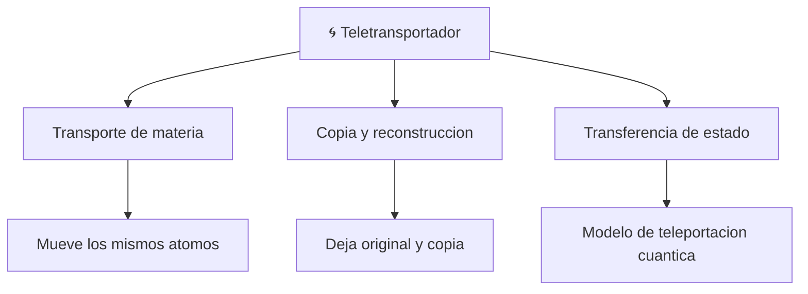

# 📋 Caracteristicas del teletransportador

[🏠 Inicio](../../../README.md) · [🌀 Curso: Teletransportador](../README.md) · 📋 Caracteristicas

> ⚖️ Material educativo original; los derechos de las obras pertenecen a sus titulares.

Que es un teletransportador generico, que rasgos lo definen en la ficcion y
cuales tendrian sentido fisico real. Este modulo da el contexto antes de abrir
la tecnologia por dentro en el Modulo 3.

---

## 🧭 Definicion

Un teletransportador, en la ficcion generica, es un aparato que hace
desaparecer a un objeto o persona en un lugar y aparecer en otro casi al
instante. Lo imaginamos como un mover directo del cuerpo. En este curso lo
usamos como excusa para estudiar que significaria de verdad: medir el objeto,
transmitir la informacion que lo describe y reconstruirlo en el destino.

---

## 🧬 Caracteristicas clave

| Caracteristica | Como la muestra la ficcion | Lectura fisica real |
| --- | --- | --- |
| Traslado instantaneo | El cuerpo aparece de inmediato lejos | Ningun dato puede ir mas rapido que la luz. |
| Desaparicion limpia | El original se esfuma sin resto | Habria que medir y desarmar atomo por atomo. |
| Reconstruccion perfecta | El cuerpo llega identico | Exige una cantidad astronomica de informacion. |
| Gasto de energia discreto | Un simple destello | La equivalencia masa-energia implica energia colosal. |
| Un solo tu al final | Solo aparece uno en el destino | Copiar el patron dejaria dos: el problema del duplicado. |
| Continuidad de la persona | "Eres tu" quien llega | Filosofia abierta: original, copia o ambos. |

---

## 🗂️ Tipos conceptuales de teletransportador

| Tipo | Idea de diseno | Compromiso fisico |
| --- | --- | --- |
| Transporte de materia | Mover los atomos mismos al destino | No hay mecanismo real para mover masa asi. |
| Copia y reconstruccion | Escanear, transmitir y rearmar con materia local | Genera el problema del duplicado y datos enormes. |
| Transferencia de estado | Llevar solo el estado a un cuerpo destino | Es lo unico real, pero mueve estado, no objetos. |

---

## 🎯 Para que sirve en el relato

- Eliminar los tiempos muertos de viaje entre escenas.
- Dar sensacion de tecnologia avanzada y casi magica.
- Resolver situaciones imposibles con una salida rapida.

En cambio, para este curso sirve como laboratorio: cada rasgo llamativo nos
deja preguntar si seria posible y por que.

---

[⬅️ Anterior: Historia](../historia/historia-teletransportador.md) · [➡️ Siguiente: Sistemas mecanicos](sistemas-mecanicos-teletransportador.md)
