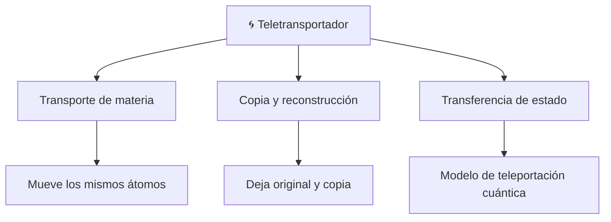

<!-- clase-meta
tipo_documento: clase
clase: 2
codigo: TELETRANSPOR-02
curso: teletransportador
titulo: "Características del teletransportador"
modalidad: "teórica aplicada"
duracion_minutos: 45
nivel: introductorio
prerrequisito: TELETRANSPOR-01
competencia: "identificacion_funcional"
resultados_aprendizaje:
  - "Explicar definición, rasgos funcionales, tipos y usos con vocabulario propio de Teletransportador."
  - "Aplicar esos conceptos a una decisión segura o a un escenario de simulación de Teletransportador."
evidencia: "Matriz comparativa y decisión justificada."
criterio_aprobacion: "La elección considera función, límites, mando y efecto en la simulación; no se apoya solo en preferencias."
fuentes: manuales/fuentes.md
ultima_revision: 2026-09-10
-->

# 📋 Características del teletransportador

[🏠 Inicio](../../../README.md) · [🌀 Curso: Teletransportador](../README.md) · 📋 Características

> ⚖️ Material educativo original; los derechos de las obras pertenecen a sus titulares.

Que es un teletransportador genérico, que rasgos lo definen en la ficción y
cuales tendrían sentido físico real. Esta clase da el contexto antes de abrir
la tecnología por dentro en el Clase 4.

---

## 🧭 Definición

Un teletransportador, en la ficción genérica, es un aparato que hace
desaparecer a un objeto o persona en un lugar y aparecer en otro casi al
instante. Lo imaginamos como un mover directo del cuerpo. En este curso lo
usamos como excusa para estudiar que significaría de verdad: medir el objeto,
transmitir la información que lo describe y reconstruirlo en el destino.

---

## 🧬 Características clave

| Característica | Como la muestra la ficción | Lectura física real |
| --- | --- | --- |
| Traslado instantáneo | El cuerpo aparece de inmediato lejos | Ningún dato puede ir más rápido que la luz. |
| Desaparición limpia | El original se esfuma sin resto | Habría que medir y desarmar átomo por átomo. |
| Reconstrucción perfecta | El cuerpo llega idéntico | Exige una cantidad astronómica de información. |
| Gasto de energía discreto | Un simple destello | La equivalencia masa-energía implica energía colosal. |
| Un solo tú al final | Solo aparece uno en el destino | Copiar el patrón dejaría dos: el problema del duplicado. |
| Continuidad de la persona | "Eres tu" quien llega | Filosofía abierta: original, copia o ambos. |

---

## 🗂️ Tipos conceptuales de teletransportador

```mermaid
flowchart TD
    Tele[🌀 Teletransportador] --> Mueve[Transporte de materia]
    Tele --> Copia[Copia y reconstrucción]
    Tele --> Estado[Transferencia de estado]
    Mueve --> Directo[Mueve los mismos átomos]
    Copia --> Doble[Deja original y copia]
    Estado --> Cuantico[Modelo de teleportación cuántica]
```

| Tipo | Idea de diseño | Compromiso físico |
| --- | --- | --- |
| Transporte de materia | Mover los átomos mismos al destino | No hay mecanismo real para mover masa así. |
| Copia y reconstrucción | Escanear, transmitir y rearmar con materia local | Genera el problema del duplicado y datos enormes. |
| Transferencia de estado | Llevar solo el estado a un cuerpo destino | Es lo único real, pero mueve estado, no objetos. |

---

## 🎯 Para qué sirve en el relato

- Eliminar los tiempos muertos de viaje entre escenas.
- Dar sensación de tecnología avanzada y casi mágica.
- Resolver situaciones imposibles con una salida rápida.

En cambio, para este curso sirve como laboratorio: cada rasgo llamativo nos
deja preguntar si sería posible y por qué.

## 🧭 Guía de estudio aplicada

### Pregunta guía

¿Cómo ayuda **Definición, Características clave, Tipos conceptuales de teletransportador y Para qué sirve en el relato** a **elegir una configuración adecuada para transporte ficticio con señal degradada y destino parcialmente bloqueado**?

### Explicación razonada

Una característica solo es útil cuando permite anticipar comportamiento. En Teletransportador, la relación entre sensado ficticio, codificación, transmisión y reconstrucción determina capacidad, respuesta y límites. Por eso «transporte convencional frente a teletransporte narrativo» no se compara por apariencia: se compara por misión, entorno, carga de trabajo y exposición al riesgo «presentar una ficción sin límites, fallas observables ni dilemas explícitos».

Esta clase se conecta con el resto del curso mediante **la tecnología narrativa plantea continuidad, información, energía y verificación de destino**. El hilo de
seguridad consiste en reconocer a tiempo **presentar una ficción sin límites, fallas observables ni dilemas explícitos** y poder justificar la decisión
**definir condiciones de autorización, aborto y evidencia de integridad**; en clases posteriores cambiará el ángulo de análisis, no esa relación causal.
La lectura funcional común sigue **sensado ficticio → codificación → transmisión → reconstrucción**, de modo que cada concepto pueda
ubicarse dentro del funcionamiento completo y no quede como un dato aislado.

**Apoyo documental:** [Star Trek Database](https://www.startrek.com/database) aporta canon narrativo y tecnologías de ficción;
[Quantum Teleportation](https://quantum.cloud.ibm.com/learning/en/courses/basics-of-quantum-information/entanglement-in-action/quantum-teleportation) se usa para información cuántica, entrelazamiento y teorema de no clonación. Estas fuentes
se contrastan con el alcance de la clase y no sustituyen un manual de equipo concreto.

### Caso resuelto: de la observación a la decisión

1. **Definir la necesidad:** convierte «transporte ficticio con señal degradada y destino parcialmente bloqueado» en requisitos de capacidad, entorno y respuesta.
2. **Comparar:** contrasta **transporte convencional frente a teletransporte narrativo** usando esos requisitos y la cadena **sensado ficticio → codificación → transmisión → reconstrucción**.
3. **Descartar:** elimina la alternativa que deja menos margen frente a **presentar una ficción sin límites, fallas observables ni dilemas explícitos**.
4. **Elegir:** declara la variante escogida, la evidencia usada y una limitación que todavía debe respetarse.

### Comprueba tu comprensión

1. ¿Qué característica de **reconstrucción** condiciona primero el caso «transporte ficticio con señal degradada y destino parcialmente bloqueado»?
2. ¿Qué requisito descartaría una de las alternativas **transporte convencional frente a teletransporte narrativo**?
3. ¿Qué límite debe declararse junto con la variante elegida?

Orientación para revisar tus respuestas

- La primera respuesta debe relacionar el eslabón elegido con un efecto posterior, no solo nombrarlo.
- La segunda debe proponer una señal medible u observable y explicar qué tendencia sería preocupante.
- La tercera debe cambiar al menos una variable de capacidad, mando, entorno o margen de seguridad.

## 🎓 Cierre de clase

- **Actividad:** Compara variantes de Teletransportador mediante los ejes «definición, rasgos funcionales, tipos y usos» y elige una para un caso de uso razonado.
- **Evidencia:** Matriz comparativa y decisión justificada.
- **Criterio de aprobación:** La elección considera función, límites, mando y efecto en la simulación; no se apoya solo en preferencias.
- **Transferencia:** explica qué cambiaría al pasar a otra variante de esta máquina.

### Fuentes de esta clase

- [STARTREK-DATABASE](https://www.startrek.com/database): Star Trek Database, Paramount. Uso: canon narrativo y tecnologías de ficción.
- [IBM-QUANTUM-TELEPORT](https://quantum.cloud.ibm.com/learning/en/courses/basics-of-quantum-information/entanglement-in-action/quantum-teleportation): Quantum Teleportation, IBM Quantum Learning. Uso: información cuántica, entrelazamiento y teorema de no clonación.
- [NASA-FLIGHT](https://www1.grc.nasa.gov/beginners-guide-to-aeronautics/): Beginner's Guide to Aeronautics, NASA. Uso: contraste con física y vuelo reales.

> Las fuentes sostienen el marco conceptual y normativo; esta clase no reemplaza el manual
> del fabricante, la formación certificada ni la habilitación exigida para operar equipos reales.

---

[⬅️ Anterior: Historia](../historia/historia-teletransportador.md) · [➡️ Siguiente: Modelos y variantes](../modelos/modelos-teletransportador.md)
