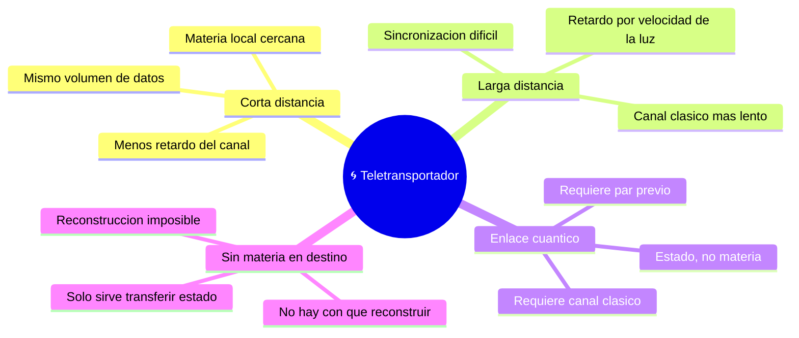

<!-- clase-meta
tipo_documento: clase
clase: 7
codigo: TELETRANSPOR-07
curso: teletransportador
titulo: "Entornos del teletransportador"
modalidad: "análisis de escenarios"
duracion_minutos: 60
nivel: introductorio
prerrequisito: TELETRANSPOR-06
competencia: "adaptacion_al_entorno"
resultados_aprendizaje:
  - "Explicar entornos, factores ambientales, riesgos y respuesta de simulación con vocabulario propio de Teletransportador."
  - "Aplicar esos conceptos a una decisión segura o a un escenario de simulación de Teletransportador."
evidencia: "Matriz entorno–cambio–riesgo–respuesta."
criterio_aprobacion: "Cada respuesta se adapta al entorno y distingue riesgos que no son intercambiables entre escenarios."
fuentes: manuales/fuentes.md
ultima_revision: 2026-09-10
-->

# 🌍 Entornos del teletransportador

[🏠 Inicio](../../../README.md) · [🌀 Curso: Teletransportador](../README.md) · 🌍 Entornos

> ⚖️ Material educativo original; los derechos de las obras pertenecen a sus titulares.

Dónde se usaría un teletransportador y cómo cambia su exigencia según el
entorno. Cada escenario implica límites físicos distintos, y en simulación se
traduce en condiciones diferentes de distancia, energía y materia disponible.

---

## 🗺️ Entornos principales

```mermaid
mindmap
  root((🌀 Teletransportador))
    Corta distancia
      Menos retardo del canal
      Mismo volumen de datos
      Materia local cercana
    Larga distancia
      Retardo por velocidad de la luz
      Canal clasico mas lento
      Sincronizacion dificil
    Enlace cuantico
      Estado, no materia
      Requiere par previo
      Requiere canal clasico
    Sin materia en destino
      No hay con que reconstruir
      Solo sirve transferir estado
      Reconstruccion imposible
```

| Entorno | Características | Riesgos típicos | Ajuste del proceso |
| --- | --- | --- | --- |
| Corta distancia | Poco retardo en el canal. | Igual gasto de datos y energía. | Optimizar escaneo y reserva local. |
| Larga distancia | Retardo grande por la velocidad de la luz. | Pérdida de sincronización. | Planificar el tiempo del canal clásico. |
| Enlace cuántico | Solo transfiere estado, no objetos. | Confundirlo con mover materia. | Preparar el par y el canal clásico. |
| Sin materia en destino | No hay con que reconstruir. | Reconstrucción imposible. | Limitarse a transferir estado. |

---

## 🌡️ Factores del entorno

- **Distancia**: no cambia el volumen de datos, pero si el retardo del canal
  clásico, limitado por la velocidad de la luz.
- **Materia disponible**: sin una reserva de materia en el destino no hay con
  que ensamblar el patrón recibido.
- **Energía accesible**: manipular materia a nivel de partículas exige energía
  colosal; el entorno debe poder aportarla.
- **Ruido e interferencia**: cualquier error en los datos o en el enlace
  cuántico degrada el resultado y puede arruinar el patrón.

---

## 🎮 Traducción a simulación

Cada entorno es un escenario con su distancia, su reserva de materia y su
presupuesto de energía. El paso de transferir estado a intentar reconstruir un
cuerpo cambia por completo lo que es posible y es una gran lección de física.
Ver cómo se modela en el
[Clase 9: Diseño de simulación](../simulacion/diseno-simulador-teletransportador.md).

## 🧭 Guía de estudio aplicada

### Pregunta guía

¿Cómo ayuda **Entornos principales, Factores del entorno, Traducción a simulación y Guía de estudio aplicada** a **adaptar transporte ficticio con señal degradada y destino parcialmente bloqueado a tres condiciones ambientales distintas**?

### Explicación razonada

El entorno no es decoración: modifica las fuerzas, la percepción y el tiempo disponible. En el caso «transporte ficticio con señal degradada y destino parcialmente bloqueado», cambia el comportamiento de reconstrucción y aumenta la probabilidad de presentar una ficción sin límites, fallas observables ni dilemas explícitos. La respuesta correcta empieza por reconocer qué variable cambió y después adaptar límites, ruta o misión.

Esta clase se conecta con el resto del curso mediante **la tecnología narrativa plantea continuidad, información, energía y verificación de destino**. El hilo de
seguridad consiste en reconocer a tiempo **presentar una ficción sin límites, fallas observables ni dilemas explícitos** y poder justificar la decisión
**definir condiciones de autorización, aborto y evidencia de integridad**; en clases posteriores cambiará el ángulo de análisis, no esa relación causal.
La lectura funcional común sigue **sensado ficticio → codificación → transmisión → reconstrucción**, de modo que cada concepto pueda
ubicarse dentro del funcionamiento completo y no quede como un dato aislado.

**Apoyo documental:** [Star Trek Database](https://www.startrek.com/database) aporta canon narrativo y tecnologías de ficción;
[Quantum Teleportation](https://quantum.cloud.ibm.com/learning/en/courses/basics-of-quantum-information/entanglement-in-action/quantum-teleportation) se usa para información cuántica, entrelazamiento y teorema de no clonación. Estas fuentes
se contrastan con el alcance de la clase y no sustituyen un manual de equipo concreto.

### Caso resuelto: de la observación a la decisión

1. **Escenario base:** conserva la misión «transporte ficticio con señal degradada y destino parcialmente bloqueado» para poder comparar.
2. **Cambiar una condición:** modifica sucesivamente superficie o medio, visibilidad y perturbación externa.
3. **Recalcular margen:** explica cómo cada cambio afecta **reconstrucción** y acerca o aleja **presentar una ficción sin límites, fallas observables ni dilemas explícitos**.
4. **Adaptar:** cambia límite, ruta, configuración o incluso cancela; no mantengas la misma respuesta por hábito.

### Comprueba tu comprensión

1. ¿Cómo cambiaría **reconstrucción** si empeora la perturbación externa?
2. ¿Qué condición ambiental acerca más el escenario a **presentar una ficción sin límites, fallas observables ni dilemas explícitos**?
3. ¿Cuándo adaptarías la maniobra y cuándo la cancelarías?

Orientación para revisar tus respuestas

- La primera respuesta debe relacionar el eslabón elegido con un efecto posterior, no solo nombrarlo.
- La segunda debe proponer una señal medible u observable y explicar qué tendencia sería preocupante.
- La tercera debe cambiar al menos una variable de capacidad, mando, entorno o margen de seguridad.

## 🎓 Cierre de clase

- **Actividad:** Contrasta tres entornos de Teletransportador a partir de entornos, factores ambientales, riesgos y respuesta de simulación y determina cómo cambian variables, percepción, riesgos y respuesta.
- **Evidencia:** Matriz entorno–cambio–riesgo–respuesta.
- **Criterio de aprobación:** Cada respuesta se adapta al entorno y distingue riesgos que no son intercambiables entre escenarios.
- **Transferencia:** explica qué cambiaría al pasar a otra variante de esta máquina.

### Fuentes de esta clase

- [STARTREK-DATABASE](https://www.startrek.com/database): Star Trek Database, Paramount. Uso: canon narrativo y tecnologías de ficción.
- [IBM-QUANTUM-TELEPORT](https://quantum.cloud.ibm.com/learning/en/courses/basics-of-quantum-information/entanglement-in-action/quantum-teleportation): Quantum Teleportation, IBM Quantum Learning. Uso: información cuántica, entrelazamiento y teorema de no clonación.
- [NASA-FLIGHT](https://www1.grc.nasa.gov/beginners-guide-to-aeronautics/): Beginner's Guide to Aeronautics, NASA. Uso: contraste con física y vuelo reales.

> Las fuentes sostienen el marco conceptual y normativo; esta clase no reemplaza el manual
> del fabricante, la formación certificada ni la habilitación exigida para operar equipos reales.

---

[⬅️ Anterior: Principios y operación](principios-teletransportador.md) · [➡️ Siguiente: Reglas del universo](../reglamentos/reglas-universo-teletransportador.md)
