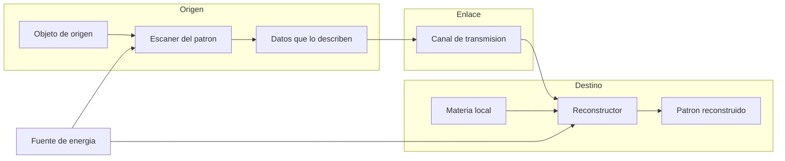
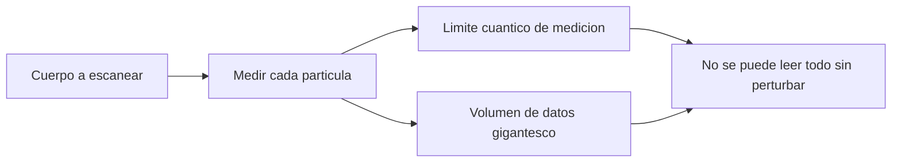
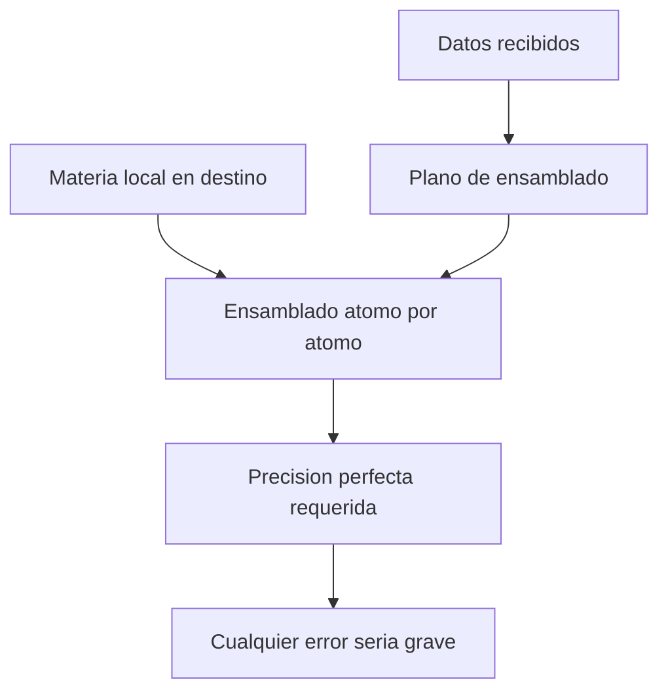

# 🔧 Sistemas mecanicos del teletransportador

[🏠 Inicio](../../../README.md) · [🌀 Curso: Teletransportador](../README.md) · 🔧 Sistemas mecanicos

> ⚖️ Material educativo original; los derechos de las obras pertenecen a sus titulares.

Este modulo abre el teletransportador por dentro. Compara la tecnologia
imaginaria de la ficcion con la fisica real que la haria funcionar (o que la
desmiente). La regla del curso es clara: describimos conceptos con nuestras
palabras, sin copiar planos ni especificaciones oficiales.

---

## 1. 🔬 Escaneo del patron

En la ficcion, un haz "lee" al cuerpo en un instante y guarda todo lo que es.
En la realidad, describir un cuerpo con detalle suficiente exigiria registrar
la posicion y el estado de una cantidad de particulas descomunal. Ademas, medir
con precision absoluta choca con limites cuanticos: no se puede conocer todo el
estado de una particula sin perturbarlo.

| Concepto de ficcion | Fisica real que evoca | Veredicto |
| --- | --- | --- |
| Lectura total e instantanea | Medicion del estado del sistema | No fisico: medir perturba y lleva tiempo. |
| Copia exacta de cada atomo | Registro de posiciones y estados | Datos astronomicos, imposibles de guardar hoy. |
| Escaner sin dano | Medicion no destructiva | Parcial: leer al detalle altera lo medido. |

---

## 2. 🧾 Transmision de la informacion

El aparato de ficcion "envia" al cuerpo por un haz. Lo que en realidad se
enviaria es informacion: una descripcion. Y toda informacion viaja sujeta a un
limite duro, la velocidad de la luz. Mover la descripcion de un cuerpo humano
supondria transmitir una cantidad de datos tan enorme que ni con toda la red
del planeta se lograria en un tiempo razonable.

| Idea de la ficcion | Que dice la fisica real |
| --- | --- |
| El cuerpo viaja por el haz | Viajaria informacion, no materia. |
| Llegada instantanea | Ningun dato supera la velocidad de la luz. |
| Envio ligero y rapido | El volumen de datos seria astronomico. |
| Sin canal visible | Siempre hace falta un canal fisico de transmision. |

---

## 3. 🏗️ Reconstruccion en destino

En la ficcion, el cuerpo se rearma solo en el otro extremo. En la realidad,
para rearmar habria que colocar materia local atomo por atomo siguiendo la
descripcion recibida. Eso plantea dos problemas: de donde sale la materia y
como se ensambla con precision perfecta sin errores que serian fatales.

| Idea de la ficcion | Que dice la fisica real |
| --- | --- |
| El cuerpo aparece formado | Habria que ensamblar cada particula en su sitio. |
| Materia surgida de la nada | La materia no se crea; saldria de una reserva local. |
| Ensamblado sin error | La precision exigida es extrema y sin margen. |
| Rearmado inmediato | El proceso de colocar tantas particulas seria lentisimo. |

---

## 4. 🔋 Energia colosal

La equivalencia entre masa y energia dice que en la materia hay una cantidad de
energia enorme. Desarmar y rearmar un cuerpo, o siquiera manipular su materia a
ese nivel, implicaria manejar cantidades de energia comparables a fenomenos
astronomicos, muy lejos de un destello discreto de la ficcion.

| Concepto de ficcion | Fisica real que evoca | Veredicto |
| --- | --- | --- |
| Un destello y listo | Energia para reordenar materia | No fisico: la energia implicada seria colosal. |
| Aparato de mesa | Instalacion de gran potencia | Improbable a esa escala energetica. |
| Gasto despreciable | Equivalencia masa-energia | La masa esconde energia inmensa. |

---

## 5. 👥 El problema del duplicado y la no clonacion

Si el metodo copia el patron y lo reconstruye en destino sin destruir el
original, al final hay dos objetos iguales. Si se destruye el original, cabe
preguntar si "eres tu" quien llega o solo una copia. La fisica cuantica agrega
una barrera: el teorema de no clonacion prohibe copiar un estado cuantico
desconocido, asi que una copia perfecta e independiente no es posible.

| Situacion | En la ficcion | En la fisica real |
| --- | --- | --- |
| Copiar sin borrar | Aparece uno solo, sin explicar | Quedarian dos: original y copia. |
| Borrar el original | "Es la misma persona" | Pregunta abierta sobre identidad. |
| Clonar el estado exacto | Se da por hecho | Prohibido por el teorema de no clonacion. |
| Transferir el estado | No se distingue del transporte | La teleportacion cuantica destruye el estado de origen. |

---

## 🔁 Como se conecta todo

1. El **escaneo** intentaria leer el patron completo del objeto.
2. La **informacion** obtenida se transmitiria por un canal fisico.
3. La **reconstruccion** ensamblaria materia local segun esa descripcion.
4. La **energia** necesaria para todo el proceso seria colosal.
5. El **duplicado** y la **no clonacion** limitan que sea copia o traslado.

Con esto claro, el [Modulo 4: Mandos](../mandos/manual-mandos-teletransportador.md)
muestra como el operador manejaria cada sistema.

---

[⬅️ Anterior: Caracteristicas](caracteristicas-teletransportador.md) · [➡️ Siguiente: Mandos e instrumentos](../mandos/manual-mandos-teletransportador.md)
