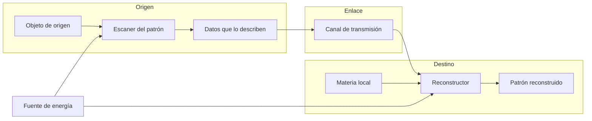
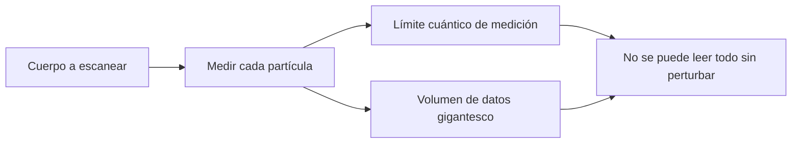
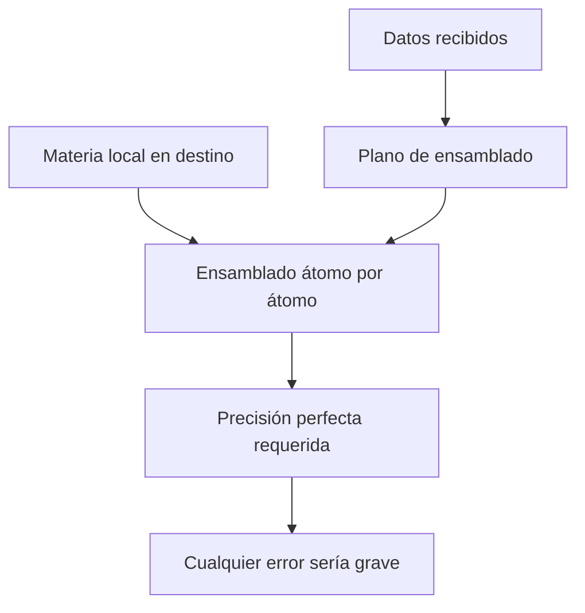
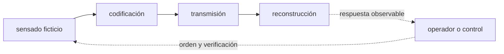

<!-- clase-meta
tipo_documento: clase
clase: 4
codigo: TELETRANSPOR-04
curso: teletransportador
titulo: "Sistemas mecánicos del teletransportador"
modalidad: "teórica aplicada"
duracion_minutos: 90
nivel: introductorio
prerrequisito: TELETRANSPOR-03
competencia: "comprension_de_sistemas"
resultados_aprendizaje:
  - "Explicar Escaneo del patrón, Transmisión de la información, Reconstrucción en destino y Energía colosal con vocabulario propio de Teletransportador."
  - "Aplicar esos conceptos a una decisión segura o a un escenario de simulación de Teletransportador."
evidencia: "Esquema con flujos de energía, materia o información anotados."
criterio_aprobacion: "Las conexiones esenciales son correctas y la consecuencia de la falla se propaga de manera coherente."
fuentes: manuales/fuentes.md
ultima_revision: 2026-09-10
-->

# 🔧 Sistemas mecánicos del teletransportador

[🏠 Inicio](../../../README.md) · [🌀 Curso: Teletransportador](../README.md) · 🔧 Sistemas mecánicos

> ⚖️ Material educativo original; los derechos de las obras pertenecen a sus titulares.

Esta clase abre el teletransportador por dentro. Compara la tecnología
imaginaria de la ficción con la física real que la haría funcionar (o que la
desmiente). La regla del curso es clara: describimos conceptos con nuestras
palabras, sin copiar planos ni especificaciones oficiales.

```mermaid
flowchart LR
    subgraph Origen
        Obj[Objeto de origen] --> Esc[Escaner del patrón]
        Esc --> Dat[Datos que lo describen]
    end
    subgraph Enlace
        Dat --> Can[Canal de transmisión]
    end
    subgraph Destino
        Can --> Rec[Reconstructor]
        Mat[Materia local] --> Rec
        Rec --> Res[Patrón reconstruido]
    end
    Ene[Fuente de energía] --> Esc
    Ene --> Rec
```

---

## 1. 🔬 Escaneo del patrón

En la ficción, un haz "lee" al cuerpo en un instante y guarda todo lo que es.
En la realidad, describir un cuerpo con detalle suficiente exigiría registrar
la posición y el estado de una cantidad de partículas descomunal. Además, medir
con precisión absoluta choca con límites cuánticos: no se puede conocer todo el
estado de una partícula sin perturbarlo.

```mermaid
flowchart LR
    Cuerpo[Cuerpo a escanear] --> Medir[Medir cada partícula]
    Medir --> Limite[Límite cuántico de medición]
    Medir --> Volumen[Volumen de datos gigantesco]
    Limite --> Problema[No se puede leer todo sin perturbar]
    Volumen --> Problema
```

| Concepto de ficción | Física real que evoca | Veredicto |
| --- | --- | --- |
| Lectura total e instantánea | Medición del estado del sistema | No físico: medir perturba y lleva tiempo. |
| Copia exacta de cada átomo | Registro de posiciones y estados | Datos astronómicos, imposibles de guardar hoy. |
| Escaner sin daño | Medición no destructiva | Parcial: leer al detalle altera lo medido. |

---

## 2. 🧾 Transmisión de la información

El aparato de ficción "envia" al cuerpo por un haz. Lo que en realidad se
enviaría es información: una descripción. Y toda información viaja sujeta a un
límite duro, la velocidad de la luz. Mover la descripción de un cuerpo humano
supondria transmitir una cantidad de datos tan enorme que ni con toda la red
del planeta se lograría en un tiempo razonable.

| Idea de la ficción | Que dice la física real |
| --- | --- |
| El cuerpo viaja por el haz | Viajaría información, no materia. |
| Llegada instantánea | Ningún dato supera la velocidad de la luz. |
| Envío ligero y rápido | El volumen de datos sería astronómico. |
| Sin canal visible | Siempre hace falta un canal físico de transmisión. |

---

## 3. 🏗️ Reconstrucción en destino

En la ficción, el cuerpo se rearma solo en el otro extremo. En la realidad,
para rearmar habría que colocar materia local átomo por átomo siguiendo la
descripción recibida. Eso plantea dos problemas: de donde sale la materia y
como se ensambla con precisión perfecta sin errores que serían fatales.

```mermaid
flowchart TD
    Datos[Datos recibidos] --> Plano[Plano de ensamblado]
    MatLocal[Materia local en destino] --> Ensamble[Ensamblado átomo por átomo]
    Plano --> Ensamble
    Ensamble --> Precision[Precisión perfecta requerida]
    Precision --> Riesgo[Cualquier error sería grave]
```

| Idea de la ficción | Que dice la física real |
| --- | --- |
| El cuerpo aparece formado | Habría que ensamblar cada partícula en su sitio. |
| Materia surgida de la nada | La materia no se crea; saldria de una reserva local. |
| Ensamblado sin error | La precisión exigida es extrema y sin margen. |
| Rearmado inmediato | El proceso de colocar tantas partículas sería lentísimo. |

---

## 4. 🔋 Energía colosal

La equivalencia entre masa y energía dice que en la materia hay una cantidad de
energía enorme. Desarmar y rearmar un cuerpo, o siquiera manipular su materia a
ese nivel, implicaría manejar cantidades de energía comparables a fenómenos
astronómicos, muy lejos de un destello discreto de la ficción.

| Concepto de ficción | Física real que evoca | Veredicto |
| --- | --- | --- |
| Un destello y listo | Energía para reordenar materia | No físico: la energía implicada sería colosal. |
| Aparato de mesa | Instalación de gran potencia | Improbable a esa escala energética. |
| Gasto despreciable | Equivalencia masa-energía | La masa esconde energía inmensa. |

---

## 5. 👥 El problema del duplicado y la no clonación

Si el método copia el patrón y lo reconstruye en destino sin destruir el
original, al final hay dos objetos iguales. Si se destruye el original, cabe
preguntar si "eres tú" quien llega o solo una copia. La física cuántica agrega
una barrera: el teorema de no clonación prohibe copiar un estado cuántico
desconocido, así que una copia perfecta e independiente no es posible.

| Situación | En la ficción | En la física real |
| --- | --- | --- |
| Copiar sin borrar | Aparece uno solo, sin explicar | Quedarían dos: original y copia. |
| Borrar el original | "Es la misma persona" | Pregunta abierta sobre identidad. |
| Clonar el estado exacto | Se da por hecho | Prohibido por el teorema de no clonación. |
| Transferir el estado | No se distingue del transporte | La teleportación cuántica destruye el estado de origen. |

---

## 🔁 Cómo se conecta todo

1. El **escaneo** intentaría leer el patrón completo del objeto.
2. La **información** obtenida se transmitiría por un canal físico.
3. La **reconstrucción** ensamblaría materia local según esa descripción.
4. La **energía** necesaria para todo el proceso sería colosal.
5. El **duplicado** y la **no clonación** limitan que sea copia o traslado.

Con esto claro, el [Clase 5: Mandos](../mandos/manual-mandos-teletransportador.md)
muestra como el operador manejaría cada sistema.

## 🧭 Guía de estudio aplicada

### Pregunta guía

¿Cómo ayuda **Escaneo del patrón, Transmisión de la información, Reconstrucción en destino y Energía colosal** a **seguir una alteración desde sensado ficticio hasta reconstrucción durante transporte ficticio con señal degradada y destino parcialmente bloqueado**?

### Explicación razonada

El funcionamiento puede leerse como una cadena causal: sensado ficticio entrega o transforma energía; codificación la adapta; transmisión la transmite o gobierna; y reconstrucción produce el efecto observable. La cadena no es lineal en sentido estricto: sensores, estructura y operador cierran el lazo. Si un eslabón se degrada, la señal importante es cómo cambia el estado de reconstrucción y qué margen queda.

```mermaid
flowchart LR
    A["sensado ficticio"] --> B["codificación"] --> C["transmisión"] --> D["reconstrucción"]
    D -. respuesta observable .-> O["operador o control"]
    O -. orden y verificación .-> A
```

Esta clase se conecta con el resto del curso mediante **la tecnología narrativa plantea continuidad, información, energía y verificación de destino**. El hilo de
seguridad consiste en reconocer a tiempo **presentar una ficción sin límites, fallas observables ni dilemas explícitos** y poder justificar la decisión
**definir condiciones de autorización, aborto y evidencia de integridad**; en clases posteriores cambiará el ángulo de análisis, no esa relación causal.
La lectura funcional común sigue **sensado ficticio → codificación → transmisión → reconstrucción**, de modo que cada concepto pueda
ubicarse dentro del funcionamiento completo y no quede como un dato aislado.

**Apoyo documental:** [Star Trek Database](https://www.startrek.com/database) aporta canon narrativo y tecnologías de ficción;
[Quantum Teleportation](https://quantum.cloud.ibm.com/learning/en/courses/basics-of-quantum-information/entanglement-in-action/quantum-teleportation) se usa para información cuántica, entrelazamiento y teorema de no clonación. Estas fuentes
se contrastan con el alcance de la clase y no sustituyen un manual de equipo concreto.

### Caso resuelto: de la observación a la decisión

1. **Entrada:** identifica el estado inicial de **sensado ficticio** durante **transporte ficticio con señal degradada y destino parcialmente bloqueado**.
2. **Transformación:** explica qué hacen **codificación** y **transmisión**, y qué magnitud cambia en cada paso.
3. **Salida:** comprueba el efecto esperado en **reconstrucción** y busca una desviación temprana.
4. **Falla razonada:** si aparece **presentar una ficción sin límites, fallas observables ni dilemas explícitos**, retrocede por la cadena antes de ordenar otra acción.

### Comprueba tu comprensión

1. Si se degrada **codificación**, ¿qué efecto esperarías primero en **transmisión** y después en **reconstrucción**?
2. ¿Qué observación ayudaría a diferenciar una falla de **sensado ficticio** de una falla de **transmisión**?
3. ¿Por qué una segunda orden podría agravar **presentar una ficción sin límites, fallas observables ni dilemas explícitos**?

Orientación para revisar tus respuestas

- La primera respuesta debe relacionar el eslabón elegido con un efecto posterior, no solo nombrarlo.
- La segunda debe proponer una señal medible u observable y explicar qué tendencia sería preocupante.
- La tercera debe cambiar al menos una variable de capacidad, mando, entorno o margen de seguridad.

## 🎓 Cierre de clase

- **Actividad:** Dibuja un esquema funcional de Teletransportador que conecte Escaneo del patrón, Transmisión de la información, Reconstrucción en destino y Energía colosal; después predice el efecto de una falla simulada.
- **Evidencia:** Esquema con flujos de energía, materia o información anotados.
- **Criterio de aprobación:** Las conexiones esenciales son correctas y la consecuencia de la falla se propaga de manera coherente.
- **Transferencia:** explica qué cambiaría al pasar a otra variante de esta máquina.

### Fuentes de esta clase

- [STARTREK-DATABASE](https://www.startrek.com/database): Star Trek Database, Paramount. Uso: canon narrativo y tecnologías de ficción.
- [IBM-QUANTUM-TELEPORT](https://quantum.cloud.ibm.com/learning/en/courses/basics-of-quantum-information/entanglement-in-action/quantum-teleportation): Quantum Teleportation, IBM Quantum Learning. Uso: información cuántica, entrelazamiento y teorema de no clonación.
- [NASA-FLIGHT](https://www1.grc.nasa.gov/beginners-guide-to-aeronautics/): Beginner's Guide to Aeronautics, NASA. Uso: contraste con física y vuelo reales.

> Las fuentes sostienen el marco conceptual y normativo; esta clase no reemplaza el manual
> del fabricante, la formación certificada ni la habilitación exigida para operar equipos reales.

---

[⬅️ Anterior: Modelos y variantes](../modelos/modelos-teletransportador.md) · [➡️ Siguiente: Mandos e instrumentos](../mandos/manual-mandos-teletransportador.md)
