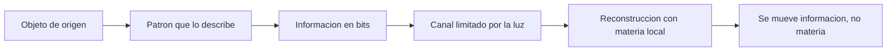

# 🧰 Recursos del teletransportador

[🏠 Inicio](../../../README.md) · [🌀 Curso: Teletransportador](../README.md) · 🧰 Recursos

> ⚖️ Material educativo original; los derechos de las obras pertenecen a sus titulares.

Glosario especifico, enlaces y diagramas de apoyo del curso de teletransportador.
Amplia el [glosario general](../../../docs/05-glosario-general.md).

---

## 📖 Glosario especifico

| Termino | Definicion |
| --- | --- |
| Patron | Disposicion precisa de las particulas que describe a un objeto. |
| Informacion | Datos necesarios para describir por completo el patron. |
| Materia | Sustancia fisica del objeto; no se crea ni se destruye a voluntad. |
| Masa-energia | Equivalencia que revela la energia colosal contenida en la masa. |
| Escaneo | Medicion del patron del objeto de origen. |
| Reconstruccion | Ensamblado de materia local segun la informacion recibida. |
| Duplicado | Problema de que copiar un patron deja dos objetos iguales. |
| Teleportacion cuantica | Transferencia de un estado cuantico, no de materia. |
| Canal clasico | Via de comunicacion limitada por la velocidad de la luz. |
| No clonacion | Teorema que prohibe copiar un estado cuantico desconocido. |

---

## 🗺️ Diagrama: informacion frente a materia

---

## 🔗 Enlaces y fuentes

- Portada del curso: [🌀 Curso: Teletransportador](../README.md)
- Catalogo de naves de ficcion: [🌌 Naves de ficcion](../../README.md)
- Glosario general: [📖 docs/05-glosario-general.md](../../../docs/05-glosario-general.md)
- Niveles de realismo: [🎚️ docs/03-niveles-de-realismo.md](../../../docs/03-niveles-de-realismo.md)
- Registro de fuentes: [📚 manuales/fuentes.md](../../../manuales/fuentes.md)

Registrar cada recurso nuevo con su origen y licencia, respetando el aviso de
derechos del catalogo de naves de ficcion.

---

[🎓 Portada del curso](../README.md) · [⬅️ Anterior: Diseno de simulacion](../simulacion/diseno-simulador-teletransportador.md)
