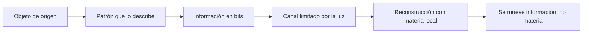

# 🧰 Recursos del teletransportador

[🏠 Inicio](../../../README.md) · [🌀 Curso: Teletransportador](../README.md) · 🧰 Recursos

> ⚖️ Material educativo original; los derechos de las obras pertenecen a sus titulares.

Glosario específico, enlaces y diagramas de apoyo del curso de teletransportador.
Amplia el [glosario general](../../../docs/05-glosario-general.md).

---

## 📖 Glosario específico

| Término | Definición |
| --- | --- |
| Patrón | Disposición precisa de las partículas que describe a un objeto. |
| Información | Datos necesarios para describir por completo el patrón. |
| Materia | Sustancia física del objeto; no se crea ni se destruye a voluntad. |
| Masa-energía | Equivalencia que revela la energía colosal contenida en la masa. |
| Escaneo | Medición del patrón del objeto de origen. |
| Reconstrucción | Ensamblado de materia local según la información recibida. |
| Duplicado | Problema de que copiar un patrón deja dos objetos iguales. |
| Teleportación cuántica | Transferencia de un estado cuántico, no de materia. |
| Canal clásico | Vía de comunicación limitada por la velocidad de la luz. |
| No clonación | Teorema que prohibe copiar un estado cuántico desconocido. |

---

## 🗺️ Diagrama: información frente a materia

```mermaid
flowchart LR
    Objeto[Objeto de origen] --> Patron[Patrón que lo describe]
    Patron --> Datos[Información en bits]
    Datos --> Canal[Canal limitado por la luz]
    Canal --> Destino[Reconstrucción con materia local]
    Destino --> Idea[Se mueve información, no materia]
```

---

## 🔗 Enlaces y fuentes

- Portada del curso: [🌀 Curso: Teletransportador](../README.md)
- Catálogo de naves de ficción: [🌌 Naves de ficción](../../README.md)
- Glosario general: [📖 docs/05-glosario-general.md](../../../docs/05-glosario-general.md)
- Niveles de realismo: [🎚️ docs/03-niveles-de-realismo.md](../../../docs/03-niveles-de-realismo.md)
- Registro de fuentes: [📚 manuales/fuentes.md](../../../manuales/fuentes.md)

Registrar cada recurso nuevo con su origen y licencia, respetando el aviso de
derechos del catálogo de naves de ficción.

## 🎓 Cierre de clase

- **Actividad:** Selecciona términos de glosario, esquemas y trazabilidad de fuentes, explícalos en contexto de Teletransportador y verifica la procedencia de las fuentes utilizadas.
- **Evidencia:** Glosario aplicado y ficha breve de trazabilidad.
- **Criterio de aprobación:** Los términos permiten interpretar el curso y las fuentes se distinguen por autoridad, alcance y vigencia.
- **Transferencia:** explica qué cambiaría al pasar a otra variante de esta máquina.

### Fuentes de esta clase

- [STARTREK-DATABASE](https://www.startrek.com/database): Star Trek Database, Paramount. Uso: canon narrativo y tecnologías de ficción.
- [NASA-FLIGHT](https://www1.grc.nasa.gov/beginners-guide-to-aeronautics/): Beginner's Guide to Aeronautics, NASA. Uso: contraste con física y vuelo reales.

> Las fuentes sostienen el marco conceptual y normativo; esta clase no reemplaza el manual
> del fabricante, la formación certificada ni la habilitación exigida para operar equipos reales.

---

[🎓 Portada del curso](../README.md) · [⬅️ Anterior: Diseño de simulación](../simulacion/diseno-simulador-teletransportador.md) · [➡️ Siguiente: Ejercicios](../ejercicios/ejercicios-teletransportador.md)
