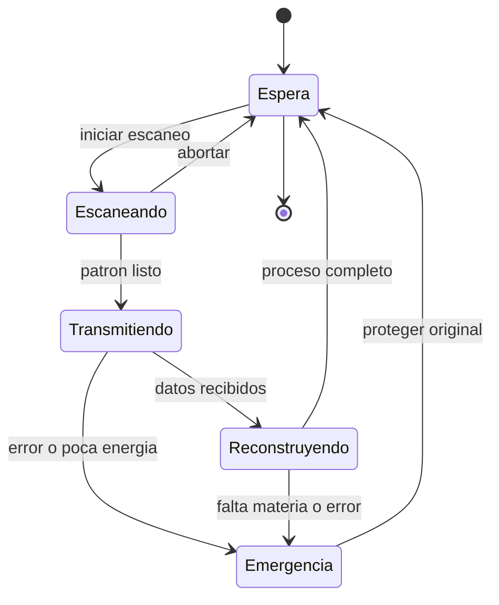

# 🎮 Diseno de simulacion del teletransportador

[🏠 Inicio](../../../README.md) · [🌀 Curso: Teletransportador](../README.md) · 🎮 Simulacion

> ⚖️ Material educativo original; los derechos de las obras pertenecen a sus titulares.

Como modelar de forma educativa y divertida un teletransportador. La idea
central es poder alternar entre la version espectacular de la ficcion y la
version fiel a la fisica, para que el usuario compare ambas con el mismo aparato.

## Objetivo de la simulacion

Que el usuario comprenda, jugando, que el teletransporte moveria informacion y
no materia, que reconstruir un cuerpo exigiria energia y datos colosales, y que
copiar un patron plantea el problema del duplicado. El modo ficcion sirve para
engancharse; el modo ciencia, para aprender.

## Modo ciencia o ficcion

La variable mas importante del simulador es el **modo**:

- **Modo ficcion**: el cuerpo llega al instante, el original se esfuma limpio y
  aparece un solo tu. Es comodo y familiar.
- **Modo ciencia**: se aplican los limites reales de informacion, energia,
  velocidad de la luz y no clonacion. Hay retardo, gasto colosal y dilema del
  duplicado.

Al cambiar de modo, la interfaz avisa que reglas se activan o desactivan, para
que la comparacion sea explicita y educativa.

## Variables principales

| Variable | Tipo | Rango | Afecta a | Comentarios |
| --- | --- | --- | --- | --- |
| Modo | discreta | ciencia / ficcion | Todas las reglas | Interruptor central del aprendizaje. |
| Volumen de datos | numerica | 0-enorme en bits | Tiempo del canal | En modo ficcion puede ignorarse. |
| Distancia | numerica | 0-muy grande | Retardo del canal | En ciencia limita por la velocidad de la luz. |
| Energia disponible | numerica | 0-100% | Viabilidad del proceso | En ciencia la exigencia es colosal. |
| Materia local | numerica | 0-100% | Reconstruccion | Sin materia no hay rearmado. |
| Integridad del patron | numerica | 0-100% | Exito del resultado | Errores arruinan el destino. |
| Modo de proceso | discreta | copia / transferencia | Problema del duplicado | Decide si queda una o dos. |
| Estado del original | discreta | intacto / borrado | Identidad | Clave para el dilema del duplicado. |

## Ciclo basico

1. Leer entrada del usuario (origen, resolucion, canal, modo de proceso).
2. Comprobar el modo activo (ciencia o ficcion).
3. Calcular el volumen de datos segun la resolucion elegida.
4. Aplicar reglas del modo: en ciencia, retardo por distancia y gasto de energia.
5. Aplicar el entorno: materia local disponible y ruido del canal.
6. Actualizar integridad del patron, estado del original y resultado en destino.
7. Refrescar instrumentos (datos, energia, integridad, estado del original).

## Modos de juego futuros

- Tutorial de informacion: ver que se transmite un patron, no un cuerpo.
- Reto de energia: intentar un traslado y descubrir la escala colosal.
- Comparador lado a lado: mismo envio en modo ciencia y en modo ficcion.
- Dilema del duplicado: elegir copiar o transferir y discutir la identidad.
- Escenario de teleportacion cuantica con enlace y canal clasico.

## Elementos fuera de alcance

- Presentar la version de ficcion como si fuera fisica real sin avisarlo.
- Mostrar la teleportacion cuantica como transporte de materia.
- Cualquier contenido que confunda espectaculo con ciencia sin distinguirlos.

## Pendientes

- [ ] Definir valores por defecto de cada variable por tipo de escenario.
- [ ] Prototipar el ciclo basico con retardo del canal clasico.
- [ ] Ajustar el modelo de energia colosal para que sea didactico.
- [ ] Agregar fuentes de divulgacion a [`manuales/fuentes.md`](../../../manuales/fuentes.md).

---

[⬅️ Anterior: Reglas del universo](../reglamentos/reglas-universo-teletransportador.md) · [➡️ Siguiente: Recursos](../recursos/recursos-teletransportador.md)
