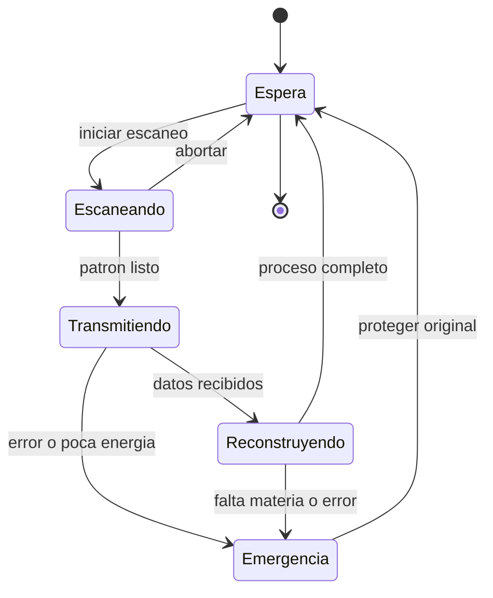
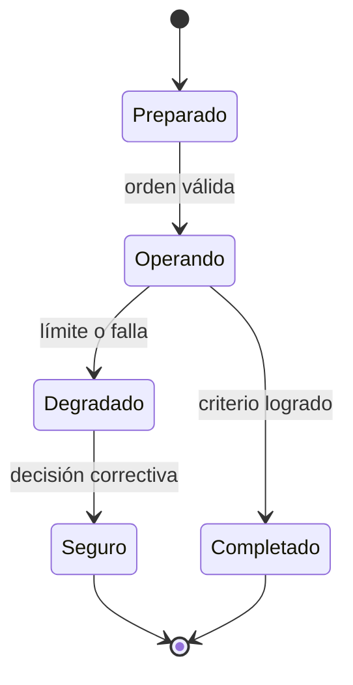

<!-- clase-meta
tipo_documento: clase
clase: 9
codigo: TELETRANSPOR-09
curso: teletransportador
titulo: "Diseño de simulación del teletransportador"
modalidad: "laboratorio de diseño"
duracion_minutos: 90
nivel: introductorio
prerrequisito: TELETRANSPOR-08
competencia: "modelado_de_simulacion"
resultados_aprendizaje:
  - "Explicar objetivo, variables, estados, ciclo y escenarios de simulación con vocabulario propio de Teletransportador."
  - "Aplicar esos conceptos a una decisión segura o a un escenario de simulación de Teletransportador."
evidencia: "Ficha de escenario y diagrama de estados."
criterio_aprobacion: "El modelo es específico de la máquina, medible, seguro y trazable a clases anteriores."
fuentes: manuales/fuentes.md
ultima_revision: 2026-09-10
-->

# 🎮 Diseño de simulación del teletransportador

[🏠 Inicio](../../../README.md) · [🌀 Curso: Teletransportador](../README.md) · 🎮 Simulación

> ⚖️ Material educativo original; los derechos de las obras pertenecen a sus titulares.

Como modelar de forma educativa y divertida un teletransportador. La idea
central es poder alternar entre la versión espectacular de la ficción y la
versión fiel a la física, para que el usuario compare ambas con el mismo aparato.

```mermaid
stateDiagram-v2
    [*] --> Espera
    Espera --> Escaneando: iniciar escaneo
    Escaneando --> Espera: abortar
    Escaneando --> Transmitiendo: patron listo
    Transmitiendo --> Reconstruyendo: datos recibidos
    Transmitiendo --> Emergencia: error o poca energia
    Reconstruyendo --> Espera: proceso completo
    Reconstruyendo --> Emergencia: falta materia o error
    Emergencia --> Espera: proteger original
    Espera --> [*]
```

## Objetivo de la simulación

Que el usuario comprenda, jugando, que el teletransporte movería información y
no materia, que reconstruir un cuerpo exigiría energía y datos colosales, y que
copiar un patrón plantea el problema del duplicado. El modo ficción sirve para
engancharse; el modo ciencia, para aprender.

## Modo ciencia o ficción

La variable más importante del simulador es el **modo**:

- **Modo ficción**: el cuerpo llega al instante, el original se esfuma limpio y
  aparece un solo tú. Es cómodo y familiar.
- **Modo ciencia**: se aplican los límites reales de información, energía,
  velocidad de la luz y no clonación. Hay retardo, gasto colosal y dilema del
  duplicado.

Al cambiar de modo, la interfaz avisa que reglas se activan o desactivan, para
que la comparación sea explícita y educativa.

## Variables principales

| Variable | Tipo | Rango | Afecta a | Comentarios |
| --- | --- | --- | --- | --- |
| Modo | discreta | ciencia / ficción | Todas las reglas | Interruptor central del aprendizaje. |
| Volumen de datos | numérica | 0-enorme en bits | Tiempo del canal | En modo ficción puede ignorarse. |
| Distancia | numérica | 0-muy grande | Retardo del canal | En ciencia limita por la velocidad de la luz. |
| Energía disponible | numérica | 0-100% | Viabilidad del proceso | En ciencia la exigencia es colosal. |
| Materia local | numérica | 0-100% | Reconstrucción | Sin materia no hay rearmado. |
| Integridad del patrón | numérica | 0-100% | Éxito del resultado | Errores arruinan el destino. |
| Modo de proceso | discreta | copia / transferencia | Problema del duplicado | Decide si queda una o dos. |
| Estado del original | discreta | intacto / borrado | Identidad | Clave para el dilema del duplicado. |

## Ciclo básico

1. Leer entrada del usuario (origen, resolución, canal, modo de proceso).
2. Comprobar el modo activo (ciencia o ficción).
3. Calcular el volumen de datos según la resolución elegida.
4. Aplicar reglas del modo: en ciencia, retardo por distancia y gasto de energía.
5. Aplicar el entorno: materia local disponible y ruido del canal.
6. Actualizar integridad del patrón, estado del original y resultado en destino.
7. Refrescar instrumentos (datos, energía, integridad, estado del original).

## Modos de juego futuros

- Tutorial de información: ver que se transmite un patrón, no un cuerpo.
- Reto de energía: intentar un traslado y descubrir la escala colosal.
- Comparador lado a lado: mismo envío en modo ciencia y en modo ficción.
- Dilema del duplicado: elegir copiar o transferir y discutir la identidad.
- Escenario de teleportación cuántica con enlace y canal clásico.

## Elementos fuera de alcance

- Presentar la versión de ficción como si fuera física real sin avisarlo.
- Mostrar la teleportación cuántica como transporte de materia.
- Cualquier contenido que confunda espectáculo con ciencia sin distinguirlos.

## Pendientes

- [ ] Definir valores por defecto de cada variable por tipo de escenario.
- [ ] Prototipar el ciclo básico con retardo del canal clásico.
- [ ] Ajustar el modelo de energía colosal para que sea didáctico.
- [ ] Agregar fuentes de divulgación a [`manuales/fuentes.md`](../../../manuales/fuentes.md).

## 🧭 Guía de estudio aplicada

### Pregunta guía

¿Cómo ayuda **Objetivo de la simulación, Modo ciencia o ficción, Variables principales y Ciclo básico** a **modelar transporte ficticio con señal degradada y destino parcialmente bloqueado como estados, variables y decisiones observables**?

### Explicación razonada

Una simulación de Teletransportador es educativa si representa decisiones y consecuencias. Como mínimo debe modelar el estado de sensado ficticio, la respuesta de codificación, la transición en transmisión y el resultado en reconstrucción. El escenario «transporte ficticio con señal degradada y destino parcialmente bloqueado» es valioso porque obliga a observar, formular una hipótesis, actuar y comprobar.

```mermaid
stateDiagram-v2
    [*] --> Preparado
    Preparado --> Operando: orden válida
    Operando --> Degradado: límite o falla
    Degradado --> Seguro: decisión correctiva
    Operando --> Completado: criterio logrado
    Seguro --> [*]
    Completado --> [*]
```

Esta clase se conecta con el resto del curso mediante **la tecnología narrativa plantea continuidad, información, energía y verificación de destino**. El hilo de
seguridad consiste en reconocer a tiempo **presentar una ficción sin límites, fallas observables ni dilemas explícitos** y poder justificar la decisión
**definir condiciones de autorización, aborto y evidencia de integridad**; en clases posteriores cambiará el ángulo de análisis, no esa relación causal.
La lectura funcional común sigue **sensado ficticio → codificación → transmisión → reconstrucción**, de modo que cada concepto pueda
ubicarse dentro del funcionamiento completo y no quede como un dato aislado.

**Apoyo documental:** [Star Trek Database](https://www.startrek.com/database) aporta canon narrativo y tecnologías de ficción;
[Quantum Teleportation](https://quantum.cloud.ibm.com/learning/en/courses/basics-of-quantum-information/entanglement-in-action/quantum-teleportation) se usa para información cuántica, entrelazamiento y teorema de no clonación. Estas fuentes
se contrastan con el alcance de la clase y no sustituyen un manual de equipo concreto.

### Caso resuelto: de la observación a la decisión

1. **Estado inicial:** representa transporte ficticio con señal degradada y destino parcialmente bloqueado con valores observables para **sensado ficticio**, **codificación**, **transmisión** y **reconstrucción**.
2. **Decisión del estudiante:** ofrece una elección que cambie el estado, no una animación automática.
3. **Consecuencia:** modela la tendencia hacia **presentar una ficción sin límites, fallas observables ni dilemas explícitos** y una señal previa que permita corregir.
4. **Cierre:** evalúa la explicación de la decisión, además de si el estudiante “ganó” el escenario.

### Comprueba tu comprensión

1. ¿Qué cuatro estados mínimos necesita el escenario «transporte ficticio con señal degradada y destino parcialmente bloqueado»?
2. ¿Qué variable anticipa **presentar una ficción sin límites, fallas observables ni dilemas explícitos** antes de llegar al estado de falla?
3. ¿Cómo evaluarías la explicación del estudiante y no solo el resultado final?

Orientación para revisar tus respuestas

- La primera respuesta debe relacionar el eslabón elegido con un efecto posterior, no solo nombrarlo.
- La segunda debe proponer una señal medible u observable y explicar qué tendencia sería preocupante.
- La tercera debe cambiar al menos una variable de capacidad, mando, entorno o margen de seguridad.

## 🎓 Cierre de clase

- **Actividad:** Diseña un escenario educativo de Teletransportador basado en objetivo, variables, estados, ciclo y escenarios de simulación, con entradas, estados, variables y criterio de cierre.
- **Evidencia:** Ficha de escenario y diagrama de estados.
- **Criterio de aprobación:** El modelo es específico de la máquina, medible, seguro y trazable a clases anteriores.
- **Transferencia:** explica qué cambiaría al pasar a otra variante de esta máquina.

### Fuentes de esta clase

- [STARTREK-DATABASE](https://www.startrek.com/database): Star Trek Database, Paramount. Uso: canon narrativo y tecnologías de ficción.
- [IBM-QUANTUM-TELEPORT](https://quantum.cloud.ibm.com/learning/en/courses/basics-of-quantum-information/entanglement-in-action/quantum-teleportation): Quantum Teleportation, IBM Quantum Learning. Uso: información cuántica, entrelazamiento y teorema de no clonación.
- [NASA-FLIGHT](https://www1.grc.nasa.gov/beginners-guide-to-aeronautics/): Beginner's Guide to Aeronautics, NASA. Uso: contraste con física y vuelo reales.

> Las fuentes sostienen el marco conceptual y normativo; esta clase no reemplaza el manual
> del fabricante, la formación certificada ni la habilitación exigida para operar equipos reales.

---

[⬅️ Anterior: Reglas del universo](../reglamentos/reglas-universo-teletransportador.md) · [➡️ Siguiente: Recursos](../recursos/recursos-teletransportador.md)
