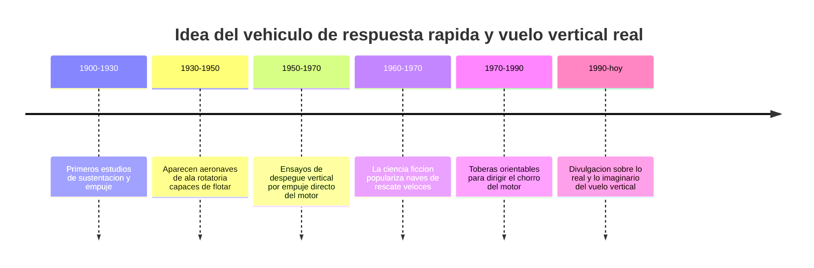

# 📜 Historia de Thunderbird 1

[🏠 Inicio](../../../README.md) · [⚡ Curso: Thunderbird 1](../README.md) · 📜 Historia

> ⚖️ Material educativo original; los derechos de las obras pertenecen a sus titulares.

Este modulo situa la idea de Thunderbird 1 dentro de la ciencia ficcion y la
compara con la historia real del vuelo vertical y de los vehiculos de respuesta
rapida. No describe una nave oficial: analiza el concepto generico de vehiculo
veloz "estilo Thunderbirds" y lo contrasta con lo que la ingenieria sabe hacer
de verdad.

## De donde viene la idea

El vehiculo de respuesta rapida de la ficcion toma prestada la fantasia de
llegar a cualquier sitio en minutos: despegar sin pista, subir recto hacia el
cielo y lanzarse a gran velocidad hacia la emergencia. Es una imagen atractiva
porque resuelve de golpe el problema de los aeropuertos y las carreteras. El
interes de este curso esta en separar esa fantasia de lo que la fisica permite.

## Lo real frente a lo imaginado

La historia real del vuelo vertical siguio un camino mas exigente. Elevarse sin
pista obliga a empujar el suelo con un chorro potente, y sostener ese empuje
gasta mucho combustible. Las maquinas que lo lograron tuvieron siempre que
equilibrar la fuerza para subir con el peso que podian cargar y la distancia que
podian recorrer despues.

| Periodo | Hito de referencia | Importancia para el curso |
| --- | --- | --- |
| 1900-1930 | Estudio de sustentacion y empuje | Base para entender como se sostiene un cuerpo en el aire. |
| 1930-1950 | Aeronaves capaces de flotar en el sitio | Muestra el vuelo estacionario sin avanzar. |
| 1950-1970 | Despegue vertical por empuje del motor | Confirma que hace falta empuje mayor que el peso. |
| 1960-1970 | Naves de rescate veloces en el cine | Fija la imagen popular de la respuesta rapida. |
| 1970-1990 | Toberas orientables del chorro | Base real del empuje vectorizado. |
| 1990-hoy | Divulgacion de fisica del vuelo | Separa el espectaculo de la realidad. |

## Por que la ficcion eligio la respuesta rapida

Contar una historia de rescate con un vehiculo que llega en minutos es emocionante:
hay urgencia, cuenta atras y una maquina que parece capaz de todo. Un vehiculo
real de despegue vertical seria mas lento de preparar, cargaria menos y gastaria
mucho combustible en cada vuelo. La ficcion prioriza la emocion sobre el balance
fisico, y eso es una decision artistica legitima que este curso respeta y analiza.

## Que aprenderemos de todo esto

- Que conceptos de fisica real evoca la nave aunque los exagere.
- Que licencias creativas ignoran el consumo y el peso, y por que.
- Como seria un vehiculo de respuesta rapida si obedeciera la fisica de verdad.

## Fuentes

- Registrar aqui las fuentes publicas de divulgacion consultadas.
- Enlazar cada fuente tambien en [`manuales/fuentes.md`](../../../manuales/fuentes.md).

---

[🎓 Portada del curso](../README.md) · [➡️ Siguiente: Caracteristicas](../operacion/caracteristicas-thunderbird-1.md)
