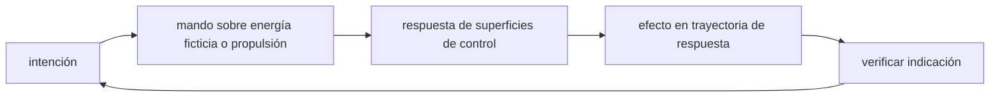

<!-- clase-meta
tipo_documento: clase
clase: 5
codigo: THUNDERBIRD1-05
curso: thunderbird-1
titulo: "Mandos e instrumentos de Thunderbird 1"
modalidad: "taller de simulación"
duracion_minutos: 60
nivel: introductorio
prerrequisito: THUNDERBIRD1-04
competencia: "lectura_y_mando"
resultados_aprendizaje:
  - "Explicar controles, instrumentos, entradas y estados del sistema con vocabulario propio de Thunderbird 1."
  - "Aplicar esos conceptos a una decisión segura o a un escenario de simulación de Thunderbird 1."
evidencia: "Mapa de mandos y resolución de dos estados del tablero."
criterio_aprobacion: "Reconoce los controles críticos y responde a los estados sin introducir acciones inseguras."
fuentes: manuales/fuentes.md
ultima_revision: 2026-09-10
-->

# 🎛️ Mandos e instrumentos de Thunderbird 1

[🏠 Inicio](../../../README.md) · [⚡ Curso: Thunderbird 1](../README.md) · 🎛️ Mandos

> ⚖️ Material educativo original; los derechos de las obras pertenecen a sus titulares.

## Vista general

El puesto de mando de un vehículo de respuesta rápida realista debe controlar
dos cosas a la vez: la potencia del motor que sostiene y eleva la nave, y la
orientación del chorro que decide si sube, flota o avanza. Esa combinación es la
gran diferencia con pilotar un avión normal, que solo se apoya en sus alas.

## Mapa de controles

| Zona | Control | Tipo | Función | Prioridad | Comentarios |
| --- | --- | --- | --- | --- | --- |
| Mano izquierda | Palanca de potencia | Palanca lineal | Regular el empuje del motor | Alta | Decide si sube, flota o baja. |
| Mano derecha | Mando de toberas | Joystick 2 ejes | Inclinar el chorro del motor | Alta | Controla la transición vertical a horizontal. |
| Mano derecha | Palanca de actitud | Joystick 3 ejes | Ajustar cabeceo, alabeo y guiñada | Alta | Mantiene la nave nivelada al flotar. |
| Panel central | Gestión de energía | Botonera | Repartir energía entre sistemas | Media | Motor, sensores y servicios. |
| Panel derecho | Modo de vuelo | Selector | Elegir vertical, transición o crucero | Alta | Cambia como responden los mandos. |
| Panel izquierdo | Asistencia | Selector | Activar estabilización automática | Media | Ayuda a flotar sin oscilar. |
| Consola | Instrumentos | Pantallas | Mostrar estado y sensores | Alta | Ver sección de instrumentos. |

## Instrumentos principales

| Instrumento | Muestra | Unidad | Importancia | Notas |
| --- | --- | --- | --- | --- |
| Empuje relativo | Empuje frente al peso | porcentaje | Alta | Por encima de cien la nave sube. |
| Altura | Distancia al suelo | metros | Alta | Clave durante despegue y aterrizaje. |
| Velocidad horizontal | Avance hacia adelante | m/s | Alta | Cuando sube, las alas ayudan. |
| Ángulo de toberas | Inclinación del chorro | grados | Alta | Marca el grado de transición. |
| Nivel de combustible | Propelente restante | porcentaje | Alta | Flotar lo consume muy rápido. |
| Temperatura del motor | Calor acumulado | grados | Media | Limita el empuje sostenido. |

## Entradas de simulación

| Acción | Teclado | Controlador | Comentarios |
| --- | --- | --- | --- |
| Subir potencia | Flecha arriba | Gatillo derecho | Aumenta el empuje del motor. |
| Bajar potencia | Flecha abajo | Gatillo izquierdo | Reduce el empuje, la nave desciende. |
| Inclinar toberas | W y S | Stick derecho vertical | Pasa de vertical a horizontal. |
| Guiñada | A y D | Stick derecho horizontal | Apunta la nariz a los lados. |
| Alabeo | Q y E | Botones laterales | Nivela la nave sobre su eje. |
| Estabilizar | Barra espaciadora | Botón central | Mantiene el vuelo estacionario. |
| Cambiar modo | Tecla M | Botón de modo | Vertical, transición o crucero. |

## Estados del sistema

| Estado | Descripción | Indicadores | Acciones disponibles |
| --- | --- | --- | --- |
| En tierra | Nave posada, motor al mínimo | Empuje bajo el peso | Encender motor, planificar despegue. |
| Estacionario | Flota a altura constante | Empuje igual al peso | Ajustar altura, iniciar transición. |
| Transición | Pasa de vertical a horizontal | Toberas inclinandose | Ganar velocidad, aliviar el motor. |
| Crucero | Vuela rápido apoyada en las alas | Velocidad horizontal alta | Avanzar, vigilar combustible. |
| Emergencia | Falla o poco combustible | Alerta de nivel bajo | Ahorrar potencia, aterrizar. |

## Observaciones ergonomicas

- La interfaz debe mostrar a la vez el empuje relativo al peso y la altura,
  porque de esa relación depende que la nave suba, flote o baje.
- El combustible es tan crítico como en un cohete: flotar lo consume muy rápido,
  así que conviene alertar pronto del nivel bajo.
- La transición debe ser gradual y clara: inclinar el chorro de golpe puede
  hacer perder altura antes de ganar velocidad.
- Conviene un modo de asistencia para principiantes que estabilice el vuelo
  estacionario y evite oscilaciones.

## 🧭 Guía de estudio aplicada

### Pregunta guía

¿Cómo ayuda **Vista general, Mapa de controles, Instrumentos principales y Entradas de simulación** a **interpretar mandos e indicaciones durante despliegue de rescate a una pista corta con meteorología cambiante**?

### Explicación razonada

Un mando no se aprende memorizando su nombre, sino recorriendo el ciclo intención → acción → indicación → verificación. En Thunderbird 1, el operador actúa sobre energía ficticia o propulsión, observa la respuesta en superficies de control y confirma el efecto en trayectoria de respuesta. Una indicación inesperada exige detener la secuencia mental, identificar el modo activo y evitar una segunda orden que agrave el estado.

Esta clase se conecta con el resto del curso mediante **una aeronave de alerta rápida prioriza tiempo de llegada sin abandonar energía ni margen de aterrizaje**. El hilo de
seguridad consiste en reconocer a tiempo **convertir velocidad narrativa en llegada segura sin plan de aproximación** y poder justificar la decisión
**separar crucero rápido de aproximación estabilizada y mantener alternativa**; en clases posteriores cambiará el ángulo de análisis, no esa relación causal.
La lectura funcional común sigue **energía ficticia → propulsión → superficies de control → trayectoria de respuesta**, de modo que cada concepto pueda
ubicarse dentro del funcionamiento completo y no quede como un dato aislado.

**Apoyo documental:** [Thunderbirds Vehicles](https://www.thunderbirds.com/) aporta referencia oficial de vehículos de rescate;
[Aviation Handbooks and Manuals](https://www.faa.gov/regulations_policies/handbooks_manuals) se usa para aerodinámica, sistemas y operación. Estas fuentes
se contrastan con el alcance de la clase y no sustituyen un manual de equipo concreto.

### Caso resuelto: de la observación a la decisión

1. **Intención:** formula qué cambio se necesita durante **despliegue de rescate a una pista corta con meteorología cambiante**.
2. **Mando:** identifica el control que actúa sobre **energía ficticia** o **propulsión** y el modo que debe estar activo.
3. **Lectura:** localiza la indicación que confirma la respuesta de **superficies de control** y el efecto en **trayectoria de respuesta**.
4. **Verificación:** si la lectura no coincide, no acumules órdenes; estabiliza e investiga el estado.

### Comprueba tu comprensión

1. ¿Qué mando inicia la respuesta y qué instrumento confirma que el modo correcto está activo?
2. ¿Qué indicación temprana advertiría **convertir velocidad narrativa en llegada segura sin plan de aproximación**?
3. ¿Qué secuencia usarías si la respuesta de **trayectoria de respuesta** no coincide con la orden?

Orientación para revisar tus respuestas

- La primera respuesta debe relacionar el eslabón elegido con un efecto posterior, no solo nombrarlo.
- La segunda debe proponer una señal medible u observable y explicar qué tendencia sería preocupante.
- La tercera debe cambiar al menos una variable de capacidad, mando, entorno o margen de seguridad.

## 🎓 Cierre de clase

- **Actividad:** Recorre el puesto de mando simulado de Thunderbird 1: localiza los controles de controles, instrumentos, entradas y estados del sistema y asocia cada indicación con una decisión.
- **Evidencia:** Mapa de mandos y resolución de dos estados del tablero.
- **Criterio de aprobación:** Reconoce los controles críticos y responde a los estados sin introducir acciones inseguras.
- **Transferencia:** explica qué cambiaría al pasar a otra variante de esta máquina.

### Fuentes de esta clase

- [THUNDERBIRDS-OFFICIAL](https://www.thunderbirds.com/): Thunderbirds Vehicles, ITV. Uso: referencia oficial de vehículos de rescate.
- [US-FAA-HANDBOOKS](https://www.faa.gov/regulations_policies/handbooks_manuals): Aviation Handbooks and Manuals, FAA. Uso: aerodinámica, sistemas y operación.
- [NASA-FLIGHT](https://www1.grc.nasa.gov/beginners-guide-to-aeronautics/): Beginner's Guide to Aeronautics, NASA. Uso: contraste con física y vuelo reales.

> Las fuentes sostienen el marco conceptual y normativo; esta clase no reemplaza el manual
> del fabricante, la formación certificada ni la habilitación exigida para operar equipos reales.

---

[⬅️ Anterior: Sistemas mecánicos](../operacion/sistemas-mecanicos-thunderbird-1.md) · [➡️ Siguiente: Principios y operación](../operacion/principios-thunderbird-1.md)
