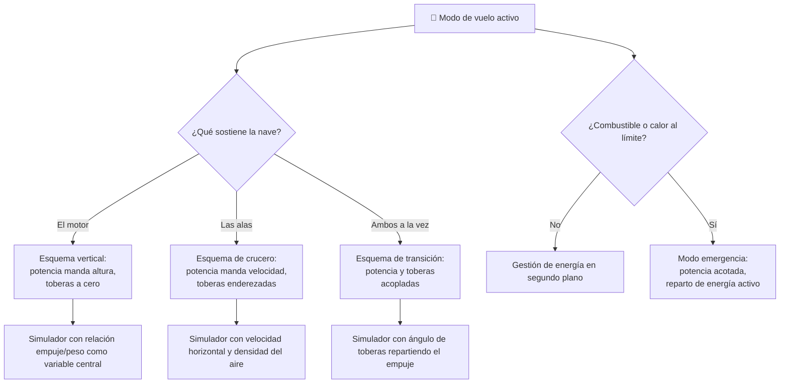

# 🧩 Modelos y variantes del Thunderbird 1

[🏠 Inicio](../../../README.md) · [⚡ Curso: Thunderbird 1](../README.md) · 🧩 Modelos

> ⚖️ Material educativo original; los derechos de las obras pertenecen a sus titulares.

El [Módulo 2](../operacion/caracteristicas-thunderbird-1.md) ya dijo qué tipos
conceptuales de vehículo de respuesta rápida existen —explorador ligero,
transporte pesado, nave de transición— y qué compromiso físico acepta cada uno.
Este módulo responde a otra cosa, y conviene decirlo sin rodeos: en esta nave el
eje que decide el simulador **no es el modelo, es el modo de vuelo**. Los tres
tipos del Módulo 2 se distinguen por masa y empuje disponible, es decir, por
rangos. Los modos de vuelo se distinguen por qué mandos tienen sentido, que es
otra categoría de diferencia.

> 🎯 **La idea que sostiene el módulo.** "Un Thunderbird 1" no es una sola
> máquina desde el punto de vista del mando. En vertical el piloto sostiene el
> peso con el motor; en crucero lo sostienen las alas y el motor solo empuja
> hacia adelante. La misma palanca de potencia manda cosas distintas en cada
> modo. Un simulador que presente un único esquema de control está
> representando un modo concreto aunque diga representar la nave entera.

---

## 🧭 Por qué el modo decide el simulador

El [Módulo 5](../mandos/manual-mandos-thunderbird-1.md) no deja lugar a dudas:
entre sus controles hay un **selector de modo de vuelo** —vertical, transición o
crucero— cuya función declarada es "cambia como responden los mandos". No cambia
la dificultad ni los rangos: cambia la respuesta. Ese selector es la confesión de
que hay tres máquinas debajo.

La razón física está en el [Módulo 4](../operacion/sistemas-mecanicos-thunderbird-1.md)
y en el [Módulo 6](../operacion/principios-thunderbird-1.md). En vertical, la nave
se sostiene por empuje directo: la palanca de potencia decide si sube, flota o
baja, y la relación empuje/peso es la variable que manda. En crucero, las alas
sostienen y el motor rebaja el empuje: esa misma palanca ya no decide la altura
sino la velocidad. Las alas, dice el Módulo 4, "casi no sirven al despegar". La
transición es el único momento en que ambos regímenes conviven, y por eso es el
más difícil de modelar: el empuje se reparte entre sostener y avanzar.

---

## 🗂️ Qué cambia en el manejo

| Modo | Qué cambia al pilotarlo |
| --- | --- |
| Despegue y vuelo vertical | Toda la carga recae en el motor. El piloto vigila el empuje frente al peso: por encima sube, igualado flota, por debajo no despega. Las alas no aportan nada. |
| Vuelo estacionario | El caso extremo del vertical: empuje igual al peso, avance nulo y consumo continuo sin ganar nada. Un desajuste pequeño hace subir, bajar o volcar. |
| Transición | El régimen inestable. Al inclinar el chorro, parte del empuje deja de sostener antes de que las alas releven: hacerlo de golpe cuesta altura antes de dar velocidad. |
| Crucero horizontal | Las alas sostienen y el motor solo empuja hacia adelante. Se parece a pilotar un avión: la velocidad se vuelve condición para no caer, no un lujo. |
| Emergencia | No es un modo de vuelo sino una restricción sobre el activo: poco combustible o falla obligan a ahorrar potencia y aterrizar. |

Los tipos conceptuales del Módulo 2 sí caben en un mismo esquema: el transporte
pesado necesita más empuje para el mismo despegue y el explorador ligero acelera
antes, pero ambos usan los mismos mandos. Es una diferencia de rango.

---

## 🎛️ Qué cambia en el mando

Contrastado con el mapa de controles del
[Módulo 5](../mandos/manual-mandos-thunderbird-1.md):

| Modo | Qué mando aparece o desaparece | Consecuencia |
| --- | --- | --- |
| Despegue y vuelo vertical | El **mando de toberas** existe pero se mantiene a cero: inclinarlo es dejar el modo. La palanca de potencia **manda la altura**. | El eje vertical del stick derecho está de hecho inhabilitado mientras se sube recto. |
| Vuelo estacionario | **Aparece** la asistencia de estabilización como mando de pleno derecho: su función descrita es "mantiene el vuelo estacionario". | Con asistencia activa, la palanca de actitud pasa a corregir, no a mandar. |
| Transición | Ningún mando desaparece: **todos actúan a la vez**. El ángulo de toberas es el mando protagonista y la potencia debe acompañarlo. | Es el único modo que exige coordinar potencia y toberas de forma continua. |
| Crucero horizontal | El **mando de toberas** deja de ser el control de transición: quedan enderezadas. La palanca de potencia **deja de mandar la altura y manda la velocidad**. | El mismo control físico gobierna otra magnitud. La altura pasa a depender del cabeceo y de la velocidad. |
| Emergencia | **Aparece** la gestión de energía del panel central como decisión real: repartir entre motor, sensores y servicios. | En vuelo normal es un mando de prioridad media; aquí decide si la misión termina bien. |

La reasignación de la palanca de potencia es el cambio más fuerte del curso, y no
tiene equivalente en el mapa de controles: el Módulo 5 describe un solo puesto de
mando porque físicamente hay uno solo. Lo que cambia es su significado.

---

## 🎮 Qué cambia en el simulador

Contrastado con las variables del
[Módulo 9](../simulacion/diseno-simulador-thunderbird-1.md):

| Modo | Variables que cambian | Esquema de control |
| --- | --- | --- |
| Despegue y vuelo vertical | `Relación empuje/peso` es la variable que decide todo. `Ángulo de toberas` queda fijo en 0. `Velocidad horizontal` vale 0 y no aporta. | Potencia como control de altura; toberas sin uso. |
| Vuelo estacionario | `Relación empuje/peso` clavada en uno. `Combustible` cae sin que ninguna otra variable progrese. `Calor del motor` marca el límite del modo. | El anterior, más la asistencia activa. |
| Transición | `Ángulo de toberas` recorre su rango de 0 a 90 grados y reparte el empuje. `Velocidad horizontal` crece y empieza a alimentar la sustentación de alas. | Potencia y toberas acopladas; es el único modo donde ambas se mandan a la vez. |
| Crucero horizontal | `Relación empuje/peso` **deja de gobernar la altura**: la sostienen las alas vía `Velocidad horizontal`. `Densidad del aire` pasa de detalle a variable central. `Empuje del motor` puede bajar sin caer. | Esquema aerodinámico: potencia como velocidad. |
| Emergencia | `Combustible` y `Calor del motor` dejan de ser límites de fondo y pasan a ser la restricción activa. | El del modo en curso, con la potencia acotada. |

Una advertencia de nomenclatura: el Módulo 9 ya usa la variable `Modo` para el
interruptor **ciencia / ficción**, que es otro eje distinto. El modo de vuelo de
este módulo necesita su propia variable; confundir ambas rompería las dos.

---

## 🗺️ Del modo al esquema de control

---

## ⚠️ Qué modos no comparten simulador

Dos separaciones no se resuelven ajustando parámetros, porque el esquema de
control es otro:

- **El vertical frente al crucero**: no es que uno sea más difícil. Es que la
  palanca de potencia gobierna magnitudes distintas y la sustentación viene de
  fuentes distintas. Son dos modelos de vuelo, no dos niveles del mismo.
- **La transición frente a los dos anteriores**: es el único régimen donde el
  empuje se reparte entre sostener y avanzar, con las alas entrando a medias.
  No es un punto intermedio entre los otros dos: tiene su propia física, y el
  Módulo 6 insiste en que es gradual, nunca instantánea.

Los tipos conceptuales del Módulo 2 sí caben en un mismo simulador ajustando
rangos, igual que el interruptor ciencia / ficción del Módulo 9 actúa sobre las
reglas sin tocar los mandos. La escala está en los
[niveles de realismo](../../../docs/03-niveles-de-realismo.md) que recoge el
Módulo 6: en el nivel 1 basta despegar y notar que hace falta empuje, y solo al
subir de nivel la transición y el crucero exigen su propio esquema.

> ⚖️ **El principio detrás de todo esto.** Cuánto pesa la carga y dónde va no cambia
> solo los números: cambia qué puede hacer el operador. La física común a todas las
> máquinas del catálogo —sostener, girar, equilibrar y la masa que cambia en
> marcha— está en [⚖️ carga y manejo](../../../docs/09-carga-y-manejo.md).

---

[⬅️ Anterior: Características](../operacion/caracteristicas-thunderbird-1.md) · [➡️ Siguiente: Sistemas mecánicos](../operacion/sistemas-mecanicos-thunderbird-1.md)
