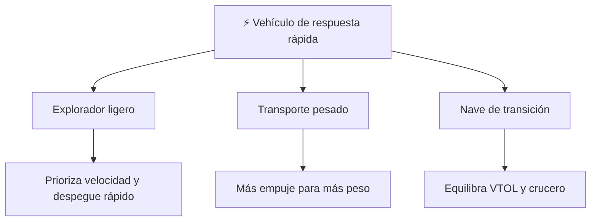

<!-- clase-meta
tipo_documento: clase
clase: 2
codigo: THUNDERBIRD1-02
curso: thunderbird-1
titulo: "Características de Thunderbird 1"
modalidad: "teórica aplicada"
duracion_minutos: 45
nivel: introductorio
prerrequisito: THUNDERBIRD1-01
competencia: "identificacion_funcional"
resultados_aprendizaje:
  - "Explicar definición, rasgos funcionales, tipos y usos con vocabulario propio de Thunderbird 1."
  - "Aplicar esos conceptos a una decisión segura o a un escenario de simulación de Thunderbird 1."
evidencia: "Matriz comparativa y decisión justificada."
criterio_aprobacion: "La elección considera función, límites, mando y efecto en la simulación; no se apoya solo en preferencias."
fuentes: manuales/fuentes.md
ultima_revision: 2026-09-10
-->

# 📋 Características de Thunderbird 1

[🏠 Inicio](../../../README.md) · [⚡ Curso: Thunderbird 1](../README.md) · 📋 Características

> ⚖️ Material educativo original; los derechos de las obras pertenecen a sus titulares.

Que es un vehículo de respuesta rápida genérico, que rasgos lo definen en la
ficción y cuales tendrían sentido físico real. Esta clase da el contexto antes
de abrir la tecnología por dentro en el Clase 4.

---

## 🧭 Definición

Thunderbird 1, en la ficción estilo "Thunderbirds", es una nave veloz pensada
para llegar la primera a una emergencia. La imaginamos capaz de despegar en
vertical sin pista, subir recta y luego lanzarse a gran velocidad. En este curso
la usamos como excusa para estudiar cómo se movería de verdad un vehículo así.

---

## 🧬 Características clave

| Característica | Como la muestra la ficción | Lectura física real |
| --- | --- | --- |
| Despegue vertical | Sube recta sin necesidad de pista | Posible si el empuje supera al peso. |
| Velocidad extrema | Alcanza el destino en minutos | Real pero con enorme gasto de combustible. |
| Transición en el aire | Pasa de subir a volar hacia adelante | Real orientando el chorro del motor. |
| Autonomía ilimitada | Siempre llega y regresa sin repostar | Falso: más velocidad implica menos alcance. |
| Vuelo estacionario | Se queda quieta flotando en el aire | Real solo mientras dure el propelente. |
| Alas visibles | Grandes superficies para el vuelo rápido | Útiles solo en vuelo horizontal, no al subir. |

---

## 🗂️ Tipos conceptuales de vehículo de respuesta rápida

```mermaid
flowchart TD
    Nave[⚡ Vehículo de respuesta rápida] --> Ligero[Explorador ligero]
    Nave --> Pesado[Transporte pesado]
    Nave --> Mixto[Nave de transición]
    Ligero --> Agil[Prioriza velocidad y despegue rápido]
    Pesado --> Carga[Más empuje para más peso]
    Mixto --> Equilibrio[Equilibra VTOL y crucero]
```

| Tipo | Idea de diseño | Compromiso físico |
| --- | --- | --- |
| Explorador ligero | Poca masa, mucho empuje disponible | Sube y acelera rápido pero lleva poco combustible. |
| Transporte pesado | Gran capacidad de carga | Más peso exige más empuje para despegar. |
| Nave de transición | Motor orientable y alas amplias | Cambia bien de vertical a crucero, gasta en cada modo. |

---

## 🎯 Para qué sirve en el relato

- Dar espectáculo con llegadas rápidas y despegues verticales.
- Representar la respuesta inmediata ante cualquier emergencia.
- Simplificar el vuelo a algo que parece no tener límites de combustible.

En cambio, para este curso sirve como laboratorio: cada rasgo llamativo nos
deja preguntar si sería posible y por qué.

## 🧭 Guía de estudio aplicada

### Pregunta guía

¿Cómo ayuda **Definición, Características clave, Tipos conceptuales de vehículo de respuesta rápida y Para qué sirve en el relato** a **elegir una configuración adecuada para despliegue de rescate a una pista corta con meteorología cambiante**?

### Explicación razonada

Una característica solo es útil cuando permite anticipar comportamiento. En Thunderbird 1, la relación entre energía ficticia, propulsión, superficies de control y trayectoria de respuesta determina capacidad, respuesta y límites. Por eso «vuelo supersónico ficticio frente a jet ligero real» no se compara por apariencia: se compara por misión, entorno, carga de trabajo y exposición al riesgo «convertir velocidad narrativa en llegada segura sin plan de aproximación».

Esta clase se conecta con el resto del curso mediante **una aeronave de alerta rápida prioriza tiempo de llegada sin abandonar energía ni margen de aterrizaje**. El hilo de
seguridad consiste en reconocer a tiempo **convertir velocidad narrativa en llegada segura sin plan de aproximación** y poder justificar la decisión
**separar crucero rápido de aproximación estabilizada y mantener alternativa**; en clases posteriores cambiará el ángulo de análisis, no esa relación causal.
La lectura funcional común sigue **energía ficticia → propulsión → superficies de control → trayectoria de respuesta**, de modo que cada concepto pueda
ubicarse dentro del funcionamiento completo y no quede como un dato aislado.

**Apoyo documental:** [Thunderbirds Vehicles](https://www.thunderbirds.com/) aporta referencia oficial de vehículos de rescate;
[Aviation Handbooks and Manuals](https://www.faa.gov/regulations_policies/handbooks_manuals) se usa para aerodinámica, sistemas y operación. Estas fuentes
se contrastan con el alcance de la clase y no sustituyen un manual de equipo concreto.

### Caso resuelto: de la observación a la decisión

1. **Definir la necesidad:** convierte «despliegue de rescate a una pista corta con meteorología cambiante» en requisitos de capacidad, entorno y respuesta.
2. **Comparar:** contrasta **vuelo supersónico ficticio frente a jet ligero real** usando esos requisitos y la cadena **energía ficticia → propulsión → superficies de control → trayectoria de respuesta**.
3. **Descartar:** elimina la alternativa que deja menos margen frente a **convertir velocidad narrativa en llegada segura sin plan de aproximación**.
4. **Elegir:** declara la variante escogida, la evidencia usada y una limitación que todavía debe respetarse.

### Comprueba tu comprensión

1. ¿Qué característica de **trayectoria de respuesta** condiciona primero el caso «despliegue de rescate a una pista corta con meteorología cambiante»?
2. ¿Qué requisito descartaría una de las alternativas **vuelo supersónico ficticio frente a jet ligero real**?
3. ¿Qué límite debe declararse junto con la variante elegida?

Orientación para revisar tus respuestas

- La primera respuesta debe relacionar el eslabón elegido con un efecto posterior, no solo nombrarlo.
- La segunda debe proponer una señal medible u observable y explicar qué tendencia sería preocupante.
- La tercera debe cambiar al menos una variable de capacidad, mando, entorno o margen de seguridad.

## 🎓 Cierre de clase

- **Actividad:** Compara variantes de Thunderbird 1 mediante los ejes «definición, rasgos funcionales, tipos y usos» y elige una para un caso de uso razonado.
- **Evidencia:** Matriz comparativa y decisión justificada.
- **Criterio de aprobación:** La elección considera función, límites, mando y efecto en la simulación; no se apoya solo en preferencias.
- **Transferencia:** explica qué cambiaría al pasar a otra variante de esta máquina.

### Fuentes de esta clase

- [THUNDERBIRDS-OFFICIAL](https://www.thunderbirds.com/): Thunderbirds Vehicles, ITV. Uso: referencia oficial de vehículos de rescate.
- [US-FAA-HANDBOOKS](https://www.faa.gov/regulations_policies/handbooks_manuals): Aviation Handbooks and Manuals, FAA. Uso: aerodinámica, sistemas y operación.
- [NASA-FLIGHT](https://www1.grc.nasa.gov/beginners-guide-to-aeronautics/): Beginner's Guide to Aeronautics, NASA. Uso: contraste con física y vuelo reales.

> Las fuentes sostienen el marco conceptual y normativo; esta clase no reemplaza el manual
> del fabricante, la formación certificada ni la habilitación exigida para operar equipos reales.

---

[⬅️ Anterior: Historia](../historia/historia-thunderbird-1.md) · [➡️ Siguiente: Modelos y variantes](../modelos/modelos-thunderbird-1.md)
