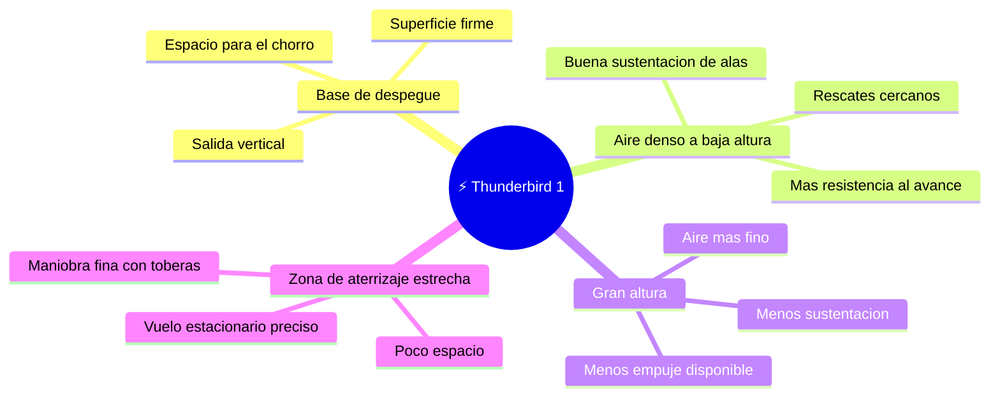

# 🌍 Entornos de Thunderbird 1

[🏠 Inicio](../../../README.md) · [⚡ Curso: Thunderbird 1](../README.md) · 🌍 Entornos

> ⚖️ Material educativo original; los derechos de las obras pertenecen a sus titulares.

Dónde opera un vehículo de respuesta rápida y cómo cambia su comportamiento
según el entorno. Cada escenario implica reglas físicas distintas, y en
simulación se traduce en condiciones diferentes de aire, altura y espacio para
maniobrar.

---

## 🗺️ Entornos principales

| Entorno | Características | Riesgos típicos | Ajuste de maniobra |
| --- | --- | --- | --- |
| Base de despegue | Superficie firme y espacio para el chorro. | Dañar el suelo, levantar polvo. | Empuje vertical controlado, subida limpia. |
| Aire denso a baja altura | Buena sustentación, más resistencia. | Consumo alto, turbulencia. | Aprovechar las alas, moderar potencia. |
| Gran altura | Aire fino, menos empuje y sustentación. | Perder altura, motor al límite. | Vigilar el margen de empuje sobre el peso. |
| Zona estrecha | Poco espacio para maniobrar. | Choques, aterrizaje brusco. | Vuelo estacionario, toberas finas. |

---

## 🌡️ Factores del entorno

- **Densidad del aire**: con aire denso las alas sostienen mejor y el motor puede
  aliviar el empuje; con aire fino hay menos sustentación y menos empuje.
- **Espacio de maniobra**: un despegue vertical necesita sitio para el chorro y
  para elevarse; en zonas estrechas todo el peso recae en el control fino.
- **Viento**: al flotar, una racha desplaza la nave y obliga a corregir con las
  toberas y la potencia.
- **Superficie**: el chorro hacia abajo puede levantar polvo o dañar suelos
  blandos, lo que condiciona donde se puede despegar y aterrizar.

---

## 🎮 Traducción a simulación

Cada entorno es un escenario con su densidad de aire, su altura y su espacio de
maniobra. El paso de un despegue vertical con aire denso a un vuelo de crucero en
altura cambia cuanto empuje hace falta y cuanto combustible se gasta, y es una
gran lección de física. Ver cómo se modela en el
[Módulo 9: Diseño de simulación](../simulacion/diseno-simulador-thunderbird-1.md).

---

[⬅️ Anterior: Principios y operación](principios-thunderbird-1.md) · [➡️ Siguiente: Reglas del universo](../reglamentos/reglas-universo-thunderbird-1.md)
