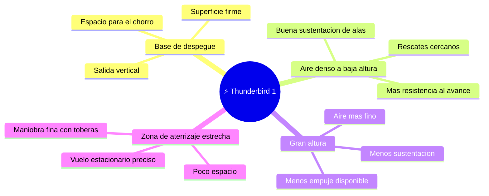

<!-- clase-meta
tipo_documento: clase
clase: 7
codigo: THUNDERBIRD1-07
curso: thunderbird-1
titulo: "Entornos de Thunderbird 1"
modalidad: "análisis de escenarios"
duracion_minutos: 60
nivel: introductorio
prerrequisito: THUNDERBIRD1-06
competencia: "adaptacion_al_entorno"
resultados_aprendizaje:
  - "Explicar entornos, factores ambientales, riesgos y respuesta de simulación con vocabulario propio de Thunderbird 1."
  - "Aplicar esos conceptos a una decisión segura o a un escenario de simulación de Thunderbird 1."
evidencia: "Matriz entorno–cambio–riesgo–respuesta."
criterio_aprobacion: "Cada respuesta se adapta al entorno y distingue riesgos que no son intercambiables entre escenarios."
fuentes: manuales/fuentes.md
ultima_revision: 2026-09-10
-->

# 🌍 Entornos de Thunderbird 1

[🏠 Inicio](../../../README.md) · [⚡ Curso: Thunderbird 1](../README.md) · 🌍 Entornos

> ⚖️ Material educativo original; los derechos de las obras pertenecen a sus titulares.

Dónde opera un vehículo de respuesta rápida y cómo cambia su comportamiento
según el entorno. Cada escenario implica reglas físicas distintas, y en
simulación se traduce en condiciones diferentes de aire, altura y espacio para
maniobrar.

---

## 🗺️ Entornos principales

```mermaid
mindmap
  root((⚡ Thunderbird 1))
    Base de despegue
      Espacio para el chorro
      Superficie firme
      Salida vertical
    Aire denso a baja altura
      Buena sustentacion de alas
      Mas resistencia al avance
      Rescates cercanos
    Gran altura
      Aire mas fino
      Menos sustentacion
      Menos empuje disponible
    Zona de aterrizaje estrecha
      Poco espacio
      Vuelo estacionario preciso
      Maniobra fina con toberas
```

| Entorno | Características | Riesgos típicos | Ajuste de maniobra |
| --- | --- | --- | --- |
| Base de despegue | Superficie firme y espacio para el chorro. | Dañar el suelo, levantar polvo. | Empuje vertical controlado, subida limpia. |
| Aire denso a baja altura | Buena sustentación, más resistencia. | Consumo alto, turbulencia. | Aprovechar las alas, moderar potencia. |
| Gran altura | Aire fino, menos empuje y sustentación. | Perder altura, motor al límite. | Vigilar el margen de empuje sobre el peso. |
| Zona estrecha | Poco espacio para maniobrar. | Choques, aterrizaje brusco. | Vuelo estacionario, toberas finas. |

---

## 🌡️ Factores del entorno

- **Densidad del aire**: con aire denso las alas sostienen mejor y el motor puede
  aliviar el empuje; con aire fino hay menos sustentación y menos empuje.
- **Espacio de maniobra**: un despegue vertical necesita sitio para el chorro y
  para elevarse; en zonas estrechas todo el peso recae en el control fino.
- **Viento**: al flotar, una racha desplaza la nave y obliga a corregir con las
  toberas y la potencia.
- **Superficie**: el chorro hacia abajo puede levantar polvo o dañar suelos
  blandos, lo que condiciona donde se puede despegar y aterrizar.

---

## 🎮 Traducción a simulación

Cada entorno es un escenario con su densidad de aire, su altura y su espacio de
maniobra. El paso de un despegue vertical con aire denso a un vuelo de crucero en
altura cambia cuanto empuje hace falta y cuanto combustible se gasta, y es una
gran lección de física. Ver cómo se modela en el
[Clase 9: Diseño de simulación](../simulacion/diseno-simulador-thunderbird-1.md).

## 🧭 Guía de estudio aplicada

### Pregunta guía

¿Cómo ayuda **Entornos principales, Factores del entorno, Traducción a simulación y Guía de estudio aplicada** a **adaptar despliegue de rescate a una pista corta con meteorología cambiante a tres condiciones ambientales distintas**?

### Explicación razonada

El entorno no es decoración: modifica las fuerzas, la percepción y el tiempo disponible. En el caso «despliegue de rescate a una pista corta con meteorología cambiante», cambia el comportamiento de trayectoria de respuesta y aumenta la probabilidad de convertir velocidad narrativa en llegada segura sin plan de aproximación. La respuesta correcta empieza por reconocer qué variable cambió y después adaptar límites, ruta o misión.

Esta clase se conecta con el resto del curso mediante **una aeronave de alerta rápida prioriza tiempo de llegada sin abandonar energía ni margen de aterrizaje**. El hilo de
seguridad consiste en reconocer a tiempo **convertir velocidad narrativa en llegada segura sin plan de aproximación** y poder justificar la decisión
**separar crucero rápido de aproximación estabilizada y mantener alternativa**; en clases posteriores cambiará el ángulo de análisis, no esa relación causal.
La lectura funcional común sigue **energía ficticia → propulsión → superficies de control → trayectoria de respuesta**, de modo que cada concepto pueda
ubicarse dentro del funcionamiento completo y no quede como un dato aislado.

**Apoyo documental:** [Thunderbirds Vehicles](https://www.thunderbirds.com/) aporta referencia oficial de vehículos de rescate;
[Aviation Handbooks and Manuals](https://www.faa.gov/regulations_policies/handbooks_manuals) se usa para aerodinámica, sistemas y operación. Estas fuentes
se contrastan con el alcance de la clase y no sustituyen un manual de equipo concreto.

### Caso resuelto: de la observación a la decisión

1. **Escenario base:** conserva la misión «despliegue de rescate a una pista corta con meteorología cambiante» para poder comparar.
2. **Cambiar una condición:** modifica sucesivamente superficie o medio, visibilidad y perturbación externa.
3. **Recalcular margen:** explica cómo cada cambio afecta **trayectoria de respuesta** y acerca o aleja **convertir velocidad narrativa en llegada segura sin plan de aproximación**.
4. **Adaptar:** cambia límite, ruta, configuración o incluso cancela; no mantengas la misma respuesta por hábito.

### Comprueba tu comprensión

1. ¿Cómo cambiaría **trayectoria de respuesta** si empeora la perturbación externa?
2. ¿Qué condición ambiental acerca más el escenario a **convertir velocidad narrativa en llegada segura sin plan de aproximación**?
3. ¿Cuándo adaptarías la maniobra y cuándo la cancelarías?

Orientación para revisar tus respuestas

- La primera respuesta debe relacionar el eslabón elegido con un efecto posterior, no solo nombrarlo.
- La segunda debe proponer una señal medible u observable y explicar qué tendencia sería preocupante.
- La tercera debe cambiar al menos una variable de capacidad, mando, entorno o margen de seguridad.

## 🎓 Cierre de clase

- **Actividad:** Contrasta tres entornos de Thunderbird 1 a partir de entornos, factores ambientales, riesgos y respuesta de simulación y determina cómo cambian variables, percepción, riesgos y respuesta.
- **Evidencia:** Matriz entorno–cambio–riesgo–respuesta.
- **Criterio de aprobación:** Cada respuesta se adapta al entorno y distingue riesgos que no son intercambiables entre escenarios.
- **Transferencia:** explica qué cambiaría al pasar a otra variante de esta máquina.

### Fuentes de esta clase

- [THUNDERBIRDS-OFFICIAL](https://www.thunderbirds.com/): Thunderbirds Vehicles, ITV. Uso: referencia oficial de vehículos de rescate.
- [US-FAA-HANDBOOKS](https://www.faa.gov/regulations_policies/handbooks_manuals): Aviation Handbooks and Manuals, FAA. Uso: aerodinámica, sistemas y operación.
- [NASA-FLIGHT](https://www1.grc.nasa.gov/beginners-guide-to-aeronautics/): Beginner's Guide to Aeronautics, NASA. Uso: contraste con física y vuelo reales.

> Las fuentes sostienen el marco conceptual y normativo; esta clase no reemplaza el manual
> del fabricante, la formación certificada ni la habilitación exigida para operar equipos reales.

---

[⬅️ Anterior: Principios y operación](principios-thunderbird-1.md) · [➡️ Siguiente: Reglas del universo](../reglamentos/reglas-universo-thunderbird-1.md)
