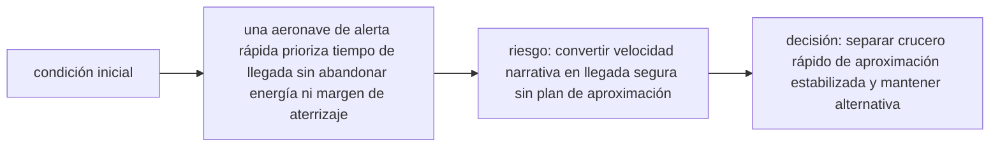

<!-- clase-meta
tipo_documento: clase
clase: 6
codigo: THUNDERBIRD1-06
curso: thunderbird-1
titulo: "Principios y operación de Thunderbird 1"
modalidad: "resolución de problemas"
duracion_minutos: 90
nivel: introductorio
prerrequisito: THUNDERBIRD1-05
competencia: "razonamiento_operacional"
resultados_aprendizaje:
  - "Explicar principios físicos, fases de operación, decisiones y errores frecuentes con vocabulario propio de Thunderbird 1."
  - "Aplicar esos conceptos a una decisión segura o a un escenario de simulación de Thunderbird 1."
evidencia: "Resolución argumentada de un escenario operacional."
criterio_aprobacion: "Aplica los principios correctos, anticipa consecuencias y respeta los límites del curso."
fuentes: manuales/fuentes.md
ultima_revision: 2026-09-10
-->

# 🧪 Principios y operación de Thunderbird 1

[🏠 Inicio](../../../README.md) · [⚡ Curso: Thunderbird 1](../README.md) · 🧪 Principios

> ⚖️ Material educativo original; los derechos de las obras pertenecen a sus titulares.

Documento educativo y de divulgación. Aquí está el corazón del curso: la física
del despegue vertical, el empuje vectorizado y el compromiso entre velocidad y
autonomía. Explica que si sería posible, que no, y sobre todo por qué.

## La condición del vuelo vertical: empuje mayor que el peso

Para elevarse en vertical sin apoyarse en las alas, la nave debe empujar hacia
abajo con una fuerza mayor que su propio peso. Se mide con la relación
empuje/peso: si es mayor que uno, la nave acelera hacia arriba; si es igual a
uno, flota sin subir ni bajar; si es menor que uno, no despega. Esta es la regla
fundamental de todo vehículo VTOL.

## Sustentación por empuje frente a sustentación aerodinámica

Un avión se sostiene porque sus alas desvian el aire al avanzar rápido: es
sustentación aerodinámica, y necesita velocidad. Un vehículo VTOL, en cambio, se
sostiene lanzando gas hacia abajo con su motor: es sustentación por empuje
directo, y funciona incluso parado en el aire. La primera es eficiente pero exige
velocidad; la segunda permite flotar pero gasta mucho combustible.

## Empuje vectorizado: dirigir el chorro para maniobrar

Orientar el chorro del motor permite decidir hacia donde actua la fuerza. Con el
gas saliendo recto hacia abajo, la nave sube o flota. Al inclinar las toberas,
parte del empuje sigue sosteniendo el peso y otra parte impulsa hacia adelante.
Así la nave transiciona del vuelo vertical al horizontal sin necesitar el aire, y
puede maniobrar con precisión incluso a baja velocidad.

## Velocidad frente a autonomía: el compromiso central

Volar más rápido y mantener más empuje consume más combustible por segundo. Como
el depósito es finito, cada decisión es un compromiso: si la nave prioriza la
velocidad y el vuelo estacionario, gasta mucho y llega menos lejos; si prioriza
el alcance, debe moderar el empuje y aprovechar las alas en crucero. No se puede
tener a la vez máxima rapidez, máximo tiempo flotando y máximo alcance.

## Calor y estructura

Un motor que sostiene todo el peso de la nave trabaja al límite y libera mucho
calor. Ese calor debe evacuarse para no dañar el motor ni la estructura, lo que
impone un límite al tiempo que se puede mantener el empuje máximo. La estructura,
además, soporta esfuerzos distintos al subir en vertical y al volar en crucero.

## Que si y que no

| Idea de la ficción | Que si es real | Que no es real |
| --- | --- | --- |
| Despega recta sin pista | El VTOL es posible con empuje mayor que el peso | No es gratis: exige mucho empuje y consumo. |
| Flota quieta cuanto quiera | El vuelo estacionario existe | No sin gastar combustible todo el tiempo. |
| Pasa a gran velocidad al instante | El empuje vectorizado permite transicionar | La transición es gradual, no instantánea. |
| Vuela rápido y llega lejos siempre | Se puede priorizar una u otra cosa | No las dos al máximo a la vez. |
| El motor nunca se calienta | Hay refrigeración posible | El empuje sostenido genera calor limitante. |
| Combustible inagotable | El empuje por reacción es real | El propelente es finito y limita el alcance. |

## Cómo sería una operación realista

- El despegue exigiría comprobar que el empuje supere claramente al peso.
- El vuelo estacionario se usaría lo justo, por su enorme consumo.
- La transición a crucero se haría pronto para dejar que las alas sostengan.
- La planificación cuidaría el combustible como recurso más valioso.

## Relación con los niveles de realismo

- **Nivel 1 (educativo)**: despegar en vertical y notar que hace falta empuje.
- **Nivel 2 (simplificado)**: sumar la transición con toberas y el consumo.
- **Nivel 3 (técnico)**: gestionar empuje/peso, calor, alcance y velocidad.

Ver [`docs/03-niveles-de-realismo.md`](../../../docs/03-niveles-de-realismo.md)
para el detalle de cada nivel.

## 🧭 Guía de estudio aplicada

### Pregunta guía

¿Cómo ayuda **La condición del vuelo vertical: empuje mayor que el peso, Sustentación por empuje frente a sustentación aerodinámica, Empuje vectorizado: dirigir el chorro para maniobrar y Velocidad frente a autonomía: el compromiso central** a **resolver despliegue de rescate a una pista corta con meteorología cambiante sin agotar el margen operacional**?

### Explicación razonada

El principio rector puede resumirse así: una aeronave de alerta rápida prioriza tiempo de llegada sin abandonar energía ni margen de aterrizaje. Esto explica por qué una misma orden produce resultados distintos cuando cambian velocidad, carga, configuración o entorno. Operar bien consiste en leer la tendencia antes de agotar el margen y tomar esta decisión: separar crucero rápido de aproximación estabilizada y mantener alternativa.

Esta clase se conecta con el resto del curso mediante **una aeronave de alerta rápida prioriza tiempo de llegada sin abandonar energía ni margen de aterrizaje**. El hilo de
seguridad consiste en reconocer a tiempo **convertir velocidad narrativa en llegada segura sin plan de aproximación** y poder justificar la decisión
**separar crucero rápido de aproximación estabilizada y mantener alternativa**; en clases posteriores cambiará el ángulo de análisis, no esa relación causal.
La lectura funcional común sigue **energía ficticia → propulsión → superficies de control → trayectoria de respuesta**, de modo que cada concepto pueda
ubicarse dentro del funcionamiento completo y no quede como un dato aislado.

**Apoyo documental:** [Thunderbirds Vehicles](https://www.thunderbirds.com/) aporta referencia oficial de vehículos de rescate;
[Aviation Handbooks and Manuals](https://www.faa.gov/regulations_policies/handbooks_manuals) se usa para aerodinámica, sistemas y operación. Estas fuentes
se contrastan con el alcance de la clase y no sustituyen un manual de equipo concreto.

### Caso resuelto: de la observación a la decisión

1. **Datos:** reconoce condiciones, configuración y margen disponibles en **despliegue de rescate a una pista corta con meteorología cambiante**.
2. **Modelo:** aplica **una aeronave de alerta rápida prioriza tiempo de llegada sin abandonar energía ni margen de aterrizaje** para predecir una tendencia antes de actuar.
3. **Riesgo:** explica mediante qué cadena de causas podría ocurrir **convertir velocidad narrativa en llegada segura sin plan de aproximación**.
4. **Decisión:** ejecuta mentalmente **separar crucero rápido de aproximación estabilizada y mantener alternativa** y define qué observación confirmaría que funcionó.

### Comprueba tu comprensión

1. ¿Qué variable del principio «una aeronave de alerta rápida prioriza tiempo de llegada sin abandonar energía ni margen de aterrizaje» cambia primero en el caso?
2. ¿Cómo se propaga ese cambio hasta **trayectoria de respuesta**?
3. ¿Qué evidencia confirmaría que **separar crucero rápido de aproximación estabilizada y mantener alternativa** conservó margen operacional?

Orientación para revisar tus respuestas

- La primera respuesta debe relacionar el eslabón elegido con un efecto posterior, no solo nombrarlo.
- La segunda debe proponer una señal medible u observable y explicar qué tendencia sería preocupante.
- La tercera debe cambiar al menos una variable de capacidad, mando, entorno o margen de seguridad.

## 🎓 Cierre de clase

- **Actividad:** Resuelve un escenario de Thunderbird 1 explicando, paso a paso, cómo intervienen principios físicos, fases de operación, decisiones y errores frecuentes.
- **Evidencia:** Resolución argumentada de un escenario operacional.
- **Criterio de aprobación:** Aplica los principios correctos, anticipa consecuencias y respeta los límites del curso.
- **Transferencia:** explica qué cambiaría al pasar a otra variante de esta máquina.

### Fuentes de esta clase

- [THUNDERBIRDS-OFFICIAL](https://www.thunderbirds.com/): Thunderbirds Vehicles, ITV. Uso: referencia oficial de vehículos de rescate.
- [US-FAA-HANDBOOKS](https://www.faa.gov/regulations_policies/handbooks_manuals): Aviation Handbooks and Manuals, FAA. Uso: aerodinámica, sistemas y operación.
- [NASA-FLIGHT](https://www1.grc.nasa.gov/beginners-guide-to-aeronautics/): Beginner's Guide to Aeronautics, NASA. Uso: contraste con física y vuelo reales.

> Las fuentes sostienen el marco conceptual y normativo; esta clase no reemplaza el manual
> del fabricante, la formación certificada ni la habilitación exigida para operar equipos reales.

---

[⬅️ Anterior: Mandos](../mandos/manual-mandos-thunderbird-1.md) · [➡️ Siguiente: Entornos](entornos-thunderbird-1.md)
