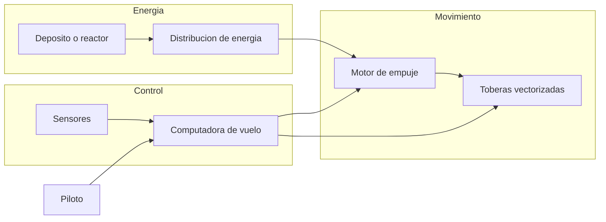
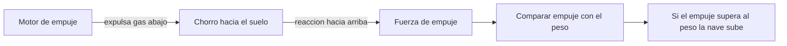
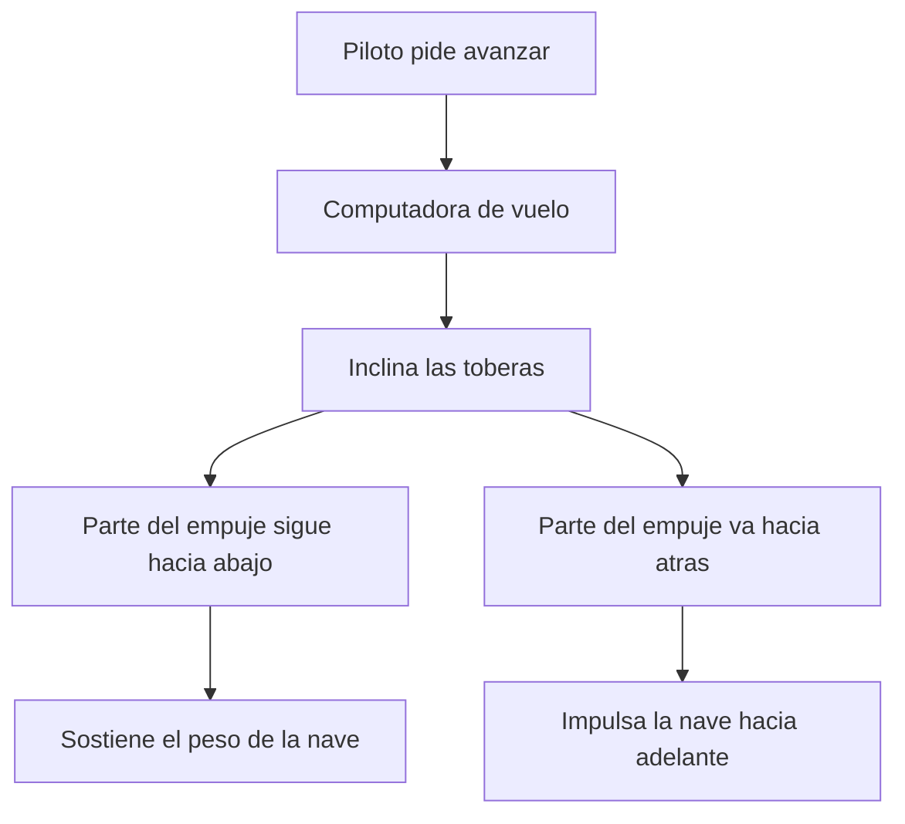

# 🔧 Sistemas mecanicos de Thunderbird 1

[🏠 Inicio](../../../README.md) · [⚡ Curso: Thunderbird 1](../README.md) · 🔧 Sistemas mecanicos

> ⚖️ Material educativo original; los derechos de las obras pertenecen a sus titulares.

Este modulo abre Thunderbird 1 por dentro. Compara la tecnologia imaginaria de
la ficcion con la fisica real que la haria funcionar (o que la desmiente). La
regla del curso es clara: describimos conceptos con nuestras palabras, sin copiar
planos ni especificaciones oficiales.

---

## 1. 🔋 Fuente de energia

En la ficcion, un motor compacto entrega potencia casi ilimitada durante todo el
rescate. En la realidad, sostener el vuelo vertical consume combustible a gran
ritmo: mientras la nave flota, el motor debe empujar hacia abajo tanta fuerza
como pesa la nave, y eso gasta propelente cada segundo sin avanzar nada.

| Concepto de ficcion | Fisica real que evoca | Veredicto |
| --- | --- | --- |
| Motor de potencia infinita | Fuentes de energia densas | Plausible como idea, no como "infinita". |
| Flotar sin gastar nada | Empuje sostenido que gasta propelente | No fisico: flotar cuesta combustible. |
| Repostaje que nunca hace falta | Deposito de combustible finito | Falso: el alcance esta limitado. |

---

## 2. 🚀 Motor de empuje y despegue vertical

El chorro potente que sale hacia abajo representa un motor de reaccion: expulsa
gas a gran velocidad y, por la tercera ley de Newton, la nave recibe un empuje
hacia arriba. Esto si es real. Para despegar en vertical, ese empuje debe ser
mayor que el peso de la nave; si es igual, solo flota; si es menor, no sube.

| Idea de la ficcion | Que dice la fisica real |
| --- | --- |
| Sube recta sin esfuerzo aparente | Necesita empuje mayor que su propio peso. |
| Flota quieta cuanto haga falta | Flotar gasta propelente todo el tiempo. |
| Aceleracion vertical instantanea | La subida depende de empuje menos peso, y de la masa. |
| Combustible que nunca importa | El propelente es finito y limita la mision. |

---

## 3. 🎯 Toberas vectorizadas y empuje dirigido

Aqui esta una de las claves fisicas del curso. Para pasar de subir en vertical a
volar hacia adelante, la nave orienta el chorro del motor: si el gas sale hacia
abajo, empuja hacia arriba; si se inclina hacia atras, aparece una componente que
empuja hacia adelante. A esto se le llama empuje vectorizado, y permite maniobrar
y transicionar sin depender del aire.

- **Empuje vertical**: toda la fuerza hacia abajo sostiene el peso y permite subir.
- **Empuje inclinado**: parte de la fuerza sostiene y parte impulsa hacia adelante.
- **Transicion**: al inclinar mas el chorro, la nave gana velocidad horizontal y
  las alas empiezan a aportar sustentacion.

---

## 4. 🖥️ Computadora de vuelo y sensores

En la ficcion el piloto lo hace todo con instinto. En la realidad, equilibrar el
empuje mientras la nave flota y se inclina exige una computadora que ajuste el
motor y las toberas muchas veces por segundo. Un pequeno desajuste al flotar
hace que la nave suba, baje o vuelque, asi que el control fino es imprescindible.

| Sistema | En la ficcion | En la realidad |
| --- | --- | --- |
| Estabilidad al flotar | El piloto la mantiene solo | Computadora corrige el empuje sin parar. |
| Transicion a crucero | Un gesto y ya vuela | Ajuste gradual de toberas y potencia. |
| Deteccion del entorno | Vista directa | Sensores de altura, velocidad y viento. |

---

## 5. 🪽 Alas, superficies y calor

Las alas casi no sirven al despegar: sin velocidad hacia adelante no generan
sustentacion, y toda la carga recae en el motor. Solo cuando la nave avanza
rapido las alas empiezan a sostenerla, y entonces el motor puede rebajar el
empuje y ahorrar combustible. El motor, en cambio, disipa mucho calor que hay
que evacuar para no danar la estructura.

| Elemento | Funcion en la ficcion | Funcion util real |
| --- | --- | --- |
| Alas | Aspecto de nave veloz | Sustentacion solo en vuelo horizontal rapido. |
| Toberas | Efecto visual del despegue | Dirigir el empuje para subir y avanzar. |
| Estructura | Resiste cualquier esfuerzo | Debe soportar empuje, calor y cambios de modo. |

---

## 🔁 Como se conecta todo

1. La **energia** alimenta el motor y los sistemas.
2. El **motor de empuje** genera la fuerza que sostiene y eleva la nave.
3. Las **toberas** orientan ese empuje para flotar, subir o avanzar.
4. La **computadora** equilibra empuje y toberas para un vuelo estable.
5. Los **sensores** informan de altura, velocidad y entorno.

Con esto claro, el [Modulo 4: Mandos](../mandos/manual-mandos-thunderbird-1.md)
muestra como el piloto operaria cada sistema.

---

[⬅️ Anterior: Caracteristicas](caracteristicas-thunderbird-1.md) · [➡️ Siguiente: Mandos e instrumentos](../mandos/manual-mandos-thunderbird-1.md)
