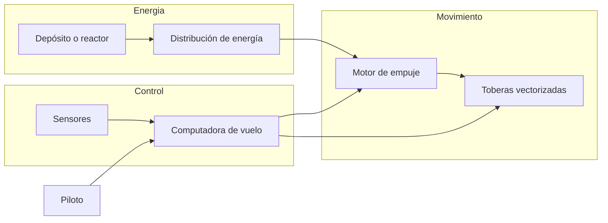
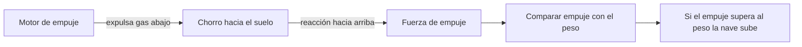
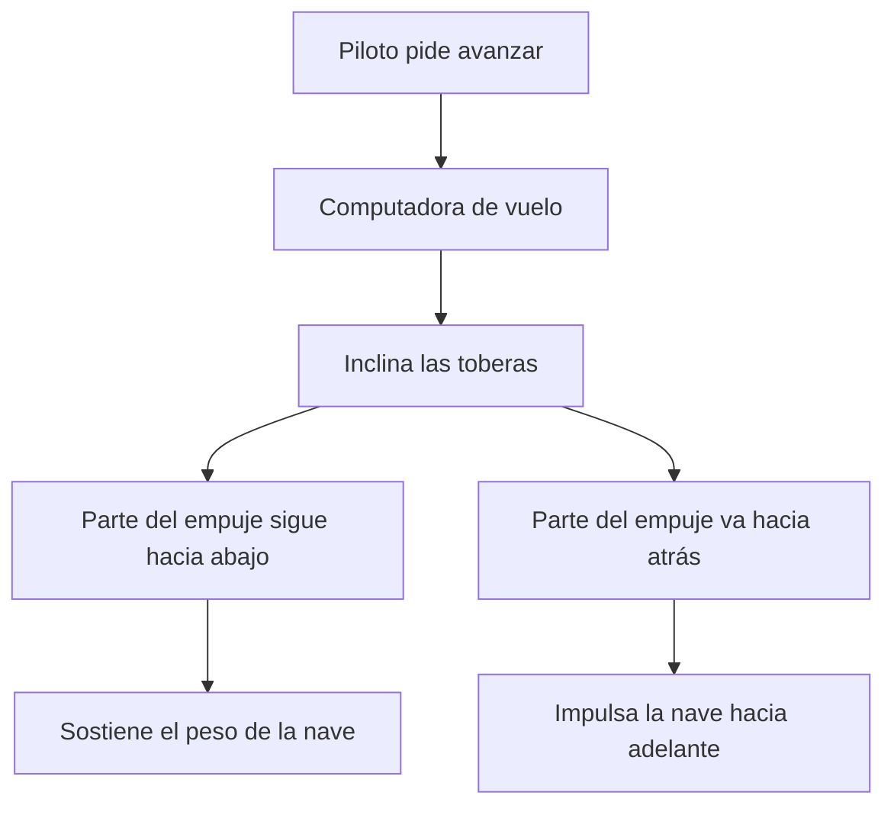
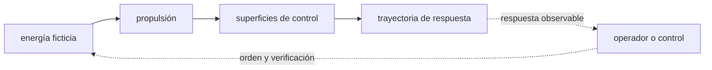

<!-- clase-meta
tipo_documento: clase
clase: 4
codigo: THUNDERBIRD1-04
curso: thunderbird-1
titulo: "Sistemas mecánicos de Thunderbird 1"
modalidad: "teórica aplicada"
duracion_minutos: 90
nivel: introductorio
prerrequisito: THUNDERBIRD1-03
competencia: "comprension_de_sistemas"
resultados_aprendizaje:
  - "Explicar Fuente de energía, Motor de empuje y despegue vertical, Toberas vectorizadas y empuje dirigido y Computadora de vuelo y sensores con vocabulario propio de Thunderbird 1."
  - "Aplicar esos conceptos a una decisión segura o a un escenario de simulación de Thunderbird 1."
evidencia: "Esquema con flujos de energía, materia o información anotados."
criterio_aprobacion: "Las conexiones esenciales son correctas y la consecuencia de la falla se propaga de manera coherente."
fuentes: manuales/fuentes.md
ultima_revision: 2026-09-10
-->

# 🔧 Sistemas mecánicos de Thunderbird 1

[🏠 Inicio](../../../README.md) · [⚡ Curso: Thunderbird 1](../README.md) · 🔧 Sistemas mecánicos

> ⚖️ Material educativo original; los derechos de las obras pertenecen a sus titulares.

Esta clase abre Thunderbird 1 por dentro. Compara la tecnología imaginaria de
la ficción con la física real que la haría funcionar (o que la desmiente). La
regla del curso es clara: describimos conceptos con nuestras palabras, sin copiar
planos ni especificaciones oficiales.

```mermaid
flowchart LR
    subgraph Energia
        R[Depósito o reactor] --> Dist[Distribución de energía]
    end
    subgraph Movimiento
        Dist --> Motor[Motor de empuje]
        Motor --> Toberas[Toberas vectorizadas]
    end
    subgraph Control
        Sen[Sensores] --> Comp[Computadora de vuelo]
        Comp --> Motor
        Comp --> Toberas
    end
    Piloto[Piloto] --> Comp
```

---

## 1. 🔋 Fuente de energía

En la ficción, un motor compacto entrega potencia casi ilimitada durante todo el
rescate. En la realidad, sostener el vuelo vertical consume combustible a gran
ritmo: mientras la nave flota, el motor debe empujar hacia abajo tanta fuerza
como pesa la nave, y eso gasta propelente cada segundo sin avanzar nada.

| Concepto de ficción | Física real que evoca | Veredicto |
| --- | --- | --- |
| Motor de potencia infinita | Fuentes de energía densas | Plausible como idea, no como "infinita". |
| Flotar sin gastar nada | Empuje sostenido que gasta propelente | No físico: flotar cuesta combustible. |
| Repostaje que nunca hace falta | Depósito de combustible finito | Falso: el alcance está limitado. |

---

## 2. 🚀 Motor de empuje y despegue vertical

El chorro potente que sale hacia abajo representa un motor de reacción: expulsa
gas a gran velocidad y, por la tercera ley de Newton, la nave recibe un empuje
hacia arriba. Esto si es real. Para despegar en vertical, ese empuje debe ser
mayor que el peso de la nave; si es igual, solo flota; si es menor, no sube.

```mermaid
flowchart LR
    Motor[Motor de empuje] -->|expulsa gas abajo| Chorro[Chorro hacia el suelo]
    Chorro -->|reacción hacia arriba| Empuje[Fuerza de empuje]
    Empuje --> Compara[Comparar empuje con el peso]
    Compara --> Sube[Si el empuje supera al peso la nave sube]
```

| Idea de la ficción | Que dice la física real |
| --- | --- |
| Sube recta sin esfuerzo aparente | Necesita empuje mayor que su propio peso. |
| Flota quieta cuanto haga falta | Flotar gasta propelente todo el tiempo. |
| Aceleración vertical instantánea | La subida depende de empuje menos peso, y de la masa. |
| Combustible que nunca importa | El propelente es finito y limita la misión. |

---

## 3. 🎯 Toberas vectorizadas y empuje dirigido

Aquí está una de las claves físicas del curso. Para pasar de subir en vertical a
volar hacia adelante, la nave orienta el chorro del motor: si el gas sale hacia
abajo, empuja hacia arriba; si se inclina hacia atrás, aparece una componente que
empuja hacia adelante. A esto se le llama empuje vectorizado, y permite maniobrar
y transicionar sin depender del aire.

```mermaid
flowchart TD
    Piloto[Piloto pide avanzar] --> Comp[Computadora de vuelo]
    Comp --> Tobera[Inclina las toberas]
    Tobera --> Abajo[Parte del empuje sigue hacia abajo]
    Tobera --> Atras[Parte del empuje va hacia atrás]
    Abajo --> Sostiene[Sostiene el peso de la nave]
    Atras --> Avanza[Impulsa la nave hacia adelante]
```

- **Empuje vertical**: toda la fuerza hacia abajo sostiene el peso y permite subir.
- **Empuje inclinado**: parte de la fuerza sostiene y parte impulsa hacia adelante.
- **Transición**: al inclinar más el chorro, la nave gana velocidad horizontal y
  las alas empiezan a aportar sustentación.

---

## 4. 🖥️ Computadora de vuelo y sensores

En la ficción el piloto lo hace todo con instinto. En la realidad, equilibrar el
empuje mientras la nave flota y se inclina exige una computadora que ajuste el
motor y las toberas muchas veces por segundo. Un pequeño desajuste al flotar
hace que la nave suba, baje o vuelque, así que el control fino es imprescindible.

| Sistema | En la ficción | En la realidad |
| --- | --- | --- |
| Estabilidad al flotar | El piloto la mantiene solo | Computadora corrige el empuje sin parar. |
| Transición a crucero | Un gesto y ya vuela | Ajuste gradual de toberas y potencia. |
| Detección del entorno | Vista directa | Sensores de altura, velocidad y viento. |

---

## 5. 🪽 Alas, superficies y calor

Las alas casi no sirven al despegar: sin velocidad hacia adelante no generan
sustentación, y toda la carga recae en el motor. Solo cuando la nave avanza
rápido las alas empiezan a sostenerla, y entonces el motor puede rebajar el
empuje y ahorrar combustible. El motor, en cambio, disipa mucho calor que hay
que evacuar para no dañar la estructura.

| Elemento | Función en la ficción | Función útil real |
| --- | --- | --- |
| Alas | Aspecto de nave veloz | Sustentación solo en vuelo horizontal rápido. |
| Toberas | Efecto visual del despegue | Dirigir el empuje para subir y avanzar. |
| Estructura | Resiste cualquier esfuerzo | Debe soportar empuje, calor y cambios de modo. |

---

## 🔁 Cómo se conecta todo

1. La **energía** alimenta el motor y los sistemas.
2. El **motor de empuje** genera la fuerza que sostiene y eleva la nave.
3. Las **toberas** orientan ese empuje para flotar, subir o avanzar.
4. La **computadora** equilibra empuje y toberas para un vuelo estable.
5. Los **sensores** informan de altura, velocidad y entorno.

Con esto claro, el [Clase 5: Mandos](../mandos/manual-mandos-thunderbird-1.md)
muestra como el piloto operaría cada sistema.

## 🧭 Guía de estudio aplicada

### Pregunta guía

¿Cómo ayuda **Fuente de energía, Motor de empuje y despegue vertical, Toberas vectorizadas y empuje dirigido y Computadora de vuelo y sensores** a **seguir una alteración desde energía ficticia hasta trayectoria de respuesta durante despliegue de rescate a una pista corta con meteorología cambiante**?

### Explicación razonada

El funcionamiento puede leerse como una cadena causal: energía ficticia entrega o transforma energía; propulsión la adapta; superficies de control la transmite o gobierna; y trayectoria de respuesta produce el efecto observable. La cadena no es lineal en sentido estricto: sensores, estructura y operador cierran el lazo. Si un eslabón se degrada, la señal importante es cómo cambia el estado de trayectoria de respuesta y qué margen queda.

```mermaid
flowchart LR
    A["energía ficticia"] --> B["propulsión"] --> C["superficies de control"] --> D["trayectoria de respuesta"]
    D -. respuesta observable .-> O["operador o control"]
    O -. orden y verificación .-> A
```

Esta clase se conecta con el resto del curso mediante **una aeronave de alerta rápida prioriza tiempo de llegada sin abandonar energía ni margen de aterrizaje**. El hilo de
seguridad consiste en reconocer a tiempo **convertir velocidad narrativa en llegada segura sin plan de aproximación** y poder justificar la decisión
**separar crucero rápido de aproximación estabilizada y mantener alternativa**; en clases posteriores cambiará el ángulo de análisis, no esa relación causal.
La lectura funcional común sigue **energía ficticia → propulsión → superficies de control → trayectoria de respuesta**, de modo que cada concepto pueda
ubicarse dentro del funcionamiento completo y no quede como un dato aislado.

**Apoyo documental:** [Thunderbirds Vehicles](https://www.thunderbirds.com/) aporta referencia oficial de vehículos de rescate;
[Aviation Handbooks and Manuals](https://www.faa.gov/regulations_policies/handbooks_manuals) se usa para aerodinámica, sistemas y operación. Estas fuentes
se contrastan con el alcance de la clase y no sustituyen un manual de equipo concreto.

### Caso resuelto: de la observación a la decisión

1. **Entrada:** identifica el estado inicial de **energía ficticia** durante **despliegue de rescate a una pista corta con meteorología cambiante**.
2. **Transformación:** explica qué hacen **propulsión** y **superficies de control**, y qué magnitud cambia en cada paso.
3. **Salida:** comprueba el efecto esperado en **trayectoria de respuesta** y busca una desviación temprana.
4. **Falla razonada:** si aparece **convertir velocidad narrativa en llegada segura sin plan de aproximación**, retrocede por la cadena antes de ordenar otra acción.

### Comprueba tu comprensión

1. Si se degrada **propulsión**, ¿qué efecto esperarías primero en **superficies de control** y después en **trayectoria de respuesta**?
2. ¿Qué observación ayudaría a diferenciar una falla de **energía ficticia** de una falla de **superficies de control**?
3. ¿Por qué una segunda orden podría agravar **convertir velocidad narrativa en llegada segura sin plan de aproximación**?

Orientación para revisar tus respuestas

- La primera respuesta debe relacionar el eslabón elegido con un efecto posterior, no solo nombrarlo.
- La segunda debe proponer una señal medible u observable y explicar qué tendencia sería preocupante.
- La tercera debe cambiar al menos una variable de capacidad, mando, entorno o margen de seguridad.

## 🎓 Cierre de clase

- **Actividad:** Dibuja un esquema funcional de Thunderbird 1 que conecte Fuente de energía, Motor de empuje y despegue vertical, Toberas vectorizadas y empuje dirigido y Computadora de vuelo y sensores; después predice el efecto de una falla simulada.
- **Evidencia:** Esquema con flujos de energía, materia o información anotados.
- **Criterio de aprobación:** Las conexiones esenciales son correctas y la consecuencia de la falla se propaga de manera coherente.
- **Transferencia:** explica qué cambiaría al pasar a otra variante de esta máquina.

### Fuentes de esta clase

- [THUNDERBIRDS-OFFICIAL](https://www.thunderbirds.com/): Thunderbirds Vehicles, ITV. Uso: referencia oficial de vehículos de rescate.
- [US-FAA-HANDBOOKS](https://www.faa.gov/regulations_policies/handbooks_manuals): Aviation Handbooks and Manuals, FAA. Uso: aerodinámica, sistemas y operación.
- [NASA-FLIGHT](https://www1.grc.nasa.gov/beginners-guide-to-aeronautics/): Beginner's Guide to Aeronautics, NASA. Uso: contraste con física y vuelo reales.

> Las fuentes sostienen el marco conceptual y normativo; esta clase no reemplaza el manual
> del fabricante, la formación certificada ni la habilitación exigida para operar equipos reales.

---

[⬅️ Anterior: Modelos y variantes](../modelos/modelos-thunderbird-1.md) · [➡️ Siguiente: Mandos e instrumentos](../mandos/manual-mandos-thunderbird-1.md)
