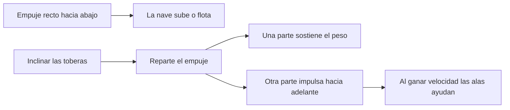

# 🧰 Recursos de Thunderbird 1

[🏠 Inicio](../../../README.md) · [⚡ Curso: Thunderbird 1](../README.md) · 🧰 Recursos

> ⚖️ Material educativo original; los derechos de las obras pertenecen a sus titulares.

Glosario especifico, enlaces y diagramas de apoyo del curso de Thunderbird 1.
Amplia el [glosario general](../../../docs/05-glosario-general.md).

---

## 📖 Glosario especifico

| Termino | Definicion |
| --- | --- |
| VTOL | Despegue y aterrizaje vertical sin necesidad de pista. |
| Empuje | Fuerza que impulsa la nave, resultado de expulsar gas por el motor. |
| Peso | Fuerza con que la gravedad tira de la nave hacia abajo. |
| Relacion empuje/peso | Cociente entre empuje y peso; mayor que uno para elevarse. |
| Sustentacion aerodinamica | Fuerza que dan las alas al avanzar rapido por el aire. |
| Sustentacion por empuje | Sostenimiento directo por el chorro del motor hacia abajo. |
| Empuje vectorizado | Orientar el chorro del motor para maniobrar y transicionar. |
| Vuelo estacionario | Flotar en el aire sin avanzar, con empuje igual al peso. |
| Transicion | Paso del vuelo vertical al horizontal inclinando el empuje. |
| Autonomia | Alcance o tiempo de vuelo que permite el combustible disponible. |

---

## 🗺️ Diagrama: subir frente a avanzar

---

## 🔗 Enlaces y fuentes

- Portada del curso: [⚡ Curso: Thunderbird 1](../README.md)
- Catalogo de naves de ficcion: [🌌 Naves de ficcion](../../README.md)
- Glosario general: [📖 docs/05-glosario-general.md](../../../docs/05-glosario-general.md)
- Niveles de realismo: [🎚️ docs/03-niveles-de-realismo.md](../../../docs/03-niveles-de-realismo.md)
- Registro de fuentes: [📚 manuales/fuentes.md](../../../manuales/fuentes.md)

Registrar cada recurso nuevo con su origen y licencia, respetando el aviso de
derechos del catalogo de naves de ficcion.

---

[🎓 Portada del curso](../README.md) · [⬅️ Anterior: Diseno de simulacion](../simulacion/diseno-simulador-thunderbird-1.md)
