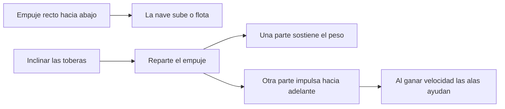

# 🧰 Recursos de Thunderbird 1

[🏠 Inicio](../../../README.md) · [⚡ Curso: Thunderbird 1](../README.md) · 🧰 Recursos

> ⚖️ Material educativo original; los derechos de las obras pertenecen a sus titulares.

Glosario específico, enlaces y diagramas de apoyo del curso de Thunderbird 1.
Amplia el [glosario general](../../../docs/05-glosario-general.md).

---

## 📖 Glosario específico

| Término | Definición |
| --- | --- |
| VTOL | Despegue y aterrizaje vertical sin necesidad de pista. |
| Empuje | Fuerza que impulsa la nave, resultado de expulsar gas por el motor. |
| Peso | Fuerza con que la gravedad tira de la nave hacia abajo. |
| Relación empuje/peso | Cociente entre empuje y peso; mayor que uno para elevarse. |
| Sustentación aerodinámica | Fuerza que dan las alas al avanzar rápido por el aire. |
| Sustentación por empuje | Sostenimiento directo por el chorro del motor hacia abajo. |
| Empuje vectorizado | Orientar el chorro del motor para maniobrar y transicionar. |
| Vuelo estacionario | Flotar en el aire sin avanzar, con empuje igual al peso. |
| Transición | Paso del vuelo vertical al horizontal inclinando el empuje. |
| Autonomía | Alcance o tiempo de vuelo que permite el combustible disponible. |

---

## 🗺️ Diagrama: subir frente a avanzar

```mermaid
flowchart LR
    Vertical[Empuje recto hacia abajo] --> Sube[La nave sube o flota]
    Inclinar[Inclinar las toberas] --> Reparte[Reparte el empuje]
    Reparte --> Sostiene[Una parte sostiene el peso]
    Reparte --> Avanza[Otra parte impulsa hacia adelante]
    Avanza --> Alas[Al ganar velocidad las alas ayudan]
```

---

## 🔗 Enlaces y fuentes

- Portada del curso: [⚡ Curso: Thunderbird 1](../README.md)
- Catálogo de naves de ficción: [🌌 Naves de ficción](../../README.md)
- Glosario general: [📖 docs/05-glosario-general.md](../../../docs/05-glosario-general.md)
- Niveles de realismo: [🎚️ docs/03-niveles-de-realismo.md](../../../docs/03-niveles-de-realismo.md)
- Registro de fuentes: [📚 manuales/fuentes.md](../../../manuales/fuentes.md)

Registrar cada recurso nuevo con su origen y licencia, respetando el aviso de
derechos del catálogo de naves de ficción.

## 🎓 Cierre de clase

- **Actividad:** Selecciona términos de glosario, esquemas y trazabilidad de fuentes, explícalos en contexto de Thunderbird 1 y verifica la procedencia de las fuentes utilizadas.
- **Evidencia:** Glosario aplicado y ficha breve de trazabilidad.
- **Criterio de aprobación:** Los términos permiten interpretar el curso y las fuentes se distinguen por autoridad, alcance y vigencia.
- **Transferencia:** explica qué cambiaría al pasar a otra variante de esta máquina.

### Fuentes de esta clase

- [THUNDERBIRDS-OFFICIAL](https://www.thunderbirds.com/): Thunderbirds Vehicles, ITV. Uso: referencia oficial de vehículos de rescate.
- [US-FAA-HANDBOOKS](https://www.faa.gov/regulations_policies/handbooks_manuals): Aviation Handbooks and Manuals, FAA. Uso: aerodinámica, sistemas y operación.
- [NASA-FLIGHT](https://www1.grc.nasa.gov/beginners-guide-to-aeronautics/): Beginner's Guide to Aeronautics, NASA. Uso: contraste con física y vuelo reales.

> Las fuentes sostienen el marco conceptual y normativo; esta clase no reemplaza el manual
> del fabricante, la formación certificada ni la habilitación exigida para operar equipos reales.

---

[🎓 Portada del curso](../README.md) · [⬅️ Anterior: Diseño de simulación](../simulacion/diseno-simulador-thunderbird-1.md) · [➡️ Siguiente: Ejercicios](../ejercicios/ejercicios-thunderbird-1.md)
