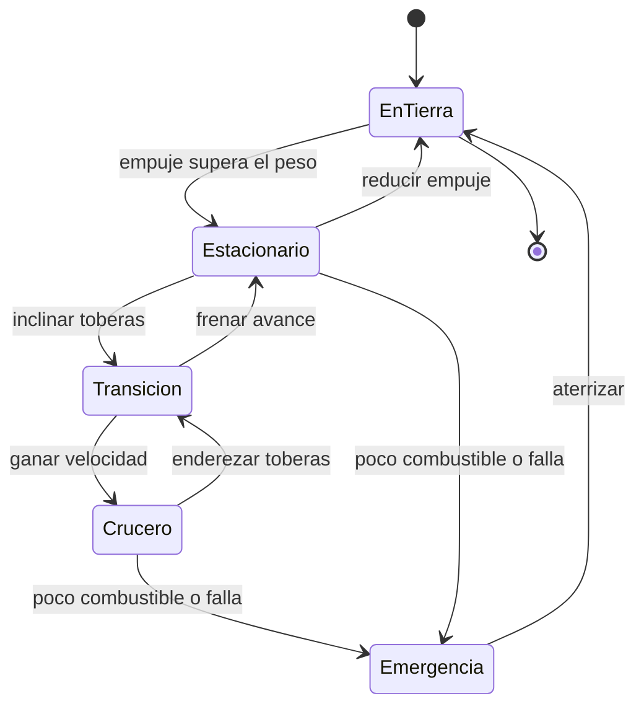

# 🎮 Diseno de simulacion de Thunderbird 1

[🏠 Inicio](../../../README.md) · [⚡ Curso: Thunderbird 1](../README.md) · 🎮 Simulacion

> ⚖️ Material educativo original; los derechos de las obras pertenecen a sus titulares.

Como modelar de forma educativa y divertida un vehiculo de respuesta rapida. La
idea central es poder alternar entre la version espectacular de la ficcion y la
version fiel a la fisica, para que el usuario compare ambas con la misma nave.

## Objetivo de la simulacion

Que el usuario comprenda, jugando, que para subir hace falta empuje mayor que el
peso, que flotar gasta mucho combustible, y que ir mas rapido reduce el alcance.
El modo ficcion sirve para engancharse; el modo ciencia, para aprender.

## Modo ciencia o ficcion

La variable mas importante del simulador es el **modo**:

- **Modo ficcion**: la nave despega sin esfuerzo, flota sin gastar y llega a
  cualquier sitio sin importar el combustible. Es divertido y familiar.
- **Modo ciencia**: se aplican la relacion empuje/peso, el consumo continuo al
  flotar y el compromiso entre velocidad y autonomia. Volar cuesta recursos.

Al cambiar de modo, la interfaz avisa que reglas se activan o desactivan, para
que la comparacion sea explicita y educativa.

## Variables principales

| Variable | Tipo | Rango | Afecta a | Comentarios |
| --- | --- | --- | --- | --- |
| Modo | discreta | ciencia / ficcion | Todas las reglas | Interruptor central del aprendizaje. |
| Empuje del motor | numerica | 0-100% | Subida y sostenimiento | Sobre el peso la nave sube. |
| Relacion empuje/peso | numerica | 0-varios | Despegue y flotacion | Mayor que uno para elevarse. |
| Angulo de toberas | numerica | 0-90 grados | Transicion | De vertical a horizontal. |
| Velocidad horizontal | numerica | 0-varios | Sustentacion de alas | Ayuda a sostener en crucero. |
| Combustible | numerica | 0-100% | Autonomia | En ficcion puede ignorarse. |
| Calor del motor | numerica | 0-100% | Empuje sostenido | Limita el tiempo a maxima potencia. |
| Densidad del aire | numerica | baja-alta | Sustentacion y empuje | Cambia con la altura. |

## Ciclo basico

1. Leer entrada del usuario (empuje, toberas, actitud, modo).
2. Comprobar el modo activo (ciencia o ficcion).
3. Calcular fuerzas: empuje del motor y su componente vertical y horizontal.
4. Aplicar reglas del modo: en ciencia, comparar empuje y peso, descontar combustible.
5. Aplicar el entorno: densidad del aire, viento, espacio de maniobra.
6. Actualizar altura, velocidad y actitud.
7. Refrescar instrumentos (empuje relativo, altura, combustible, calor).

## Modos de juego futuros

- Tutorial de despegue: aprender que hace falta empuje mayor que el peso.
- Reto de vuelo estacionario preciso sobre una zona estrecha.
- Comparador lado a lado: misma mision en modo ciencia y en modo ficcion.
- Gestion de combustible en un rescate con alcance limitado.
- Escenario de transicion donde las alas relevan al motor en crucero.

## Elementos fuera de alcance

- Presentar la version de ficcion como si fuera fisica real sin avisarlo.
- Detalles de propulsion presentados como datos tecnicos reales.
- Cualquier contenido que confunda espectaculo con ciencia sin distinguirlos.

## Pendientes

- [ ] Definir valores por defecto de cada variable por tipo de nave.
- [ ] Prototipar el ciclo basico con la relacion empuje/peso.
- [ ] Ajustar el consumo de combustible al flotar y en crucero.
- [ ] Agregar fuentes de divulgacion a [`manuales/fuentes.md`](../../../manuales/fuentes.md).

---

[⬅️ Anterior: Reglas del universo](../reglamentos/reglas-universo-thunderbird-1.md) · [➡️ Siguiente: Recursos](../recursos/recursos-thunderbird-1.md)
