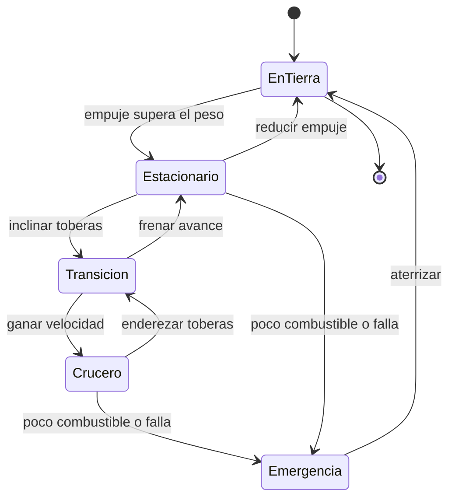

# 🎮 Diseño de simulación de Thunderbird 1

[🏠 Inicio](../../../README.md) · [⚡ Curso: Thunderbird 1](../README.md) · 🎮 Simulación

> ⚖️ Material educativo original; los derechos de las obras pertenecen a sus titulares.

Como modelar de forma educativa y divertida un vehículo de respuesta rápida. La
idea central es poder alternar entre la versión espectacular de la ficción y la
versión fiel a la física, para que el usuario compare ambas con la misma nave.

## Objetivo de la simulación

Que el usuario comprenda, jugando, que para subir hace falta empuje mayor que el
peso, que flotar gasta mucho combustible, y que ir más rápido reduce el alcance.
El modo ficción sirve para engancharse; el modo ciencia, para aprender.

## Modo ciencia o ficción

La variable más importante del simulador es el **modo**:

- **Modo ficción**: la nave despega sin esfuerzo, flota sin gastar y llega a
  cualquier sitio sin importar el combustible. Es divertido y familiar.
- **Modo ciencia**: se aplican la relación empuje/peso, el consumo continuo al
  flotar y el compromiso entre velocidad y autonomía. Volar cuesta recursos.

Al cambiar de modo, la interfaz avisa que reglas se activan o desactivan, para
que la comparación sea explícita y educativa.

## Variables principales

| Variable | Tipo | Rango | Afecta a | Comentarios |
| --- | --- | --- | --- | --- |
| Modo | discreta | ciencia / ficción | Todas las reglas | Interruptor central del aprendizaje. |
| Empuje del motor | numérica | 0-100% | Subida y sostenimiento | Sobre el peso la nave sube. |
| Relación empuje/peso | numérica | 0-varios | Despegue y flotación | Mayor que uno para elevarse. |
| Ángulo de toberas | numérica | 0-90 grados | Transición | De vertical a horizontal. |
| Velocidad horizontal | numérica | 0-varios | Sustentación de alas | Ayuda a sostener en crucero. |
| Combustible | numérica | 0-100% | Autonomía | En ficción puede ignorarse. |
| Calor del motor | numérica | 0-100% | Empuje sostenido | Limita el tiempo a máxima potencia. |
| Densidad del aire | numérica | baja-alta | Sustentación y empuje | Cambia con la altura. |

## Ciclo básico

1. Leer entrada del usuario (empuje, toberas, actitud, modo).
2. Comprobar el modo activo (ciencia o ficción).
3. Calcular fuerzas: empuje del motor y su componente vertical y horizontal.
4. Aplicar reglas del modo: en ciencia, comparar empuje y peso, descontar combustible.
5. Aplicar el entorno: densidad del aire, viento, espacio de maniobra.
6. Actualizar altura, velocidad y actitud.
7. Refrescar instrumentos (empuje relativo, altura, combustible, calor).

## Modos de juego futuros

- Tutorial de despegue: aprender que hace falta empuje mayor que el peso.
- Reto de vuelo estacionario preciso sobre una zona estrecha.
- Comparador lado a lado: misma misión en modo ciencia y en modo ficción.
- Gestión de combustible en un rescate con alcance limitado.
- Escenario de transición donde las alas relevan al motor en crucero.

## Elementos fuera de alcance

- Presentar la versión de ficción como si fuera física real sin avisarlo.
- Detalles de propulsión presentados como datos técnicos reales.
- Cualquier contenido que confunda espectáculo con ciencia sin distinguirlos.

## Pendientes

- [ ] Definir valores por defecto de cada variable por tipo de nave.
- [ ] Prototipar el ciclo básico con la relación empuje/peso.
- [ ] Ajustar el consumo de combustible al flotar y en crucero.
- [ ] Agregar fuentes de divulgación a [`manuales/fuentes.md`](../../../manuales/fuentes.md).

---

[⬅️ Anterior: Reglas del universo](../reglamentos/reglas-universo-thunderbird-1.md) · [➡️ Siguiente: Recursos](../recursos/recursos-thunderbird-1.md)
