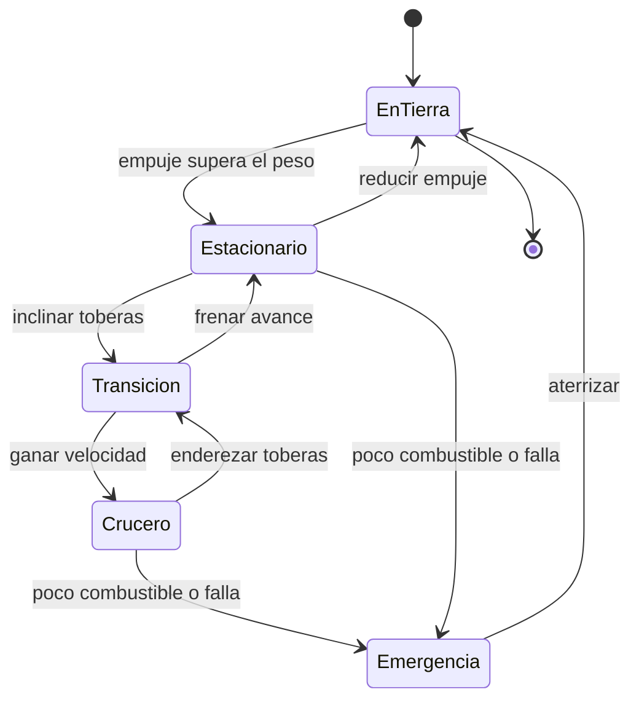
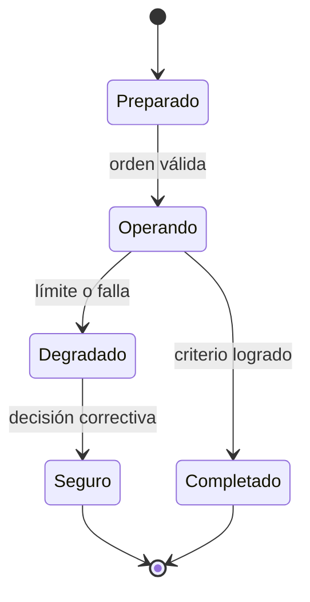

<!-- clase-meta
tipo_documento: clase
clase: 9
codigo: THUNDERBIRD1-09
curso: thunderbird-1
titulo: "Diseño de simulación de Thunderbird 1"
modalidad: "laboratorio de diseño"
duracion_minutos: 90
nivel: introductorio
prerrequisito: THUNDERBIRD1-08
competencia: "modelado_de_simulacion"
resultados_aprendizaje:
  - "Explicar objetivo, variables, estados, ciclo y escenarios de simulación con vocabulario propio de Thunderbird 1."
  - "Aplicar esos conceptos a una decisión segura o a un escenario de simulación de Thunderbird 1."
evidencia: "Ficha de escenario y diagrama de estados."
criterio_aprobacion: "El modelo es específico de la máquina, medible, seguro y trazable a clases anteriores."
fuentes: manuales/fuentes.md
ultima_revision: 2026-09-10
-->

# 🎮 Diseño de simulación de Thunderbird 1

[🏠 Inicio](../../../README.md) · [⚡ Curso: Thunderbird 1](../README.md) · 🎮 Simulación

> ⚖️ Material educativo original; los derechos de las obras pertenecen a sus titulares.

Como modelar de forma educativa y divertida un vehículo de respuesta rápida. La
idea central es poder alternar entre la versión espectacular de la ficción y la
versión fiel a la física, para que el usuario compare ambas con la misma nave.

```mermaid
stateDiagram-v2
    [*] --> EnTierra
    EnTierra --> Estacionario: empuje supera el peso
    Estacionario --> EnTierra: reducir empuje
    Estacionario --> Transicion: inclinar toberas
    Transicion --> Crucero: ganar velocidad
    Crucero --> Transicion: enderezar toberas
    Transicion --> Estacionario: frenar avance
    Crucero --> Emergencia: poco combustible o falla
    Estacionario --> Emergencia: poco combustible o falla
    Emergencia --> EnTierra: aterrizar
    EnTierra --> [*]
```

## Objetivo de la simulación

Que el usuario comprenda, jugando, que para subir hace falta empuje mayor que el
peso, que flotar gasta mucho combustible, y que ir más rápido reduce el alcance.
El modo ficción sirve para engancharse; el modo ciencia, para aprender.

## Modo ciencia o ficción

La variable más importante del simulador es el **modo**:

- **Modo ficción**: la nave despega sin esfuerzo, flota sin gastar y llega a
  cualquier sitio sin importar el combustible. Es divertido y familiar.
- **Modo ciencia**: se aplican la relación empuje/peso, el consumo continuo al
  flotar y el compromiso entre velocidad y autonomía. Volar cuesta recursos.

Al cambiar de modo, la interfaz avisa que reglas se activan o desactivan, para
que la comparación sea explícita y educativa.

## Variables principales

| Variable | Tipo | Rango | Afecta a | Comentarios |
| --- | --- | --- | --- | --- |
| Modo | discreta | ciencia / ficción | Todas las reglas | Interruptor central del aprendizaje. |
| Empuje del motor | numérica | 0-100% | Subida y sostenimiento | Sobre el peso la nave sube. |
| Relación empuje/peso | numérica | 0-varios | Despegue y flotación | Mayor que uno para elevarse. |
| Ángulo de toberas | numérica | 0-90 grados | Transición | De vertical a horizontal. |
| Velocidad horizontal | numérica | 0-varios | Sustentación de alas | Ayuda a sostener en crucero. |
| Combustible | numérica | 0-100% | Autonomía | En ficción puede ignorarse. |
| Calor del motor | numérica | 0-100% | Empuje sostenido | Limita el tiempo a máxima potencia. |
| Densidad del aire | numérica | baja-alta | Sustentación y empuje | Cambia con la altura. |

## Ciclo básico

1. Leer entrada del usuario (empuje, toberas, actitud, modo).
2. Comprobar el modo activo (ciencia o ficción).
3. Calcular fuerzas: empuje del motor y su componente vertical y horizontal.
4. Aplicar reglas del modo: en ciencia, comparar empuje y peso, descontar combustible.
5. Aplicar el entorno: densidad del aire, viento, espacio de maniobra.
6. Actualizar altura, velocidad y actitud.
7. Refrescar instrumentos (empuje relativo, altura, combustible, calor).

## Modos de juego futuros

- Tutorial de despegue: aprender que hace falta empuje mayor que el peso.
- Reto de vuelo estacionario preciso sobre una zona estrecha.
- Comparador lado a lado: misma misión en modo ciencia y en modo ficción.
- Gestión de combustible en un rescate con alcance limitado.
- Escenario de transición donde las alas relevan al motor en crucero.

## Elementos fuera de alcance

- Presentar la versión de ficción como si fuera física real sin avisarlo.
- Detalles de propulsión presentados como datos técnicos reales.
- Cualquier contenido que confunda espectáculo con ciencia sin distinguirlos.

## Pendientes

- [ ] Definir valores por defecto de cada variable por tipo de nave.
- [ ] Prototipar el ciclo básico con la relación empuje/peso.
- [ ] Ajustar el consumo de combustible al flotar y en crucero.
- [ ] Agregar fuentes de divulgación a [`manuales/fuentes.md`](../../../manuales/fuentes.md).

## 🧭 Guía de estudio aplicada

### Pregunta guía

¿Cómo ayuda **Objetivo de la simulación, Modo ciencia o ficción, Variables principales y Ciclo básico** a **modelar despliegue de rescate a una pista corta con meteorología cambiante como estados, variables y decisiones observables**?

### Explicación razonada

Una simulación de Thunderbird 1 es educativa si representa decisiones y consecuencias. Como mínimo debe modelar el estado de energía ficticia, la respuesta de propulsión, la transición en superficies de control y el resultado en trayectoria de respuesta. El escenario «despliegue de rescate a una pista corta con meteorología cambiante» es valioso porque obliga a observar, formular una hipótesis, actuar y comprobar.

```mermaid
stateDiagram-v2
    [*] --> Preparado
    Preparado --> Operando: orden válida
    Operando --> Degradado: límite o falla
    Degradado --> Seguro: decisión correctiva
    Operando --> Completado: criterio logrado
    Seguro --> [*]
    Completado --> [*]
```

Esta clase se conecta con el resto del curso mediante **una aeronave de alerta rápida prioriza tiempo de llegada sin abandonar energía ni margen de aterrizaje**. El hilo de
seguridad consiste en reconocer a tiempo **convertir velocidad narrativa en llegada segura sin plan de aproximación** y poder justificar la decisión
**separar crucero rápido de aproximación estabilizada y mantener alternativa**; en clases posteriores cambiará el ángulo de análisis, no esa relación causal.
La lectura funcional común sigue **energía ficticia → propulsión → superficies de control → trayectoria de respuesta**, de modo que cada concepto pueda
ubicarse dentro del funcionamiento completo y no quede como un dato aislado.

**Apoyo documental:** [Thunderbirds Vehicles](https://www.thunderbirds.com/) aporta referencia oficial de vehículos de rescate;
[Aviation Handbooks and Manuals](https://www.faa.gov/regulations_policies/handbooks_manuals) se usa para aerodinámica, sistemas y operación. Estas fuentes
se contrastan con el alcance de la clase y no sustituyen un manual de equipo concreto.

### Caso resuelto: de la observación a la decisión

1. **Estado inicial:** representa despliegue de rescate a una pista corta con meteorología cambiante con valores observables para **energía ficticia**, **propulsión**, **superficies de control** y **trayectoria de respuesta**.
2. **Decisión del estudiante:** ofrece una elección que cambie el estado, no una animación automática.
3. **Consecuencia:** modela la tendencia hacia **convertir velocidad narrativa en llegada segura sin plan de aproximación** y una señal previa que permita corregir.
4. **Cierre:** evalúa la explicación de la decisión, además de si el estudiante “ganó” el escenario.

### Comprueba tu comprensión

1. ¿Qué cuatro estados mínimos necesita el escenario «despliegue de rescate a una pista corta con meteorología cambiante»?
2. ¿Qué variable anticipa **convertir velocidad narrativa en llegada segura sin plan de aproximación** antes de llegar al estado de falla?
3. ¿Cómo evaluarías la explicación del estudiante y no solo el resultado final?

Orientación para revisar tus respuestas

- La primera respuesta debe relacionar el eslabón elegido con un efecto posterior, no solo nombrarlo.
- La segunda debe proponer una señal medible u observable y explicar qué tendencia sería preocupante.
- La tercera debe cambiar al menos una variable de capacidad, mando, entorno o margen de seguridad.

## 🎓 Cierre de clase

- **Actividad:** Diseña un escenario educativo de Thunderbird 1 basado en objetivo, variables, estados, ciclo y escenarios de simulación, con entradas, estados, variables y criterio de cierre.
- **Evidencia:** Ficha de escenario y diagrama de estados.
- **Criterio de aprobación:** El modelo es específico de la máquina, medible, seguro y trazable a clases anteriores.
- **Transferencia:** explica qué cambiaría al pasar a otra variante de esta máquina.

### Fuentes de esta clase

- [THUNDERBIRDS-OFFICIAL](https://www.thunderbirds.com/): Thunderbirds Vehicles, ITV. Uso: referencia oficial de vehículos de rescate.
- [US-FAA-HANDBOOKS](https://www.faa.gov/regulations_policies/handbooks_manuals): Aviation Handbooks and Manuals, FAA. Uso: aerodinámica, sistemas y operación.
- [NASA-FLIGHT](https://www1.grc.nasa.gov/beginners-guide-to-aeronautics/): Beginner's Guide to Aeronautics, NASA. Uso: contraste con física y vuelo reales.

> Las fuentes sostienen el marco conceptual y normativo; esta clase no reemplaza el manual
> del fabricante, la formación certificada ni la habilitación exigida para operar equipos reales.

---

[⬅️ Anterior: Reglas del universo](../reglamentos/reglas-universo-thunderbird-1.md) · [➡️ Siguiente: Recursos](../recursos/recursos-thunderbird-1.md)
