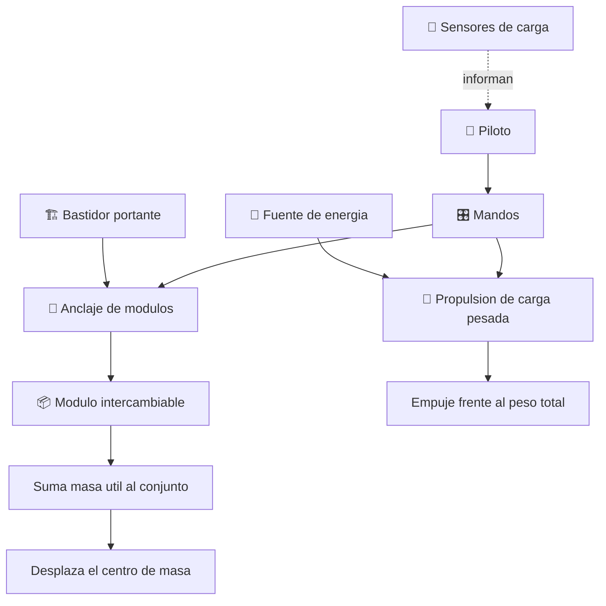

# 📦 Curso: Thunderbird 2

[🏠 Inicio](../../README.md) · [🌌 Naves de ficcion](../README.md) · [🎓 Guia de curso](../../docs/08-guia-de-estilo-y-curso.md)

> ⚖️ Material educativo original; los derechos de las obras pertenecen a sus titulares.

---

> Curso de analisis educativo de ciencia ficcion inspirado en el estilo
> "Thunderbirds". Estudiamos un transporte pesado modular generico para
> entender la fisica real de llevar carga: cuanta masa util puede mover un
> vehiculo, por que los modulos intercambiables son tan potentes y que precio
> paga la estructura por sostener tanto peso.

---

## 🎯 Objetivos de aprendizaje

Al terminar este curso deberias poder:

- Explicar la fraccion de carga util: cuanta masa aprovechable lleva un vehiculo.
- Entender la ventaja de los modulos intercambiables frente a un vehiculo fijo.
- Describir como el reparto de peso mueve el centro de masa y afecta la estabilidad.
- Razonar sobre la relacion empuje-peso en un vehiculo de carga pesada.
- Distinguir el compromiso entre estructura resistente y carga aprovechable.
- Traducir todo lo anterior a variables de un simulador educativo.

---

## 🗺️ Mapa del vehiculo

---

## 📚 Modulos del curso

| # | Modulo | Contenido | Enlace |
| :-: | --- | --- | --- |
| 1 | 📜 Historia | Contexto de la nave de ficcion y su idea de carga. | [Abrir](historia/historia-thunderbird-2.md) |
| 2 | 📋 Caracteristicas | Que es un transporte pesado modular y para que sirve. | [Abrir](operacion/caracteristicas-thunderbird-2.md) |
| 3 | 🔧 Sistemas mecanicos | Tecnologia imaginaria frente a la fisica real. | [Abrir](operacion/sistemas-mecanicos-thunderbird-2.md) |
| 4 | 🎛️ Mandos e instrumentos | Puesto de mando conceptual y controles. | [Abrir](mandos/manual-mandos-thunderbird-2.md) |
| 5 | 🧪 Principios y operacion | Carga util, empuje y estabilidad: que si y que no. | [Abrir](operacion/principios-thunderbird-2.md) |
| 6 | 🌍 Entornos | Bases, rutas y zonas de descarga. | [Abrir](operacion/entornos-thunderbird-2.md) |
| 7 | ⚖️ Reglas del universo | Las leyes internas de la ficcion frente a la fisica. | [Abrir](reglamentos/reglas-universo-thunderbird-2.md) |
| 8 | 🎮 Diseno de simulacion | Variables, ciclo y modo ciencia o ficcion. | [Abrir](simulacion/diseno-simulador-thunderbird-2.md) |
| 9 | 🧰 Recursos | Glosario, enlaces y diagramas. | [Abrir](recursos/recursos-thunderbird-2.md) |

---

## 🧩 Requisitos previos

Ninguno formal. Ayuda tener nociones basicas de peso, masa y equilibrio, pero
el curso las explica desde cero. La idea central es simple y potente: llevar
carga siempre es un compromiso entre cuanto peso util cargas y cuanta
estructura y energia necesitas para sostenerlo y moverlo.

---

[➡️ Empezar por el Modulo 1: Historia](historia/historia-thunderbird-2.md)
